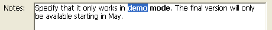
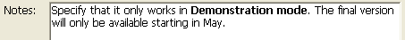

<!--REF #_command_.ST SET TEXT.Syntax-->**ST SET TEXT** ( {* ;} *object* ; *newText* {; *startSel* {; *endSel*}} )<!-- END REF-->
<!--REF #_command_.ST SET TEXT.Params-->
| Parameter | Type |  | Description |
| --- | --- | --- | --- |
| * | Operator | &#8594;  | If specified, object is an object name (string) <br/>If omitted, object is a variable or a field |
| object | any | &#8594;  | Object name (if * is specified) or <br/>Text field or variable (if * is omitted) |
| newText | Text | &#8594;  | Text to insert |
| startSel | Integer | &#8594;  | Start of selection |
| endSel | Integer | &#8594;  | End of selection |

<!-- END REF-->

#### Description 

<!--REF #_command_.ST SET TEXT.Summary-->The ST SET TEXT command inserts the text passed in the *newText* parameter into the styled text field or variable designated by the *object* parameter.<!-- END REF--> This command only applies to the plain text of the object parameter, without modifying any style tags that it contains. It can be used to modify, by programming, styled text displayed on screen. 

##### 

If you pass the optional *\** parameter, this indicates that the *object* parameter is an object name (string). During execution, when the object has the focus, the command only applies to the object being edited and not to its data source (field or variable). The changes are only transferred to the source (and to any other objects using this same source) when the object being edited is validated either by losing the focus or with the **Enter** key. When the object does not have the focus, the command applies directly to the data source and the changes are immediately transferred to any other objects using the same source.   
If you omit the *\** parameter, this indicates that the *object* parameter is a field or variable and you pass a field or variable reference instead of a string. The command applies directly to the field or variable and changes are immediately transferred to all the objects using this source, including the object with the focus. 

##### 

In *newText*, pass the text to be inserted. The ST SET TEXT command is intended for working with rich text (multistyle) containing <span> type tags. In all other cases (more particularly, when working with plain text that contains the <, > or & characters), you must use the [ST SET PLAIN TEXT](st-set-plain-text.md) command. If you pass plain text containing the <, > or & characters to the ST SET TEXT command, it does nothing. This is necessary behavior because if you insert a string such as "a<b" directly into rich text, it will distort the internal analysis of the <span> tags. In this case, "<" characters must be encoded beforehand as "&lt;", which can be done using the [ST SET PLAIN TEXT](st-set-plain-text.md) command (see also the example of this command).

The optional *startSel* and *endSel* parameters let you designate a selection of text in *object*. The *startSel* and *endSel* values give a selection of plain text, without taking any style tags found in the text into account. The action of the command varies according to the optional *startSel* and *endSel* parameters:

* If you omit *startSel* and *endSel*, ST SET TEXT replaces all the text of the *object* by *newText*,
* If you only pass *startSel* or if the values of *startSel* and *endSel* are equal, ST SET TEXT inserts the *newText* text into object beginning at *startSel*,
* If you pass both *startSel* and *endSel*, ST SET TEXT replaces the plain text set by these limits with the *newText* text.
* You can pass 0 in *endSel* to designate automatically the last character of the text (pass 1 in *startSel* to designate the first character of the text).

4D provides predefined constants so that you can designate the selection limits automatically in the *startSel* and *endSel* parameters. These constants are found in the "*Multistyle Text*" theme:

| Constant           | Type    | Value  | Comment                                                             |
| ------------------ | ------- | ------ | ------------------------------------------------------------------- |
| ST End highlight   | Integer | \-1001 | Designates last character of current text selection in object (\*)  |
| ST End text        | Integer | 0      | Designates last character of text contained in object               |
| ST Start highlight | Integer | \-1000 | Designates first character of current text selection in object (\*) |
| ST Start text      | Integer | 1      | Designates first character of text contained in object              |

(\*) You must pass an object name in *object* to be able to use this constant. If you pass a reference to a field or variable, the command is applied to all the text of the object.

**Note:** If *startSel* is greater than *endSel* (except if *endSel* value is 0, see above), the text is not modified and the OK variable is set to 0\. 

#### System variables and sets 

After this command is executed, the OK variable is set to 1 if no error occurred; otherwise, it is set to 0\. This is the case more particularly when style tags are not evaluated properly (incorrect or missing tags).   

In the case of an error, the variable is not changed. When an error occurs on a variable when text is being evaluated, 4D transforms the text into plain text; as a result, the <, > and & characters are converted into HTML entities.

#### Example 1 

You want to replace the styled text selected by the user with the contents of a variable.

Here is the selected text:



The following contents are stored in the field:


After executing this code:

```4d
 vtempo:="Demonstration"
 GET HIGHLIGHT([Products]Notes;vStart;vEnd)
 ST SET TEXT([Products]Notes;vtemp;vStart;vEnd)
```

The field and its contents are as follows:

 

#### Example 2 

Refer to the example of the [ST SET PLAIN TEXT](st-set-plain-text.md) command. 

#### See also 

[ST Get plain text](st-get-plain-text.md)  
[ST Get text](st-get-text.md)  
[ST SET PLAIN TEXT](st-set-plain-text.md)  

#### Properties

|  |  |
| --- | --- |
| Command number | 1115 |
| Thread safe | &cross; |
| Modifies variables | OK |


