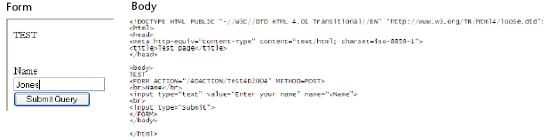

<!--REF #_command_.WEB GET HTTP BODY.Syntax-->**WEB GET HTTP BODY** ( *body* )<!-- END REF-->
<!--REF #_command_.WEB GET HTTP BODY.Params-->
| Parameter | Type |  | Description |
| --- | --- | --- | --- |
| body | Blob, Text | &#8592; | Body of the HTTP request |

<!-- END REF-->

#### Description 

<!--REF #_command_.WEB GET HTTP BODY.Summary-->The **WEB GET HTTP BODY** command returns the body of the HTTP request being processed.<!-- END REF--> The HTTP body is returned as is, without processing or parsing. 

This command can be called using a Web database method (*On Web Authentication Database Method*, [QR SET DESTINATION](qr-set-destination.md)) or any Web method. 

In *body*, you can pass a variable or a field of the BLOB or Text type. The Text type is generally sufficient (the *body* parameter can receive up to 2 GB of text).

This command allows you, for example, to carry out queries in the body of requests. It also permits advanced users to set up a WebDAV server within a 4D database.

#### Example 

In this example, a simple request is sent to the 4D Web server and the contents of the HTTP body are displayed in the debugger. Here is the form sent to the 4D Web server, as well as the corresponding HTML code:



Here is the Test4D2004 method:

```4d
 var $request : Blob
 var $requestText : Text
 
 WEB GET HTTP BODY($request)
 $requestText:=BLOB to text($request;UTF8 text without length)
 WEB SEND FILE("page.html")
```

**Note:** This method is declared “Available through 4D HTML tags and URLs (4DACTION...)” in its properties. 

When the form is submitted to the Web server, the $requestText variable receives the text of the HTTP request body.

#### See also 

[WEB GET BODY PART](web-get-body-part.md)  
[WEB GET HTTP HEADER](web-get-http-header.md)  

#### Properties

|  |  |
| --- | --- |
| Command number | 814 |
| Thread safe | &check; |


