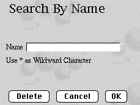

<!--REF #_command_.WEB SEND HTTP REDIRECT.Syntax-->**WEB SEND HTTP REDIRECT** ( *url* {; *} )<!-- END REF-->
<!--REF #_command_.WEB SEND HTTP REDIRECT.Params-->
| Parameter | Type |  | Description |
| --- | --- | --- | --- |
| url | Text | &#8594;  | New URL |
| * | Operator | &#8594;  | If specified = URL is not translated, If omitted = URL is translated |

<!-- END REF-->

#### Description 

<!--REF #_command_.WEB SEND HTTP REDIRECT.Summary-->The **WEB SEND HTTP REDIRECT** command allows you to transform a URL into another one.<!-- END REF--> 

The *url* parameter contains the new URL that allows you to redirect the request. If this parameter is a url to a file, it must contain the reference to this file, for example: **WEB SEND HTTP REDIRECT** ("/MyPage.HTM"). 

This command prevails over commands that send data ([WEB SEND FILE](web-send-file.md), [WEB SEND BLOB](web-send-blob.md), etc.) that may be in the same method. 

This command also allows you to redirect a request to another Web server. 

4D automatically encodes the URL’s special characters. If you pass the *\** character, 4D will not translate them.

Note that the status of the request sent by this command is **302: Moved Temporarily**. If you need a "moved permanently" status (status 301), you can set a HTTP *X-STATUS: 301* field in the header of the reply. 

#### Example 

You can use this command to execute custom requests in 4D by using static pages. Imagine that you have placed the following elements in a static HTML page:



**Note:** The POST action “/4dcgi/rech” has been associated to the text area and to the **OK** and **Cancel** buttons.

In the [QR SET DESTINATION](qr-set-destination.md), you insert the following code:

```4d
 Case of
    :($1="/4dcgi/rech") //When 4D receives this URL
  //If the OK button has been used and the ‘name’ field contains a Value
       If((bOK="OK") & (name#""))
  //Change the URL to execute the request code,
  //placed farther down in the same method
          WEB SEND HTTP REDIRECT("/4dcgi/rech?"+name)
       Else
  //Else return to the beginning page
          WEB SEND HTTP REDIRECT("/page1.htm")
       End if
       ...
    :($1="/4dcgi/rech?@") //If the URL has been redirected
       ... //Put the request code here
 End case
```


#### Properties

|  |  |
| --- | --- |
| Command number | 659 |
| Thread safe | &check; |


