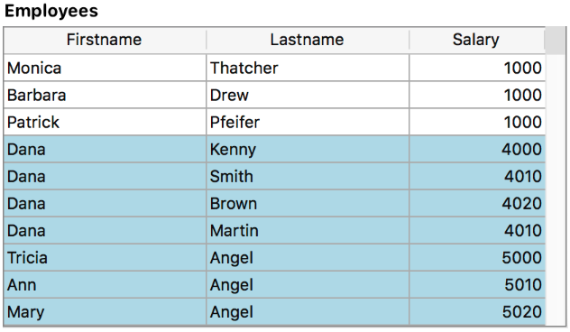

<!--REF #_command_.FORM Event.Syntax-->**FORM Event** : Object<!-- END REF-->
<!--REF #_command_.FORM Event.Params-->
| Parameter | Type |  | Description |
| --- | --- | --- | --- |
| Function result | Object | &#8592; | Event object |

<!-- END REF-->

#### Description 

<!--REF #_command_.FORM Event.Summary-->**FORM Event** returns an object containing information about the form event that has just occurred.<!-- END REF--> Usually, you will use **FORM Event** from within a form or object method.

**Returned object**

Each returned object includes the following main properties:

| **Property** | **Type** | **Description**     |
| ------------ | -------- | --------------------------------- |
| objectName   | text     | Name of the object triggering the event - Not included if the event is triggered by the form |
| code         | integer  | Numeric value of the form event.                    |
| description  | text     | Name of the form event (*e.g.* "On After Edit"). See the [**Form Events**](../Events/overview.md) section.|

For example, in the case of a click on a button, the object contains the following properties:

```json
{"code":4,"description":"On Clicked","objectName":"Button2"}
```

The event object can contain additional properties, depending on the object for which the event occurs. For *eventObj* objects generated on:

* List box or list box column objects, see the *list box documentation on developer.4d.com*.
* 4D View Pro areas, see *On VP Ready form event*.

**Note:** If there is no current event, **FORM Event** returns a null object.

#### Example 1 

You want to handle the On Clicked event on a button:

```4d
 If(FORM Event.code=On Clicked)
    ...
 End if
```

#### Example 2 

If you set the column object name with a real attribute name of a dataclass like this:


You can sort the column using the On Header Click event:

```4d
 Form.event:=FORM Event
 Case of
    :(Form event code=On Header Click)
       if(Form.event.columnName="lastname")
          Form.employees:=Form.employees.orderBy(Form.event.columnName+", firstname")
       End if
 End case
```

#### Example 3 

You want to handle the On Display Details on a list box object with a method set in the *Meta info expression* property:


The *setColor* method:

```4d
 var $event;$0;$meta : Object
 $event:=FORM Event
 $meta:=New object
 
 Case of
    :($event.code=On Display Detail)
       If($event.isRowSelected)
          $meta.fill:="lightblue"
       End if
 End case
 $0:=$meta
```

The resulting list box when rows are selected:



#### See also 

[Form Events](../Events/overview.md)
[Form event code](form-event-code.md)  

#### Properties

|  |  |
| --- | --- |
| Command number | 1606 |
| Thread safe | &check; |


