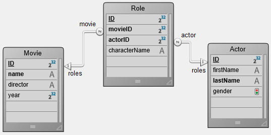

A [DataClass](ORDA/dsMapping.md#dataclass) provides an object interface to a database table. All dataclasses in a 4D application are available as a property of the `ds` [datastore](ORDA/dsMapping.md#datastore).

### Summary

||
|---|
|[<!-- INCLUDE DataClassClass.attributeName.Syntax -->](#attributename)&nbsp;&nbsp;&nbsp;&nbsp;<!-- INCLUDE DataClassClass.attributeName.Summary --> |
|[<!-- INCLUDE #DataClassClass.all().Syntax -->](#all)&nbsp;&nbsp;&nbsp;&nbsp;<!-- INCLUDE #DataClassClass.all().Summary -->|
|[<!-- INCLUDE #DataClassClass.clearRemoteCache().Syntax -->](#clearremotecache)&nbsp;&nbsp;&nbsp;&nbsp;<!-- INCLUDE #DataClassClass.clearRemoteCache().Summary -->|
|[<!-- INCLUDE #DataClassClass.fromCollection().Syntax -->](#fromcollection)&nbsp;&nbsp;&nbsp;&nbsp;<!-- INCLUDE #DataClassClass.fromCollection().Summary --> |
|[<!-- INCLUDE #DataClassClass.get().Syntax -->](#get)&nbsp;&nbsp;&nbsp;&nbsp;<!-- INCLUDE #DataClassClass.get().Summary --> |
|[<!-- INCLUDE #DataClassClass.getCount().Syntax -->](#getcount)&nbsp;&nbsp;&nbsp;&nbsp;<!-- INCLUDE #DataClassClass.getCount().Summary --> |
|[<!-- INCLUDE #DataClassClass.getDataStore().Syntax -->](#getdatastore)&nbsp;&nbsp;&nbsp;&nbsp;<!-- INCLUDE #DataClassClass.getDataStore().Summary --> |
|[<!-- INCLUDE #DataClassClass.getInfo().Syntax -->](#getinfo)&nbsp;&nbsp;&nbsp;&nbsp;<!-- INCLUDE #DataClassClass.getInfo().Summary --> |
|[<!-- INCLUDE #DataClassClass.getRemoteCache().Syntax -->](#getremotecache)&nbsp;&nbsp;&nbsp;&nbsp;<!-- INCLUDE #DataClassClass.getRemoteCache().Summary --> |
|[<!-- INCLUDE #DataClassClass.new().Syntax -->](#new)&nbsp;&nbsp;&nbsp;&nbsp;<!-- INCLUDE #DataClassClass.new().Summary --> |
|[<!-- INCLUDE #DataClassClass.newSelection().Syntax -->](#newselection)&nbsp;&nbsp;&nbsp;&nbsp;<!-- INCLUDE #DataClassClass.newSelection().Summary --> |
|[<!-- INCLUDE #DataClassClass.query().Syntax -->](#query)&nbsp;&nbsp;&nbsp;&nbsp;<!-- INCLUDE #DataClassClass.query().Summary --> |
|[<!-- INCLUDE #DataClassClass.setRemoteCacheSettings().Syntax -->](#setremotecachesettings)&nbsp;&nbsp;&nbsp;&nbsp;<!-- INCLUDE #DataClassClass.setRemoteCacheSettings().Summary --> |

<!-- REF DataClassClass.attributeName.Desc -->
## .*attributeName*

<details><summary>History</summary>

|Release|Changes|
|---|---|
|19 R3|Added .exposed attribute|
|17|Added|

</details>

<!-- REF DataClassClass.attributeName.Syntax -->***.attributeName*** : object<!-- END REF -->

#### Description

The attributes of dataclasses are <!-- REF DataClassClass.attributeName.Summary -->objects that are available directly as properties<!-- END REF --> of these classes.

The returned objects have properties that you can read to get information about your dataclass attributes.

>Dataclass attribute objects can be modified, but the underlying database structure will not be altered.


#### Returned object

Returned attribute objects contain the following properties:

|Property|Type|Description|
|---|---|---|
|autoFilled|Boolean|True if the attribute value is automatically filled by 4D. Corresponds to the following 4D field properties: "Autoincrement" for numeric type fields and "Auto UUID" for UUID (alpha) fields. Not returned if `.kind` = "relatedEntity" or "relatedEntities". |
|exposed|Boolean|True if the attribute is exposed in REST|
|fieldNumber|integer|Internal 4D field number of the attribute. Not returned if `.kind` = "relatedEntity" or "relatedEntities". |
|fieldType|Integer|4D database field type of the attribute. Depends on the attribute `kind`. Possible values: <li>if `.kind` = "storage": corresponding 4D field type, see [`Value type`](https://doc.4d.com/4dv20/help/command/en/page1509.html)</li><li>if `.kind` = "relatedEntity": 38 (`is object`)</li><li>if `.kind` = "relatedEntities": 42 (`is collection`)</li><li>if `.kind` = "calculated" or "alias" = same as above, depending on the resulting value (field type, relatedEntity or relatedEntities)</li>|
|indexed|Boolean|True if there is a B-tree or a Cluster B-tree index on the attribute. Not returned if `.kind` = "relatedEntity" or "relatedEntities". |
|inverseName|Text|Name of the attribute which is at the other side of the relation. Returned only when `.kind` = "relatedEntity" or "relatedEntities".|
|keywordIndexed|Boolean|True if there is a keyword index on the attribute. Not returned if `.kind` = "relatedEntity" or "relatedEntities". |
|kind|Text|Category of the attribute. Possible values:<li>"storage": storage (or scalar) attribute, i.e. attribute storing a value, not a reference to another attribute</li><li>"calculated": computed attribute, i.e. defined through a [`get` function](../ORDA/ordaClasses.md#function-get-attributename)</li><li>"alias": attribute built upon [another attribute](../ORDA/ordaClasses.md#alias-attributes-1)</li><li>"relatedEntity": N -> 1 relation attribute (reference to an entity)</li><li>"relatedEntities": 1 -> N relation attribute (reference to an entity selection)</li>|
|mandatory|Boolean|True if null value input is rejected for the attribute. Not returned if `.kind` = "relatedEntity" or "relatedEntities". Note: This property corresponds to the "Reject NULL value input" field property at the 4D database level. It is unrelated to the existing "Mandatory" property which is a data entry control option for a table.|
|name|Text|Name of the attribute as string|
|path|Text|Path of [an alias attribute](../ORDA/ordaClasses.md#alias-attributes-1) based upon a relation|
|readOnly|Boolean|True if the attribute is read-only. For example, computed attributes without [`set` function](../ORDA/ordaClasses.md#function-set-attributename) are read-only.|
|relatedDataClass|Text|Name of the dataclass related to the attribute. Returned only when `.kind` = "relatedEntity" or "relatedEntities".|
|type|Text|Conceptual value type of the attribute, useful for generic programming. Depends on the attribute `kind`. Possible values: <li>if `.kind` = "storage": "blob", "bool", "date", "image", "number", "object", or "string". "number" is returned for any numeric types including duration; "string" is returned for uuid, alpha and text attribute types; "blob" attributes are [blob objects](../Concepts/dt_blob.md#blob-type).</li><li>if `.kind` = "relatedEntity": related dataClass name</li><li>if `.kind` = "relatedEntities": related dataClass name + "Selection" suffix</li><li>if `.kind` = "calculated" or "alias": same as above, depending on the result</li>|
|unique|Boolean|True if the attribute value must be unique. Not returned if `.kind` = "relatedEntity" or "relatedEntities".|

:::tip

For generic programming, use `Bool(attributeName.property)`, `Num(attributeName.property)` or `String(attributeName.property)` (depending on the property type) to get a valid value even if the property is not returned.

:::

#### Example 1

```4d
$salary:=ds.Employee.salary //returns the salary attribute in the Employee dataclass
$compCity:=ds.Company["city"] //returns the city attribute in the Company dataclass
```

#### Example 2

Considering the following database structure:


```4d
var $firstnameAtt;$employerAtt;$employeesAtt : Object

 $firstnameAtt:=ds.Employee.firstname
  //{name:firstname,kind:storage,fieldType:0,type:string,fieldNumber:2,indexed:true,
  //keyWordIndexed:false,autoFilled:false,mandatory:false,unique:false}

 $employerAtt:=ds.Employee.employer
  //{name:employer,kind:relatedEntity,relatedDataClass:Company,
  //fieldType:38,type:Company,inverseName:employees}
  //38=Is object

 $employeesAtt:=ds.Company.employees
  //{name:employees,kind:relatedEntities,relatedDataClass:Employee,
  //fieldType:42,type:EmployeeSelection,inverseName:employer}
  //42=Is collection
```

#### Example 3

Considering the following table properties:


```4d
 var $sequenceNumberAtt : Object
 $sequenceNumberAtt=ds.Employee.sequenceNumber
  //{name:sequenceNumber,kind:storage,fieldType:0,type:string,fieldNumber:13,
  //indexed:true,keyWordIndexed:false,autoFilled:true,mandatory:false,unique:true}
```

<!-- END REF -->

<!-- REF DataClassClass.all().Desc -->
## .all()

<details><summary>History</summary>

|Release|Changes|
|---|---|
|17 R5|Support of the *settings* parameter|
|17|Added|

</details>

<!-- REF #DataClassClass.all().Syntax -->**.all** ( { *settings* : Object } ) : 4D.EntitySelection<!-- END REF -->


<!-- REF #DataClassClass.all().Params -->
|Parameter|Type||Description|
|---------|--- |:---:|------|
|settings|Object|->|Build option: context|
|Result|4D.EntitySelection|<-|References on all entities related to the Dataclass|<!-- END REF -->

#### Description

The `.all()` function <!-- REF #DataClassClass.all().Summary -->queries the datastore to find all the entities related to the dataclass and returns them as an entity selection<!-- END REF -->.

The entities are returned in the default order, which is initially the order in which they were created. Note however that, if entities have been deleted and new ones added, the default order does not reflect the creation order anymore.

If no corresponding entity is found, an empty entity selection is returned.

Lazy loading is applied.

**settings**

In the optional *settings* parameter, you can pass an object containing additional options. The following property is supported:

|Property| Type| Description|
|---|---|---|
|context|Text|Label for the optimization context applied to the entity selection. This context will be used by the code that handles the entity selection so that it can benefit from the optimization. This feature is [designed for ORDA client/server processing](ORDA/entities.md#client-server-optimization).|

> To know the total number of entities in a dataclass, it is recommended to use the [`getCount()`](#getcount) function which is more optimized than the `ds.myClass.all().length` expression.

#### Example

```4d
 var $allEmp : cs.EmployeeSelection
 $allEmp:=ds.Employee.all()
```

<!-- REF #DataClassClass.clearRemoteCache().Desc -->
## .clearRemoteCache()

<details><summary>History</summary>

|Release|Changes|
|---|---|
|19 R5|Added|

</details>

<!-- REF #DataClassClass.clearRemoteCache().Syntax -->**.clearRemoteCache()**<!-- END REF -->


<!-- REF #DataStoreClass.clearRemoteCache().Params -->
|Parameter|Type||Description|
|---------|--- |:---:|------|
||||Does not require any parameters|<!-- END REF -->

#### Description

The `.clearRemoteCache()` function <!-- REF #DataClassClass.clearRemoteCache().Summary -->empties the ORDA cache of a dataclass<!-- END REF -->.

> This function does not reset the `timeout` and `maxEntries` values.

#### Example

```4d
var $ds : 4D.DataStoreImplementation
var $persons : cs.PersonsSelection
var $p : cs.PersonsEntity
var $cache : Object
var $info : Collection
var $text : Text

$ds:=Open datastore(New object("hostname"; "www.myserver.com"); "myDS")

$persons:=$ds.Persons.all()
$text:=""
For each ($p; $persons)
    $text:=$p.firstname+" lives in "+$p.address.city+" / "
End for each

$cache:=$ds.Persons.getRemoteCache()

$ds.Persons.clearRemoteCache()
// Cache of the Persons dataclass = {timeout:30;maxEntries:30000;stamp:255;entries:[]}
```

<!-- END REF -->

<!-- REF DataClassClass.fromCollection().Desc -->
## .fromCollection()

<details><summary>History</summary>

|Release|Changes|
|---|---|
|17 R5|Support of the *settings* parameter|
|17|Added|

</details>

<!-- REF #DataClassClass.fromCollection().Syntax -->**.fromCollection**( *objectCol* : Collection { ; *settings* : Object } ) : 4D.EntitySelection<!-- END REF -->


<!-- REF #DataClassClass.fromCollection().Params -->
|Parameter|Type||Description|
|---------|--- |:---:|------|
|objectCol |Collection|->|Collection of objects to be mapped with entities|
|settings  |Object|->|Build option: context|
|Result|4D.EntitySelection|<-|Entity selection filled from the collection|<!-- END REF -->

#### Description

The `.fromCollection()` function <!-- REF #DataClassClass.fromCollection().Summary -->updates or creates entities in the dataclass according to the *objectCol* collection of objects, and returns the corresponding entity selection<!-- END REF -->.  

In the *objectCol* parameter, pass a collection of objects to create new or update existing entities of the dataclass. The property names must be the same as attribute names in the dataclass. If a property name does not exist in the dataclass, it is ignored. If an attribute value is not defined in the collection, its value is null.

The mapping between the objects of the collection and the entities is done on the **attribute names** and **matching types**. If an object's property has the same name as an entity's attribute but their types do not match, the entity's attribute is not filled.

**Create or update mode**

For each object of *objectCol*:

* If the object contains a boolean property "\_\_NEW" set to false (or does not contain a boolean "\_\_NEW" property), the entity is updated or created with the corresponding values of the properties from the object. No check is performed in regards to the primary key:
  * If the primary key is given and exists, the entity is updated. In this case, the primary key can be given as is or with a "\_\_KEY" property (filled with the primary key value).
  * If the primary key is given (as is) and does not exist, the entity is created
  * If the primary key is not given, the entity is created and the primary key value is assigned with respect to standard database rules.
* If the object contains a boolean property "\_\_NEW" set to **true**, the entity is created with the corresponding values of the attributes from the object. A check is performed in regards to the primary key:
  * If the primary key is given (as is) and exists, an error is sent
  * If the primary key is given (as is) and does not exist, the entity is created
  * If the primary is not given, the entity is created and the primary key value is assigned with respect to standard database rules.

 >The "\_\_KEY" property containing a value is taken into account only when the "\_\_NEW" property is set to **false** (or is omitted) and a corresponding entity exists. In all other cases, the "\_\_KEY" property value is ignored, primary key value must be passed "as is".

**Related entities**

The objects of *objectCol* may contain one or more nested object(s) featuring one or more related entities, which can be useful to create or update links between entities.

The nested objects featuring related entities must contain a "\_\_KEY" property (filled with the primary key value of the related entity) or the primary key attribute of the related entity itself. The use of a \_\_KEY property allows independence from the primary key attribute name.

>The content of the related entities cannot be created / updated through this mechanism.

**Stamp**

If a \_\_STAMP attribute is given, a check is performed with the stamp in the datastore and an error can be returned ("Given stamp does not match current one for record# XX of table XXXX"). For more information, see [Entity locking](ORDA/entities.md#entity-locking).

**settings**  

In the optional *settings* parameter, you can pass an object containing additional options. The following property is supported:

|Property |Type| Description|
|---|---|---|
|context|Text|Label for the optimization context applied to the entity selection. This context will be used by the code that handles the entity selection so that it can benefit from the optimization. This feature is [designed for ORDA client/server processing](ORDA/entities.md#client-server-optimization).|

#### Example 1

We want to update an existing entity. The \_\_NEW property is not given, the employee primary key is given and exists:

```4d
 var $empsCollection : Collection
 var $emp : Object
 var $employees : cs.EmployeeSelection

 $empsCollection:=New collection
 $emp:=New object
 $emp.ID:=668 //Existing PK in Employee table
 $emp.firstName:="Arthur"
 $emp.lastName:="Martin"
 $emp.employer:=New object("ID";121) //Existing PK in the related dataClass Company
  // For this employee, we can change the Company by using another existing PK in the related dataClass Company
 $empsCollection.push($emp)
 $employees:=ds.Employee.fromCollection($empsCollection)
```

#### Example 2

We want to update an existing entity. The \_\_NEW property is not given, the employee primary key is with the \_\_KEY attribute and exists:

```4d
 var $empsCollection : Collection
 var $emp : Object
 var $employees : cs.EmployeeSelection

 $empsCollection:=New collection
 $emp:=New object
 $emp.__KEY:=1720 //Existing PK in Employee table
 $emp.firstName:="John"
 $emp.lastName:="Boorman"
 $emp.employer:=New object("ID";121) //Existing PK in the related dataClass Company
  // For this employee, we can change the Company by using another existing PK in the related dataClass Company
 $empsCollection.push($emp)
 $employees:=ds.Employee.fromCollection($empsCollection)
```

#### Example 3

We want to simply create a new entity from a collection:

```4d
 var $empsCollection : Collection
 var $emp : Object
 var $employees : cs.EmployeeSelection

 $empsCollection:=New collection
 $emp:=New object
 $emp.firstName:="Victor"
 $emp.lastName:="Hugo"
 $empsCollection.push($emp)
 $employees:=ds.Employee.fromCollection($empsCollection)
```

#### Example 4

We want to create an entity. The \_\_NEW property is True, the employee primary key is not given:

```4d
 var $empsCollection : Collection
 var $emp : Object
 var $employees : cs.EmployeeSelection

 $empsCollection:=New collection
 $emp:=New object
 $emp.firstName:="Mary"
 $emp.lastName:="Smith"
 $emp.employer:=New object("__KEY";121) //Existing PK in the related dataClass Company
 $emp.__NEW:=True
 $empsCollection.push($emp)
 $employees:=ds.Employee.fromCollection($empsCollection)


```

#### Example 5

We want to create an entity. The \_\_NEW property is omitted, the employee primary key is given and does not exist:

```4d
 var $empsCollection : Collection
 var $emp : Object
 var $employees : cs.EmployeeSelection

 $empsCollection:=New collection
 $emp:=New object
 $emp.ID:=10000 //Unexisting primary key
 $emp.firstName:="Françoise"
 $emp.lastName:="Sagan"
 $empsCollection.push($emp)
 $employees:=ds.Employee.fromCollection($empsCollection)
```

#### Example 6

In this example, the first entity will be created and saved but the second will fail since they both use the same primary key:

```4d
 var $empsCollection : Collection
 var $emp; $emp2 : Object
 var $employees : cs.EmployeeSelection

 $empsCollection:=New collection
 $emp:=New object
 $emp.ID:=10001 // Unexisting primary key
 $emp.firstName:="Simone"
 $emp.lastName:="Martin"
 $emp.__NEW:=True
 $empsCollection.push($emp)

 $emp2:=New object
 $emp2.ID:=10001 // Same primary key, already existing
 $emp2.firstName:="Marc"
 $emp2.lastName:="Smith"
 $emp2.__NEW:=True
 $empsCollection.push($emp2)
 $employees:=ds.Employee.fromCollection($empsCollection)
  //first entity is created
  //duplicated key error for the second entity
```

#### See also

[**.toCollection()**](EntitySelectionClass.md#tocollection)

<!-- END REF -->

<!-- REF DataClassClass.get().Desc -->
## .get()

<details><summary>History</summary>

|Release|Changes|
|---|---|
|17|Added|

</details>

<!-- REF #DataClassClass.get().Syntax -->**.get**( *primaryKey* : Integer { ; *settings* : Object } ) : 4D.Entity<br/>**.get**( *primaryKey* : Text { ; *settings* : Object } ) : 4D.Entity<!-- END REF -->


<!-- REF #DataClassClass.get().Params -->
|Parameter|Type||Description|
|---------|--- |:---:|------|
|primaryKey |Integer OR Text|->|Primary key value of the entity to retrieve|
|settings  |Object|->|Build option: context|
|Result|4D.Entity|<-|Entity matching the designated primary key|<!-- END REF -->

#### Description

The `.get()` function <!-- REF #DataClassClass.get().Summary -->queries the dataclass to retrieve the entity matching the *primaryKey* parameter<!-- END REF -->.

In *primaryKey*, pass the primary key value of the entity to retrieve. The value type must match the primary key type set in the datastore (Integer or Text). You can also make sure that the primary key value is always returned as Text by using the [`.getKey()`](EntityClass.md#getkey) function with the `dk key as string` parameter.

If no entity is found with *primaryKey*, a **Null** entity is returned.

Lazy loading is applied, which means that related data is loaded from disk only when it is required.

**settings**

In the optional *settings* parameter, you can pass an object containing additional options. The following property is supported:

|Property| Type| Description|
|---|---|---|
|context| Text| Label for the automatic optimization context applied to the entity. This context will be used by the subsequent code that loads the entity so that it can benefit from the optimization. This feature is [designed for ORDA client/server processing](ORDA/entities.md#client-server-optimization).|

:::info

When you call the `.get()` function **without** *settings* parameter, a request for attribute values is directly sent to the server (the [ORDA cache](../ORDA/entities.md#orda-cache) is not used). On the other hand, when you call the `.get()` function **with** a `context` passed in the *settings* parameter, attribute values are retrieved from the ORDA cache corresponding to the context. It may be advisable in this case to call [`reload()`](EntityClass.md#reload) to make sure the most recent data is retrieved from the server.

:::


#### Example 1  

```4d
 var $entity : cs.EmployeeEntity  
 var $entity2 : cs.InvoiceEntity
 $entity:=ds.Employee.get(167) // return the entity whose primary key value is 167
 $entity2:=ds.Invoice.get("DGGX20030") // return the entity whose primary key value is "DGGX20030"
```

#### Example 2  

This example illustrates the use of the *context* property:

```4d
 var $e1; $e2; $e3; $e4 : cs.EmployeeEntity
 var $settings; $settings2 : Object

 $settings:=New object("context";"detail")
 $settings2:=New object("context";"summary")

 $e1:=ds.Employee.get(1;$settings)
 completeAllData($e1) // In completeAllData method, an optimization is triggered and associated to context "detail"

 $e2:=ds.Employee.get(2;$settings)
 completeAllData($e2) // In completeAllData method, the optimization associated to context "detail" is applied

 $e3:=ds.Employee.get(3;$settings2)
 completeSummary($e3) //In completeSummary method, an optimization is triggered and associated to context "summary"

 $e4:=ds.Employee.get(4;$settings2)
 completeSummary($e4) //In completeSummary method, the optimization associated to context "summary" is applied
```

<!-- END REF -->

<!-- REF DataClassClass.getCount.Desc -->
## .getCount()

<details><summary>History</summary>

|Release|Changes|
|---|---|
|19 R5|Added|

</details>

<!-- REF #DataClassClass.getCount().Syntax -->**.getCount()** : Integer <!-- END REF -->


<!-- REF #DataClassClass.getCount().Params -->
|Parameter|Type||Description|
|---|---|---|---|
|result|Integer|<-|Number of entities in the dataclass|<!-- END REF -->

#### Description

The `.getCount()` function <!-- REF #DataClassClass.getCount().Summary --> returns the number of entities in a dataclass<!-- END REF -->.

If this function is used within a transaction, entities created during the transaction will be taken into account.

#### Example

```4d
var $ds : 4D.DataStoreImplementation
var $number : Integer

$ds:=Open datastore(New object("hostname"; "www.myserver.com"); "myDS")

$number:=$ds.Persons.getCount()
```

<!-- END REF -->

<!-- REF DataClassClass.getDataStore().Desc -->
## .getDataStore()

<details><summary>History</summary>

|Release|Changes|
|---|---|
|17 R5|Added|

</details>

<!-- REF #DataClassClass.getDataStore().Syntax -->**.getDataStore()** : cs.DataStore<!-- END REF -->


<!-- REF #DataClassClass.getDataStore().Params -->
|Parameter|Type||Description|
|---------|--- |:---:|------|
|Result|cs.DataStore|<-|Datastore of the dataclass|<!-- END REF -->

#### Description

The `.getDataStore()` function <!-- REF #DataClassClass.getDataStore().Summary -->returns the datastore for the specified dataclass<!-- END REF -->.

The datastore can be:

* the main datastore, as returned by the `ds` command.
* a remote datastore, opened using the `Open datastore` command.

#### Example

The ***SearchDuplicate*** project method searches for duplicated values in any dataclass.

```4d
 var $pet : cs.CatsEntity
 $pet:=ds.Cats.all().first() //get an entity
 SearchDuplicate($pet;"Dogs")
```

```4d
  // SearchDuplicate method
  // SearchDuplicate(entity_to_search;dataclass_name)

 #DECLARE ($pet : Object ; $dataClassName : Text)
 var $dataStore; $duplicates : Object  

 $dataStore:=$pet.getDataClass().getDataStore()
 $duplicates:=$dataStore[$dataClassName].query("name=:1";$pet.name)
```

<!-- END REF -->

<!-- REF DataClassClass.getInfo().Desc -->
## .getInfo()

<details><summary>History</summary>

|Release|Changes|
|---|---|
|19 R3|Added exposed property|
|17 R5|Added|

</details>

<!-- REF #DataClassClass.getInfo().Syntax -->**.getInfo()** : Object <!-- END REF -->


<!-- REF #DataClassClass.getInfo().Params -->
|Parameter|Type||Description|
|---|---|---|---|
|Result|Object|<-|Information on the dataclass|<!-- END REF -->

#### Description

The `.getInfo()` function <!-- REF #DataClassClass.getInfo().Summary -->returns an object providing information about the dataclass<!-- END REF -->. This function is useful for setting up generic code.

**Returned object**

|Property| Type| Description|
|---|---|---|
|exposed|Boolean|True if the dataclass is exposed in REST|
|name| Text |Name of the dataclass|
|primaryKey |Text| Name of the primary key of the dataclass|
|tableNumber|Integer| Internal 4D table number|

#### Example 1

```4d
 #DECLARE ($entity : Object)  
 var $status : Object

 computeEmployeeNumber($entity) //do some actions on entity

 $status:=$entity.save()
 if($status.success)
    ALERT("Record updated in table "+$entity.getDataClass().getInfo().name)
 End if
```

#### Example 2  

```4d
 var $settings : Object
 var $es : cs.ClientsSelection

 $settings:=New object
 $settings.parameters:=New object("receivedIds";getIds())
 $settings.attributes:=New object("pk";ds.Clients.getInfo().primaryKey)
 $es:=ds.Clients.query(":pk in :receivedIds";$settings)
```

#### Example 3

```4d
 var $pk : Text
 var $dataClassAttribute : Object

 $pk:=ds.Employee.getInfo().primaryKey
 $dataClassAttribute:=ds.Employee[$pk] // If needed the attribute matching the primary key is accessible
```


<!-- END REF -->

<!-- REF DataClassClass.getRemoteCache().Desc -->
## .getRemoteCache()

<details><summary>History</summary>

|Release|Changes|
|---|---|
|19 R5|Added|

</details>

<!-- REF #DataClassClass.getRemoteCache().Syntax -->**.getRemoteCache**() : Object <!-- END REF -->


<!-- REF #DataClassClass.getRemoteCache().Params -->
|Parameter|Type||Description|
|---|---|---|---|
|result|Object|<-|Object describing the contents of the ORDA cache for the dataclass.|<!-- END REF -->


> **Advanced mode:** This function is intended for developers who need to customize ORDA default features for specific configurations. In most cases, you will not need to use it.


#### Description

The `.getRemoteCache()` function <!-- REF #DataClassClass.getRemoteCache().Summary -->returns an object that holds the contents of the ORDA cache for a dataclass.<!-- END REF -->.

Calling this function from a 4D single-user application returns `Null`.

The returned object has the following properties:

|Property|Type|Description|
|---|---|---|
|maxEntries|Integer|Maximum number of entries collection.|
|stamp|Integer|Stamp of the cache.|
|timeout|Integer|Time remaining before the new entries in the cache are marked as expired.|
|entries|Collection|Contains an entry object for each entity in the cache.|

Each entry object in the `entries` collection has the following properties:

|Property|Type|Description|
|---|---|---|
|data|Object|Object holding data on the entry.|
|expired|Boolean|True if the entry has expired.|
|key|Text|Primary key of the entity.|

The `data` object in each entry contains the following properties:

|Property|Type|Description|
|---|---|---|
|__KEY|Text|Primary key of the entity|
|__STAMP|Integer|Timestamp of the entity in the database|
|__TIMESTAMP|Text|Stamp of the entity in the database (format is YYYY-MM-DDTHH:MM:SS:ms:Z)|
|dataClassAttributeName|Variant|If there is data in the cache for a dataclass attribute, it is returned in a property with the same type as in the database.|

Data concerning related entities is stored in the cache of the data object.

#### Example

In the following example, `$ds.Persons.all()` loads the first entity with all its attributes. Then, the request optimization is triggered, so only `firstname` and `address.city` are loaded.

Note that `address.city` is loaded in the cache of the `Persons` dataclass.

Only the first entity of the `Address` dataclass is stored in the cache. It is loaded during the first iteration of the loop.

```4d
var $ds : 4D.DataStoreImplementation
var $persons : cs.PersonsSelection
var $p : cs.PersonsEntity
var $cachePersons; $cacheAddress : Object
var $text : Text

$ds:=Open datastore(New object("hostname"; "www.myserver.com"); "myDS")

$persons:=$ds.Persons.all()

$text:=""
For each ($p; $persons)
    $text:=$p.firstname+" lives in "+$p.address.city+" / "
End for each

$cachePersons:=$ds.Persons.getRemoteCache()
$cacheAddress:=$ds.Adress.getRemoteCache()
```

#### See also

[.setRemoteCacheSettings()](#setremotecachesettings)<br/>[.clearRemoteCache()](#clearremotecache)

<!-- REF DataClassClass.new().Desc -->
## .new()

<details><summary>History</summary>

|Release|Changes|
|---|---|
|17|Added|

</details>

<!-- REF #DataClassClass.new().Syntax -->**.new()** : 4D.Entity <!-- END REF -->


<!-- REF #DataClassClass.new().Params -->
|Parameter|Type||Description|
|---|---|---|---|
|Result|4D.Entity|<-|New entity matching the Dataclass|<!-- END REF -->

#### Description

The `.new()` function <!-- REF #DataClassClass.new().Summary -->creates in memory and returns a new blank entity related to the Dataclass<!-- END REF -->.

The entity object is created in memory and is not saved in the database until the [`.save( )`](EntityClass.md#save) function is called. If the entity is deleted before being saved, it cannot be recovered.

**4D Server**: In client-server, if the primary key of the corresponding table is auto-incremented, it will be calculated when the entity is saved on the server.

All attributes of the entity are initialized with the **null** value.

> Attributes can be initialized with default values if the **Map NULL values to blank values** option is selected at the 4D database structure level.

#### Example

This example creates a new entity in the "Log" Dataclass and records information in the "info" attribute:

```4d
 var $entity : cs.LogEntity
 $entity:=ds.Log.new() //create a reference
 $entity.info:="New entry" //store some information
 $entity.save() //save the entity
```

<!-- END REF -->

<!-- REF DataClassClass.newSelection().Desc -->
## .newSelection()

<details><summary>History</summary>

|Release|Changes|
|---|---|
|17|Added|

</details>

<!-- REF #DataClassClass.newSelection().Syntax -->**.newSelection**( { *keepOrder* : Integer } ) : 4D.EntitySelection <!-- END REF -->


<!-- REF #DataClassClass.newSelection().Params -->
|Parameter|Type||Description|
|---|---|---|---|
|keepOrder |Integer |-> |`dk keep ordered`: creates an ordered entity selection,<br/>`dk non ordered`: creates an unordered entity selection (default if omitted) |
|Result|4D.EntitySelection|<-|New blank entity selection related to the dataclass|<!-- END REF -->

#### Description

The `.newSelection()` function <!-- REF #DataClassClass.newSelection().Summary -->creates a new, blank, non-shareable entity selection, related to the dataclass, in memory<!-- END REF -->.

> For information on non-shareable entity selections, please refer to [this section](ORDA/entities.md#shareable-or-non-shareable-entity-selections).

If you want to create an ordered entity selection, pass the `dk keep ordered` selector in the *keepOrder* parameter. By default if you omit this parameter, or if you pass the `dk non ordered` selector, the method creates an unordered entity selection. Unordered entity selections are faster but you cannot rely on entity positions. For more information, please see [Ordered vs Unordered entity selections](ORDA/dsMapping.md#ordered-or-unordered-entity-selection).

When created, the entity selection does not contain any entities (`mySelection.length` returns 0). This method lets you build entity selections gradually by making subsequent calls to the [`add()`](EntitySelectionClass.md#add) function.

#### Example

```4d
 var $USelection; $OSelection : cs.EmployeeSelection
 $USelection:=ds.Employee.newSelection() //create an unordered empty entity selection
 $OSelection:=ds.Employee.newSelection(dk keep ordered) //create an ordered empty entity selection
```

<!-- END REF -->

<!-- REF DataClassClass.query().Desc -->
## .query()

<details><summary>History</summary>

|Release|Changes|
|---|---|
|17 R6|Support of Formula parameters|
|17 R5|Support of placeholders for values|
|17|Added|

</details>

<!-- REF #DataClassClass.query().Syntax -->**.query**( *queryString* : Text { ; *...value* : any } { ; *querySettings* : Object } ) : 4D.EntitySelection <br/>**.query**( *formula* : Object { ; *querySettings* : Object } ) : 4D.EntitySelection <!-- END REF -->


<!-- REF #DataClassClass.query().Params -->
|Parameter|Type||Description|
|---|---|---|---|
|queryString |Text |-> |Search criteria as string|
|formula |Object |-> |Search criteria as formula object|
|value|any|->|Value(s) to use for indexed placeholder(s)|
|querySettings|Object|->|Query options: parameters, attributes, args, allowFormulas, context, queryPath, queryPlan|
|Result|4D.EntitySelection|<-|New entity selection made up of entities from dataclass meeting the search criteria specified in *queryString* or *formula*|<!-- END REF -->

#### Description

The `.query()` function <!-- REF #DataClassClass.query().Summary -->searches for entities that meet the search criteria specified in *queryString* or *formula* and (optionally) *value*(s)<!-- END REF -->, for all the entities in the dataclass, and returns a new object of type `EntitySelection` containing all the entities that are found. Lazy loading is applied.

If no matching entities are found, an empty `EntitySelection` is returned.

#### queryString parameter

The *queryString* parameter uses the following syntax:

```4d
attributePath|formula comparator value   
 {logicalOperator attributePath|formula comparator value}   
 {order by attributePath {desc | asc}}
```

where:

* **attributePath**: path of attribute on which you want to execute the query. This parameter can be a simple name (for example "country") or any valid attribute path (for example "country.name".) In case of an attribute path whose type is `Collection`, `[]` notation is used to handle all the occurences (for example `children[].age`).

 >*You cannot use directly attributes whose name contains special characters such as ".", "\[ ]", or "=", ">", "#"..., because they will be incorrectly evaluated in the query string. If you need to query on such attributes, you must consider using placeholders, which allow an extended range of characters in attribute paths (see* **Using placeholders** *below).*

* **formula**: a valid formula passed as `Text` or `Object`. The formula will be evaluated for each processed entity and must return a boolean value. Within the formula, the entity is available through the `This` object.  

  * **Text**: the formula string must be preceeded by the `eval( )` statement, so that the query parser evaluates the expression correctly. For example: *"eval(length(This.lastname) >=30)"*
  * **Object**: the [formula object](FunctionClass.md) is passed as a **placeholder** (see below). The formula must have been created using the [`Formula`](FunctionClass.md#formula) or [`Formula from string`](FunctionClass.md#formula-from-string) command.

 >* Keep in mind that 4D formulas only support `&` and `|` symbols as logical operators.
 >* If the formula is not the only search criteria, the query engine optimizer could prior process other criteria (e.g. indexed attributes) and thus, the formula could be evaluated for only a subset of entities.

 Formulas in queries can receive parameters through $1. This point is detailed in the **formula parameter** paragraph below.

 >* You can also pass directy a `formula` parameter object instead of the `queryString` parameter (recommended when formulas are more complex). See **formula parameter** paragraph below.
 >* For security reasons, formula calls within `query()` functions can be disallowed. See `querySettings` parameter description.

* **comparator**: symbol that compares *attributePath* and *value*. The following symbols are supported:

 |Comparison| Symbol(s)| Comment|
 |---|---|---|
 |Equal to |=, == |Gets matching data, supports the wildcard (@), neither case-sensitive nor diacritic.|
 ||===, IS| Gets matching data, considers the @ as a standard character, neither case-sensitive nor diacritic|
 |Not equal to| #, != |Supports the wildcard (@). Equivalent to "Not condition applied on a statement" ([see below](#not-equal-to-in-collections)).|
 ||!==, IS NOT| Considers the @ as a standard character|
 |Not condition applied on a statement| NOT| Parenthesis are mandatory when NOT is used before a statement containing several operators. Equivalent to "Not equal to" ([see below](#not-equal-to-in-collections)).|
 |Less than| <| |
 |Greater than| > ||
 |Less than or equal to| <=||
 |Greater than or equal to| >= ||
 |Included in| IN |Gets data equal to at least one of the values in a collection or in a set of values, supports the wildcard (@)|
 |Contains keyword| %| Keywords can be used in attributes of string or picture type|

* **value**: the value to compare to the current value of the property of each entity in the entity selection or element in the collection. It can be a **placeholder** (see **Using placeholders** below) or any expression matching the data type property. Note that, in case of type mismatch with scalar types (text, date, number...), 4D will try to convert the **value** type to the attribute data type whenever possible, for an easier handling of values coming from the Internet. For example, if the string "v20" is entered as **value** to compare with an integer attribute, it will be converted to 20.
When using a constant value, the following rules must be respected:
  * **text** type constant can be passed with or without simple quotes (see **Using quotes** below). To query a string within a string (a "contains" query), use the wildcard symbol (@) in value to isolate the string to be searched for as shown in this example: "@Smith@". The following keywords are forbidden for text constants: true, false.
  * **boolean** type constants: **true** or **false** (case sensitive).
  * **numeric** type constants: decimals are separated by a '.' (period).
  * **date** type constants: "YYYY-MM-DD" format
  * **null** constant: using the "null" keyword will find **null** and **undefined** properties.  
  * in case of a query with an IN comparator, *value* must be a collection, or values matching the type of the attribute path between \[ ] separated by commas (for strings, `"` characters must be escaped with `\`).
* **logicalOperator**: used to join multiple conditions in the query (optional). You can use one of the following logical operators (either the name or the symbol can be used):

 |Conjunction|Symbol(s)|
 |---|---|
 |AND|&, &&, and|
 |OR | &#124;,&#124;&#124;, or|

* **order by attributePath**: you can include an order by *attributePath* statement in the query so that the resulting data will be sorted according to that statement. You can use multiple order by statements, separated by commas (e.g., order by *attributePath1* desc, *attributePath2* asc). By default, the order is ascending. Pass 'desc' to define a descending order and 'asc' to define an ascending order.
 >If you use this statement, the returned entity selection is ordered (for more information, please refer to [Ordered vs Unordered entity selections](ORDA/dsMapping.md#ordered-or-unordered-entity-selection)).

#### Using quotes

When you use quotes within queries, you must use single quotes ' ' inside the query and double quotes " " to enclose the whole query, otherwise an error is returned. For example:

```4d
"employee.name = 'smith' AND employee.firstname = 'john'"
```

>Single quotes (') are not supported in searched values since they would break the query string. For example "comp.name = 'John's pizza' " will generate an error. If you need to search on values with single quotes, you may consider using placeholders (see below).

#### Using parenthesis

You can use parentheses in the query to give priority to the calculation. For example, you can organize a query as follows:

```4d
"(employee.age >= 30 OR employee.age <= 65) AND (employee.salary <= 10000 OR employee.status = 'Manager')"
```

#### Using placeholders

4D allows you to use placeholders for *attributePath*, *formula* and *value* arguments within the *queryString* parameter. A placeholder is a parameter that you insert in query strings and that is replaced by another value when the query string is evaluated. The value of placeholders is evaluated once at the beginning of the query; it is not evaluated for each element.

Two types of placeholders can be used: **indexed placeholders** and **named placeholders**:

| |Indexed placeholders| Named placeholders|
|---|---|---|
|Definition |Parameters are inserted as `:paramIndex` (for example :1, :2...) in *queryString* and their corresponding values are provided by the sequence of *value* parameter(s). You can use up to 128 *value* parameters| Parameters are inserted as `:paramName` (for example :myparam) and their values are provided in the attributes and/or parameters objects in the *querySettings* parameter|
|Example|`$r:=class.query(":1=:2";"city";"Chicago")`| `$o.attributes:=New object("att";"city")`<br/> `$o.parameters:=New object("name";"Chicago")`<br/> `$r:=class.query(":att=:name";$o)`|

You can mix all argument kinds in *queryString*. A *queryString* can contain, for *attributePath*, *formula* and *value* parameters:

* direct values (no placeholders),
* indexed placeholders and/or named placeholders.

Using placeholders in queries **is recommended** for the following reasons:

1. It prevents malicious code insertion: if you directly use user-filled variables within the query string, a user could modifiy the query conditions by entering additional query arguments. For example, imagine a query string like:

 ```4d
  $vquery:="status = 'public' & name = "+myname //user enters their name
  $result:=$col.query($vquery)
 ```

 This query seems secured since non-public data are filtered. However, if the user enters in the *myname* area something like *"smith OR status='private'*, the query string would be modified at the interpretation step and could return private data.

 When using placeholders, overriding security conditions is not possible:

 ```4d
  $result:=$col.query("status='public' & name=:1";myname)
 ```

 In this case if the user enters *smith OR status='private'* in the *myname* area, it will not be interpreted in the query string, but only passed as a value. Looking for a person named "smith OR status='private'" will just fail.

2. It prevents having to worry about formatting or character issues, especially when handling *attributePath* or *value* parameters that might contain non-alphanumeric characters such as ".", "['...

3. It allows the use of variables or expressions in query arguments. Examples:

 ```4d
 $result:=$col.query("address.city = :1 & name =:2";$city;$myVar+"@")
 $result2:=$col.query("company.name = :1";"John's Pizzas")
 ```

#### Looking for null values

When you look for null values, you cannot use the placeholder syntax because the query engine considers null as an unexpected comparison value. For example, if you execute the following query:

```4d
$vSingles:=ds.Person.query("spouse = :1";Null) // will NOT work
```

You will not get the expected result because the null value will be evaluated by 4D as an error resulting from the parameter evaluation (for example, an attribute coming from another query). For these kinds of queries, you must use the direct query syntax:

```4d
 $vSingles:=ds.Person.query("spouse = null") //correct syntax
```

#### Not equal to in collections

When searching within dataclass object attributes containing collections, the "not equal to *value*" comparator (`#` or `!=`) will find elements where ALL properties are different from *value* (and not those where AT LEAST one property is different from *value*, which is how work other comparators). Basically, it is equivalent to search for "Not(find collection elements where property equals *value*"). For example, with the following entities:

```
Entity 1:
ds.Class.name: "A"
ds.Class.info:
    { "coll" : [ {
                "val":1,
                "val":1
            } ] }

Entity 2:
ds.Class.name: "B"
ds.Class.info:
    { "coll" : [ {
                "val":1,
                "val":0
            } ] }

Entity 3:
ds.Class.name: "C"
ds.Class.info:
    { "coll" : [ {
                "val":0,
                "val":0
            } ] }
```

Consider the following results:

```4d
ds.Class.query("info.coll[].val = :1";0)
// returns B and C
// finds "entities with 0 in at least one val property"

ds.Class.query("info.coll[].val != :1";0)
// returns A only
// finds "entities where all val properties are different from 0"
// which is the equivalent to
ds.Class.query(not("info.coll[].val = :1";0))
```

If you want to implement a query that finds entities where "at least one property is different from *value*", you need to use a special notation using a letter in the `[]`:

```4d
ds.Class.query("info.coll[a].val != :1";0)  
// returns A and B
// finds "entities where at least one val property is different from 0"
```

You can use any letter from the alphabet as the `[a]` notation.


#### Linking collection attribute query arguments

:::info

This feature is only available in queries on dataclasses and [entity selections](EntitySelectionClass.md#query). It cannot be used in queries on [collections](CollectionClass.md#query).

:::

When searching within dataclass object attributes containing collections using multiple query arguments joined by the AND operator, you may want to make sure that only entities containing elements that match all arguments are returned, and not entities where arguments can be found in different elements. To do this, you need to link query arguments to collection elements, so that only single elements containing linked arguments are found.

For example, with the following two entities:

```
Entity 1:
ds.People.name: "martin"
ds.People.places:
    { "locations" : [ {
                "kind":"home",
                "city":"paris"
            } ] }

Entity 2:
ds.People.name: "smith"
ds.People.places:
    { "locations" : [ {
                "kind":"home",
                "city":"lyon"
            } , {
                "kind":"office",
                "city":"paris"
            } ] }
```

You want to find people with a "home" location kind in the city "paris". If you write:

```4d
ds.People.query("places.locations[].kind= :1 and places.locations[].city= :2";"home";"paris")
```

... the query will return "martin" **and** "smith" because "smith" has a "locations" element whose "kind" is "home" and a "locations" element whose "city" is "paris", even though they are different elements.

If you want to only get entities where matching arguments are in the same collection element, you need to **link arguments**. To link query arguments:

* Add a letter between the \[] in the first path to link and repeat the same letter in all linked arguments. For example: `locations[a].city and locations[a].kind`. You can use any letter of the Latin alphabet (not case sensitive).
* To add different linked criteria in the same query, use another letter. You can create up to 26 combinations of criteria in a single query.

With the above entities, if you write:

```4d
ds.People.query("places.locations[a].kind= :1 and places.locations[a].city= :2";"home";"paris")
```

... the query will only return "martin" because it has a "locations" element whose "kind" is "home" and whose "city" is "paris". The query will not return "smith" because the values "home" and "paris" are not in the same collection element.


#### Queries in many-to-many relations

ORDA offers a special syntax to facilitate queries in many-to-many relations. In this context, you may need to search for different values with an `AND` operator BUT in the same attribute. For example, take a look at the following structure:



Imagine that you want to search all movies in which *both* actor A and actor B have a role. If you write a simple query using an `AND` operator, it will not work:

```4d
// invalid code
$es:=ds.Movie.query("roles.actor.lastName = :1 AND roles.actor.lastName = :2";"Hanks";"Ryan")  
// $es is empty
```

Basically, the issue is related to the internal logic of the query: you cannot search for an attribute whose value would be both "A" and "B".

To make it possible to perform such queries, ORDA allows a special syntax: you just need to add a *class index* between **{}** in all additional relation attributes used in the string:

```4d
"relationAttribute.attribute = :1 AND relationAttribute{x}.attribute = :2 [AND relationAttribute{y}.attribute...]"
```

**{x}** tells ORDA to create another reference for the relation attribute. It will then perform all the necessary bitmap operations internally. Note that **x** can be any number **except 0**: {1}, or {2}, or {1540}... ORDA only needs a unique reference in the query for each class index.

In our example, it would be:

```4d
// valid code
$es:=ds.Movie.query("roles.actor.lastName = :1 AND roles.actor{2}.lastName = :2";"Hanks";"Ryan")  
// $es contains movies (You've Got Mail, Sleepless in Seattle, Joe Versus the Volcano)
```


#### formula parameter

As an alternative to formula insertion within the *queryString* parameter (see above), you can pass directly a formula object as a boolean search criteria. Using a formula object for queries is **recommended** since you benefit from tokenization, and code is easier to search/read.  

The formula must have been created using the [`Formula`](FunctionClass.md#formula) or [`Formula from string`](FunctionClass.md#formula-from-string) command. In this case:

* the *formula* is evaluated for each entity and must return true or false. During the execution of the query, if the formula's result is not a boolean, it is considered as false.
* within the *formula*, the entity is available through the `This` object.  
* if the `Formula` object is **null**, the error 1626 ("Expecting a text or formula") is generated, that you call intercept using a method installed with `ON ERR CALL`.

 >For security reasons, formula calls within `query()` functions can be disallowed. See *querySettings* parameter description.

#### Passing parameters to formulas

Any *formula* called by the `query()` class function can receive parameters:

* Parameters must be passed through the **args** property (object) of the *querySettings* parameter.
* The formula receives this **args** object as a **$1** parameter.

This small code shows the principles of how parameter are passed to methods:

```4d
 $settings:=New object("args";New object("exclude";"-")) //args object to pass parameters
 $es:=ds.Students.query("eval(checkName($1.exclude))";$settings) //args is received in $1
```

Additional examples are provided in example 3.

**4D Server**: In client/server, formulas are executed on the server. In this context, only the `querySettings.args` object is sent to the formulas.

#### querySettings parameter

In the *querySettings* parameter, you can pass an object containing additional options. The following properties are supported:

|Property| Type| Description|
|---|---|---|
|parameters|Object|**Named placeholders for values** used in the *queryString* or *formula*. Values are expressed as property / value pairs, where property is the placeholder name inserted for a value in the *queryString* or *formula* (":placeholder") and value is the value to compare. You can mix indexed placeholders (values directly passed in value parameters) and named placeholder values in the same query.|
|attributes|Object|**Named placeholders for attribute paths** used in the *queryString* or *formula*. Attributes are expressed as property / value pairs, where property is the placeholder name inserted for an attribute path in the *queryString* or *formula* (":placeholder"), and value can be a string or a collection of strings. Each value is a path that can designate either a scalar or a related attribute of the dataclass or a property in an object field of the dataclass<table><tr><th>Type</th><th>Description</th></tr><tr><td>String</td><td>attributePath expressed using the dot notation, e.g. "name" or "user.address.zipCode"</td></tr><tr><td>Collection of strings</td><td>Each string of the collection represents a level of attributePath, e.g. \["name"] or \["user","address","zipCode"]. Using a collection allows querying on attributes with names that are not compliant with dot notation, e.g. \["4Dv17.1","en/fr"]</td></tr></table>You can mix indexed placeholders (values directly passed in *value* parameters) and named placeholder values in the same query.|
|args|Object|Parameter(s) to pass to formulas, if any. The **args** object will be received in $1 within formulas and thus its values will be available through *$1.property* (see example 3).|
|allowFormulas| Boolean|True to allow the formula calls in the query (default). Pass false to disallow formula execution. If set to false and `query()` is given a formula, an error is sent (1278 - Formula not allowed in this member method).|
|context|Text|Label for the automatic optimization context applied to the entity selection. This context will be used by the code that handles the entity selection so that it can benefit from the optimization. This feature is designed for client/server processing; for more information, please refer to the [**Client/server optimization**](../ORDA/remoteDatastores.md#context) section.|
|queryPlan| Boolean |In the resulting entity selection, returns or does not return the detailed description of the query just before it is executed, i.e. the planned query. The returned property is an object that includes each planned query and subquery (in the case of a complex query). This option is useful during the development phase of an application. It is usually used in conjunction with queryPath. Default if omitted: false. **Note**: This property is supported only by the `entitySelection.query()` and `dataClass.query()` functions.|
|queryPath|Boolean| In the resulting entity selection, returns or does not return the detailed description of the query as it is actually performed. The returned property is an object that contains the actual path used for the query (usually identical to that of the queryPlan, but may differ if the engine manages to optimize the query), as well as the processing time and the number of records found. This option is useful during the development phase of an application. Default if omitted: false. **Note**: This property is supported only by the `entitySelection.query()` and `dataClass.query()` functions.|

#### About queryPlan and queryPath

The information recorded in `queryPlan`/`queryPath` include the query type (indexed and sequential) and each necessary subquery along with conjunction operators. Query paths also contain the number of entities found and the time required to execute each search criterion. You may find it useful to analyze this information while developing your application(s). Generally, the description of the query plan and its path are identical but they can differ because 4D can implement dynamic optimizations when a query is executed in order to improve performance. For example, the 4D engine can dynamically convert an indexed query into a sequential one if it estimates that it is faster. This particular case can occur when the number of entities being searched for is low.

For example, if you execute the following query:

```4d
 $sel:=ds.Employee.query("salary < :1 and employer.name = :2 or employer.revenues > :3";\  
 50000;"Lima West Kilo";10000000;New object("queryPath";True;"queryPlan";True))
```

queryPlan:

```4d
{Or:[{And:[{item:[index : Employee.salary ] < 50000},  
 {item:Join on Table : Company  :  Employee.employerID = Company.ID,  
 subquery:[{item:[index : Company.name ] = Lima West Kilo}]}]},  
 {item:Join on Table : Company  :  Employee.employerID = Company.ID,  
 subquery:[{item:[index : Company.revenues ] > 10000000}]}]}
```

queryPath:

```4d
{steps:[{description:OR,time:63,recordsfounds:1388132,  
 steps:[{description:AND,time:32,recordsfounds:131,  
 steps:[{description:[index : Employee.salary ] < 50000,time:16,recordsfounds:728260},{description:Join on Table : Company  :  Employee.employerID = Company.ID,time:0,recordsfounds:131,  
 steps:[{steps:[{description:[index : Company.name ] = Lima West Kilo,time:0,recordsfounds:1}]}]}]},{description:Join on Table : Company  :  Employee.employerID = Company.ID,time:31,recordsfounds:1388132,  
 steps:[{steps:[{description:[index : Company.revenues ] > 10000000,time:0,recordsfounds:933}]}]}]}]}
```

#### Example 1

This section provides various examples of queries.

Query on a string:

```4d
$entitySelection:=ds.Customer.query("firstName = 'S@'")
```

Query with a NOT statement:

```4d
$entitySelection:=ds.Employee.query("not(firstName=Kim)")
```

Queries with dates:

```4d
$entitySelection:=ds.Employee.query("birthDate > :1";"1970-01-01")
$entitySelection:=ds.Employee.query("birthDate <= :1";Current date-10950)
```

Query with indexed placeholders for values:

```4d
$entitySelection:=ds.Customer.query("(firstName = :1 or firstName = :2) and (lastName = :3 or lastName = :4)";"D@";"R@";"S@";"K@")
```

Query with indexed placeholders for values on a related dataclass:

```4d
$entitySelection:=ds.Employee.query("lastName = :1 and manager.lastName = :2";"M@";"S@")
```

Query with indexed placeholder including a descending order by statement:

```4d
$entitySelection:=ds.Student.query("nationality = :1 order by campus.name desc, lastname";"French")
```

Query with named placeholders for values:

```4d
var $querySettings : Object
var $managedCustomers : cs.CustomerSelection
$querySettings:=New object
$querySettings.parameters:=New object("userId";1234;"extraInfo";New object("name";"Smith"))
$managedCustomers:=ds.Customer.query("salesperson.userId = :userId and name = :extraInfo.name";$querySettings)
```

Query that uses both named and indexed placeholders for values:

```4d
var $querySettings : Object
var $managedCustomers : cs.CustomerSelection
$querySettings.parameters:=New object("userId";1234)
$managedCustomers:=ds.Customer.query("salesperson.userId = :userId and name=:1";"Smith";$querySettings)
```

Query with queryPlan and queryPath objects:

```4d
$entitySelection:=ds.Employee.query("(firstName = :1 or firstName = :2) and (lastName = :3 or lastName = :4)";"D@";"R@";"S@";"K@";New object("queryPlan";True;"queryPath";True))

  //you can then get these properties in the resulting entity selection
var $queryPlan; $queryPath : Object
$queryPlan:=$entitySelection.queryPlan
$queryPath:=$entitySelection.queryPath
```

Query with an attribute path of Collection type:

```4d
$entitySelection:=ds.Employee.query("extraInfo.hobbies[].name = :1";"horsebackriding")
```

Query with an attribute path of Collection type and linked attributes:

```4d
$entitySelection:=ds.Employee.query("extraInfo.hobbies[a].name = :1 and extraInfo.hobbies[a].level=:2";"horsebackriding";2)
```

Query with an attribute path of Collection type and multiple linked attributes:

```4d
$entitySelection:=ds.Employee.query("extraInfo.hobbies[a].name = :1 and
 extraInfo.hobbies[a].level = :2 and extraInfo.hobbies[b].name = :3 and
 extraInfo.hobbies[b].level = :4";"horsebackriding";2;"Tennis";5)
```

Query with an attribute path of Object type:

```4d
$entitySelection:=ds.Employee.query("extra.eyeColor = :1";"blue")
```

Query with an IN statement:

```4d
$entitySelection:=ds.Employee.query("firstName in :1";New collection("Kim";"Dixie"))
```

Query with a NOT (IN) statement:

```4d
$entitySelection:=ds.Employee.query("not (firstName in :1)";New collection("John";"Jane"))
```

Query with indexed placeholders for attributes:

```4d
var $es : cs.EmployeeSelection
$es:=ds.Employee.query(":1 = 1234 and :2 = 'Smith'";"salesperson.userId";"name")
  //salesperson is a related entity
```

Query with indexed placeholders for attributes and named placeholders for values:

```4d
var $es : cs.EmployeeSelection
var $querySettings : Object
$querySettings:=New object
$querySettings.parameters:=New object("customerName";"Smith")
$es:=ds.Customer.query(":1 = 1234 and :2 = :customerName";"salesperson.userId";"name";$querySettings)
  //salesperson is a related entity
```

Query with indexed placeholders for attributes and values:

```4d
var $es : cs.EmployeeSelection
$es:=ds.Clients.query(":1 = 1234 and :2 = :3";"salesperson.userId";"name";"Smith")
  //salesperson is a related entity
```

#### Example 2

This section illustrates queries with named placeholders for attributes.

Given an Employee dataclass with 2 entities:

Entity 1:

```4d
name: "Marie"
number: 46
softwares:{
"Word 10.2": "Installed",
"Excel 11.3": "To be upgraded",
"Powerpoint 12.4": "Not installed"
}
```

Entity 2:

```4d
name: "Sophie"
number: 47
softwares:{
"Word 10.2": "Not installed",
"Excel 11.3": "To be upgraded",
"Powerpoint 12.4": "Not installed"
}
```

Query with named placeholders for attributes:

```4d
 var $querySettings : Object
 var $es : cs.EmployeeSelection
 $querySettings:=New object
 $querySettings.attributes:=New object("attName";"name";"attWord";New collection("softwares";"Word 10.2"))
 $es:=ds.Employee.query(":attName = 'Marie' and :attWord = 'Installed'";$querySettings)
  //$es.length=1 (Employee Marie)
```

Query with named placeholders for attributes and values:


```4d
 var $querySettings : Object
 var $es : cs.EmployeeSelection
 var $name : Text
 $querySettings:=New object
  //Named placeholders for values
  //The user is asked for a name
 $name:=Request("Please enter the name to search:")
 If(OK=1)
    $querySettings.parameters:=New object("givenName";$name)
  //Named placeholders for attribute paths
    $querySettings.attributes:=New object("attName";"name")
    $es:=ds.Employee.query(":attName= :givenName";$querySettings)
 End if
```

#### Example 3

These examples illustrate the various ways to use formulas with or without parameters in your queries.

The formula is given as text with `eval()` in the *queryString* parameter:

```4d
 var $es : cs.StudentsSelection
 $es:=ds.Students.query("eval(length(This.lastname) >=30) and nationality='French'")
```

The formula is given as a `Formula` object through a placeholder:

```4d
 var $es : cs.StudentsSelection
 var $formula : Object
 $formula:=Formula(Length(This.lastname)>=30)
 $es:=ds.Students.query(":1 and nationality='French'";$formula)
```

Only a `Formula` object is given as criteria:

```4d
 var $es : cs.StudentsSelection
 var $formula : Object
 $formula:=Formula(Length(This.lastname)>=30)
 $es:=ds.Students.query($formula)
```

Several formulas can be applied:

```4d
 var $formula1; $1; $formula2 ;$0 : Object
 $formula1:=$1
 $formula2:=Formula(Length(This.firstname)>=30)
 $0:=ds.Students.query(":1 and :2 and nationality='French'";$formula1;$formula2)
```

A text formula in *queryString* receives a parameter:

```4d
 var $es : cs.StudentsSelection
 var $settings : Object
 $settings:=New object()
 $settings.args:=New object("filter";"-")
 $es:=ds.Students.query("eval(checkName($1.filter)) and nationality=:1";"French";$settings)
```

```4d
  //checkName method
 #DECLARE($exclude : Text) -> $result : Boolean
 $result:=(Position($exclude;This.lastname)=0)
```

Using the same ***checkName*** method, a `Formula` object as placeholder receives a parameter:

```4d
 var $es : cs.StudentsSelection
 var $settings; $formula : Object
 $formula:=Formula(checkName($1.filter))
 $settings:=New object()
 $settings.args:=New object("filter";"-")
 $es:=ds.Students.query(":1 and nationality=:2";$formula;"French";$settings)
 $settings.args.filter:="*" // change the parameters without updating the $formula object
 $es:=ds.Students.query(":1 and nationality=:2";$formula;"French";$settings)
```

We want to disallow formulas, for example when the user enters their query:

```4d
 var $es : cs.StudentsSelection
 var $settings : Object
 var $queryString : Text
 $queryString:=Request("Enter your query:")
 if(OK=1)
    $settings:=New object("allowFormulas";False)
    $es:=ds.Students.query($queryString;$settings) //An error is raised if $queryString contains a formula
 End if
```

#### See also

[`.query()`](EntitySelectionClass.md#query) for entity selections
<!-- END REF -->

<!-- REF DataClassClass.setRemoteCacheSettings().Desc -->
## .setRemoteCacheSettings()

<details><summary>History</summary>

|Release|Changes|
|---|---|
|19 R5|Added|

</details>

<!-- REF #DataClassClass.setRemoteCacheSettings().Syntax -->**.setRemoteCacheSettings**(*settings* : Object) <!-- END REF -->


<!-- REF #DataClassClass.setRemoteCacheSettings().Params -->
|Parameter|Type||Description|
|---|---|---|---|
|settings|Object|->|Object that sets the timeout and maximum size of the ORDA cache for the dataclass.|<!-- END REF -->

> **Advanced mode:** This function is intended for developers who need to customize ORDA default features for specific configurations. In most cases, you will not need to use it.

#### Description

The `.setRemoteCacheSettings()` function <!-- REF #DataClassClass.setRemoteCacheSettings().Summary -->sets the timeout and maximum size of the ORDA cache for a dataclass.<!-- END REF -->.

In the *settings* parameter, pass an object with the following properties:

|Property|Type|Description|
|---|---|---|
|timeout|Integer|Timeout in seconds.|
|maxEntries|Integer|Maximum number of entities.|

`timeout` sets the timeout of the ORDA cache for the dataclass (default is 30 seconds). Once the timeout has passed, the entities of the dataclass in the cache are considered as expired. This means that:

* the data is still there
* the next time the data is needed, it will be asked to the server
* 4D automatically removes expired data when the maximum number of entities is reached

Setting a `timeout` property sets a new timeout for the entities already present in the cache. It is useful when working with data that does not change very frequently, and thus when new requests to the server are not necessary.

`maxEntries` sets the max number of entities in the ORDA cache. Default is 30 000.

The minimum number of entries is 300, so the value of `maxEntries` must be equal to or higher than 300. Otherwise it is ignored and the maximum number of entries is set to 300.

If no valid properties are passed as `timeout` and `maxEntries`, the cache remains unchanged, with its default or previously set values.

When an entity is saved, it is updated in the cache and expires once the timeout is reached.

#### Example

```4d
var $ds : 4D.DataStoreImplementation

$ds:=Open datastore(New object("hostname"; "www.myserver.com"); "myDS")

$ds.Buildings.setRemoteCacheSettings(New object("timeout"; 60; "maxEntries"; 350))
```

#### See also

[.clearRemoteCache()](#clearremotecache)<br/>[.getRemoteCache()](#clearremotecache)
