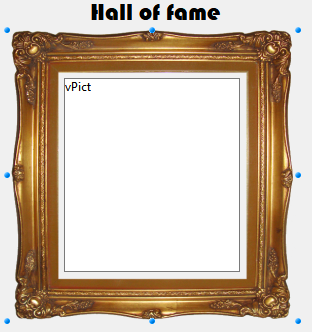

Static pictures are [static objects](formObjects_overview.md#active-and-static-objects) that can be used for various purposes in 4D forms, including decoration, background, or user interface:

  

Static pictures are stored outside the forms and inserted by reference. In the form editor, static picture objects are created by copy/paste or drag and drop operations. 

> If you place a static picture on page 0 of a multi-page form, it will appear automatically as a background element on all pages. You can also include it in an inherited form, applied in the background of other different forms. Either way, your application will run faster than if the picture was pasted into each page.

## Format and location

The original picture must be stored in a format managed natively by 4D (4D recognizes the main picture formats: JPEG, PNG, BMP, SVG, GIF, etc.).

Two main locations can be used for static picture path:

- in the **Resources** folder of the project. Appropriate when you want to share static pictures between several forms in the project. In this case, the Pathname is in the "/RESOURCES/\<picture path\>".
- in an image folder (e.g. named **Images**) within the form folder. Appropriate when the static pictures are used only in the form and/or yon want to be able to move or duplicate the whole form within the project or different projects. In this case, the Pathname is "<\picture path\>" and is resolved from the root of the form folder.

## Supported Properties

[Bottom](properties_CoordinatesAndSizing.md#bottom) - [CSS Class](properties_Object.md#css-class) - [Display](properties_Picture.md#display) - [Height](properties_CoordinatesAndSizing.md#height) - [Horizontal Sizing](properties_ResizingOptions.md#horizontal-sizing) - [Left](properties_CoordinatesAndSizing.md#left) - [Object Name](properties_Object.md#object-name) - [Pathname](properties_Picture.md#pathname) - [Right](properties_CoordinatesAndSizing.md#right) - [Top](properties_CoordinatesAndSizing.md#top) - [Type](properties_Object.md#type) - [Vertical Sizing](properties_ResizingOptions.md#vertical-sizing) - [Visibility](properties_Display.md#visibility)  - [Width](properties_CoordinatesAndSizing.md#width)
