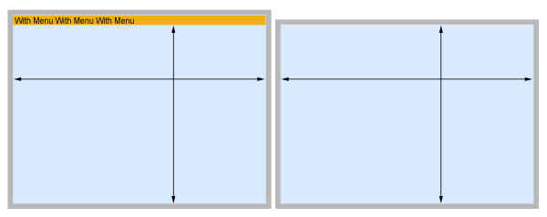

On Windows, 4D developers can test and configure their 4D merged applications to work as SDI (Single-Document Interface) applications. In SDI applications, each window is independant from others and can have its own menu bar. SDI applications are opposed to MDI (Multiple Documents Interface) applications, where all windows are contained in and depend on the main window.

:::info

The concept of sdi.mdI does not exist on macOS. This feature concerns Windows applications only and related options are ignored on macOS.

:::

## SDI mode availability

The SDI mode is available in the following execution environments only:

- Windows
- Merged [stand-alone](../Desktop/building.md#build-stand-alone-application) or [client](../Desktop/building.md#build-client-application) 4D application
- [**Test application** feature](bars.md#previewing-menu-bars) available from the **Run** menu.  

## Enabling the SDI mode

To enable the SDI mode in your application, just check the **Use SDI mode on Windows** option in the ["Interface" page of the Settings dialog box](../settings/interface.md#display-windows).

Once enabled, to actually run your application in SDI mode, you can either:

- build a merged application (standalone and/or client application) and execute it on Windows, or
- select **Test Application in SDI Mode** from the **Run** menu on Windows to test the development.

:::info

Because the development environment is executed in MDI, switching from development mode to runtime mode using the **Test Application in SDI Mode** menu item is equivalent to restarting your application.

:::

## Managing applications in SDI mode

Executing a 4D application in SDI mode does not require any specific implementation: existing menu bars are automatically moved in SDI windows themselves. However, you need to pay attention to specific principles that are listed below.

### Menus in Windows

In SDI mode, the process menu bar is automatically displayed in every document type window opened during the process life (this excludes, for example, floating palettes). When the process menu bar is not visible, menu item shortcuts remain active however.

Menus are added above windows without modifiying their contents size:

Windows can therefore be used in MDI or SDI modes without having to recalculate the position of objects.

#### Splash screen

- If the **Splash screen** interface option was [selected in the Settings](../settings/interface.md#display-windows), the splash window will contain any menus that would have been displayed in the MDI window. Note also that closing the splash screen window will result in exiting the application, just like in MDI mode.
- If the Splash screen option was not selected, menus will be displayed in opened windows only, depending on the programmer's choices.

### Debugger

When displayed in SDI mode, the [debugger window](../Debugging/debugger.md) does not contain [editing buttons](../Debugging/debugger.md#tool-bar-buttons), because switching to development environment requires to abort execution and restart the application in MDI mode. 

### Automatic quit

When executed in MDI mode, a 4D application simply quits when the user closes the application window (MDI window). However, when executed in SDI mode, 4D applications do not have an application window and, on the other hand, closing the last opened window does not necessarily mean that the user wants the application to quit (faceless processes can be running, for example) -- although it could be what they want.

To handle this case, 4D applications executed in SDI mode include a mechanism to automatically quit (by calling the `QUIT 4D` command) when the following conditions are met:

- the user cannot interact anymore with the application
- there are no live user processes
- 4D processes or worker processes are waiting for an event
- the Web server is not started
- the [WebAdmin server](../Admin/webAdmin.md) is not started.

:::note

When a menu with an associated *quit* standard action is called, the application quits and all windows are closed, wherever the menu was called from.

:::

## Language

Although it is transparently handled by 4D, the SDI mode introduces small variations in the application interface management. Specificities in the 4D language are listed below.

|Command/feature|Specificity in SDI mode on Windows|
|---|---|
|`Open form window`|Options to support floating windows in SDI (`Controller form window`) and to remove the menu bar (`Form has no menu bar`)|
|`Menu bar height`|Returns the height in pixels of a single menu bar line even if the menu bar has been wrapped on two or more lines. Returns 0 when the command is called from a process without a form window|
|`SHOW MENU BAR` / `HIDE MENU BAR`|Applied to the current form window only (from where the code is executed)|
|`MAXIMIZE WINDOW`|The window is maximized to the screen size|
|`CONVERT COORDINATES`|`XY Screen` is the global coordinate system where the main screen is positioned at (0,0). Screens on its left side or on top of it can have negative coordinates and any screens on its right side or underneath it can have coordinates greater than the values returned by `Screen height` or `Screen width`.|
|`GET MOUSE`|Global coordinates are relative to the screen|
|`GET WINDOW RECT`|When -1 is passed in window parameter, the command returns 0;0;0;0|
|`On Drop database method`|Not supported|

:::info

You can use the [**Get application info**](https://doc.4d.com/4dv19R/help/command/en/page1599.html) command to know the current running mode on Windows.

:::