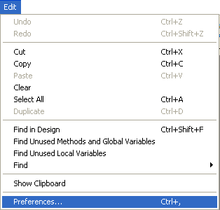

User preferences specify various settings affecting your working environment, e.g. default options, display themes, Code Editor features, shortcuts, etc. They are applied to all projects opened with your 4D or 4D Server application.

**4D Server**: Object locking occurs when two or more users try to modify the settings in the Preferences dialog box at the same time. Only one user can use the Preferences dialog box at a time.

>4D offers a different set of parameters specific to the open projet: **Settings** (available from the **Design** menu). For more information, refer to the Settings chapter.

## Access 
 
You can access the Preferences dialog box from the **Edit > Preferences...** menu (Windows) or the **4D** Application menu (macOS):

 

This menu option is available even when there is no open project.

You can also display the Preferences dialog box in Application mode using the "Preferences" standard action (associated with a menu item or a button) or using the `OPEN SETTINGS WINDOW` command.

## Storage 
 
Settings made in the Preferences dialog box are saved in an XML format preferences file named **4D Preferences vXX.4DPreferences** that is stored in the active 4D folder of the current user, as returned by the [`Get 4D folder`](https://doc.4d.com/4Dv18R6/4D/18-R6/Get-4D-folder.301-5198423.en.html) command:

*	Windows: `{disk}\Users\\{username\}\AppData\Roaming\4D`
*	macOS: `{disk}:Users:\{username\}:Library:Application Support:4D`

## Customizing parameters and reset settings

In settings dialog boxes, parameters whose values have been modified appear in bold:

Preferences indicated as customized may have been modified directly in the dialog box, or may have been modified previously in the case of a converted database. 

A parameter still appears in bold even when its value is replaced manually with its default values. This way it is always possible to visually identify any parameters that have been customized. 

To reset the parameters to their default values and remove the bold style indicating that they have been customized, click on the **Reset to factory settings** button:

This button resets all the parameters of the current page. It becomes active when at least one parameter has been modified on the current page.

