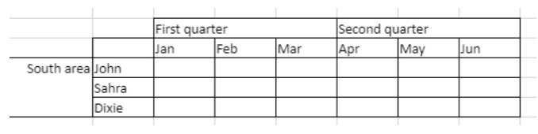
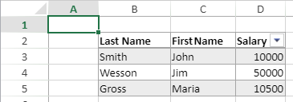

> **Warning**: The commands on this page are not thread-safe.

[A](#a) -
[C](#c) -
[D](#d) -
[E](#e) -
[F](#f) -
[G](#g) -
[I](#i) -
[M](#m) -
[N](#n) -
[O](#o) -
[P](#p) -
[R](#r) -
[S](#s)

## A

### VP ADD FORMULA NAME

<!-- REF #_method_.VP ADD FORMULA NAME.Syntax -->

**VP ADD FORMULA NAME** ( *vpAreaName* : Text ; *vpFormula* : Text ; *name* : Text { ; *options* : Object } )<!-- END REF -->

<!-- REF #_method_.VP ADD FORMULA NAME.Params -->

|Parameter|Type| |Description|
|---|---|---|---|
|vpAreaName| Text|->|4D View Pro area form object name|
|vpFormula|Text|-> |4D View Pro formula
|name|Text|->|Name for the formula|
|options|Object|->|Options for the named formula|<!-- END REF -->

#### Description

The `VP ADD FORMULA NAME` command <!-- REF #_method_.VP ADD FORMULA NAME.Summary -->creates or modifies a named formula in the open document<!-- END REF -->.

>Named formulas created by this command are saved with the document.

In *vpAreaName*, pass the name of the 4D View Pro area. If you pass a name that does not exist, an error is returned.

Pass the 4D View Pro formula that you want to name in *vpFormula*. For detailed information about formula syntax, see [Formulas and Functions](formulas.md) page.

Pass the new name for the formula in *name*. If the name is already used within the same scope, the new named formula replaces the existing one. Note that you can use the same name for different scopes (see below).

You can pass an object with additional properties for the named formula in *options*. The following properties are supported:

|Property |Type|Description|
|---|---|---|
|scope| Number| Scope for the formula. You can pass the sheet index (counting begins at 0) or use the following constants: <li>`vk current sheet`</li><li>`vk workbook`</li>The scope determines whether a formula name is local to a given worksheet (*scope*=sheet index or `vk current sheet`), or global across the entire workbook (*scope*=`vk workbook`).|
|comment|Text|Comment associated to named formula

#### Example  

```4d
VP ADD FORMULA NAME("ViewProArea";"SUM($A$1:$A$10)";"Total2")
```

#### See also

[Cell references](formulas.md#cell-references)<br/>[VP Get formula by name](#vp-get-formula-by-name)<br/>[VP Get names](#vp-get-names)

### VP ADD RANGE NAME

<!-- REF #_method_.VP ADD RANGE NAME.Syntax -->

**VP ADD RANGE NAME** ( *rangeObj* : Object ; *name* : Text { ; *options* : Object } )<!-- END REF -->

<!-- REF #_method_.VP ADD RANGE NAME.Params -->

|Parameter|Type| |Description|
|---|---|---|---|
|rangeObj| Object|->|Range object |
|name|Text|->|Name for the fomula|
|options|Object|->|Options for the named formula|<!-- END REF -->

#### Description

The `VP ADD RANGE NAME` command <!-- REF #_method_.VP ADD RANGE NAME.Summary -->creates or modifies a named range in the open document<!-- END REF -->.

>Named ranges created by this command are saved with the document.

In *rangeObj*, pass the range that you want to name and in *name*, pass the new name for the range. If the name is already used within the same scope, the new named range replaces the existing one. Note that you can use the same name for different scopes (see below).

You can pass an object with additional properties for the named range in *options*. The following properties are supported:

|Property |Type|Description|
|---|---|---|
|scope| Number| Scope for the range. You can pass the sheet index (counting begins at 0) or use the following constants: <li>`vk current sheet`</li><li>`vk workbook`</li>The scope determines whether a range name is local to a given worksheet (*scope*=sheet index or `vk current sheet`), or global across the entire workbook (*scope*=`vk workbook`).|
|comment|Text|Comment associated to named range|

>* A named range is actually a named formula containing coordinates. `VP ADD RANGE NAME` facilitates the creation of named ranges, but you can also use the [`VP ADD FORMULA NAME`](#vp-add-formula-name) method to create named ranges.
> * Formulas defining named ranges can be retrieved with the [`VP Get formula by name`](#vp-get-formula-by-name) method.

#### Example  

You want to create a named range for a cell range:

```4d
$range:=VP Cell("ViewProArea";2;10)
VP ADD RANGE NAME($range;"Total1")
```

#### See also

[VP Get names](#vp-get-names)<br/>[VP Name](#vp-name)

### VP ADD SELECTION

<!-- REF #_method_.VP ADD SELECTION.Syntax -->

**VP ADD SELECTION** ( *rangeObj* : Object )<!-- END REF -->

<!-- REF #_method_.VP ADD SELECTION.Params -->

|Parameter|Type| |Description|
|---|---|---|---|
|rangeObj| Object|->|Range object |<!-- END REF -->

#### Description

The `VP ADD SELECTION` command <!-- REF #_method_.VP ADD SELECTION.Summary -->adds the specified cells to the currently selected cells<!-- END REF -->.

In *rangeObj*, pass a range object of cells to add to the current selection.

>The active cell is not modified.

#### Example  

You have cells currently selected:


The following code will add cells to your selection:

```4d
$currentSelection:=VP Cells("myVPArea";3;4;2;3)
VP ADD SELECTION($currentSelection)
```

Result:


#### See also

[VP Get active cell](#vp-get-active-cell)<br/>[VP Get selection](#vp-get-selection)<br/>[VP RESET SELECTION](#vp-reset-selection)<br/>[VP SET ACTIVE CELL](#vp-set-active-cell)<br/>[VP SET SELECTION](#vp-set-selection)<br/>[VP SHOW CELL](#vp-show-cell)

### VP ADD SHEET

<!-- REF #_method_.VP ADD SHEET.Syntax -->
**VP ADD SHEET** ( *vpAreaName* : Text )<br/>**VP ADD SHEET** ( *vpAreaName* : Text ; *index* : Integer )<br/>**VP ADD SHEET** ( *vpAreaName* : Text ; *sheet* : Integer ; *name* : Text )<!-- END REF -->

<!-- REF #_method_.VP ADD SHEET.Params -->

|Parameter|Type| |Description|
|---|---|---|---|
|vpAreaName| Text|->|4D View Pro area form object name|
|sheet|Integer|-> |Index of the new sheet|
|name|Text|->|Sheet name|<!-- END REF -->

#### Description

The `VP ADD SHEET` command <!-- REF #_method_.VP ADD SHEET.Summary -->inserts a sheet in the document loaded in *vpAreaName*.<!-- END REF -->

In *vpAreaName*, pass the name of the 4D View Pro area.

In *sheet*, you can pass an index for the new sheet. If the passed *index* is inferior to or equal to 0, the command inserts the new sheet at the beginning. If *index* exceeds the number of sheets, the command inserts the new sheet after the existing ones.

>Indexing starts at 0.

In *name*, you can pass a name for the new sheet. The new name cannot contain the following characters: `*, :, [, ], ?,\,/`

#### Example

The document currently has 3 sheets:


To insert a sheet at the third position (index 2) and name it "March":

```4d
VP ADD SHEET("ViewProArea";2;"March")
```


#### See also

[VP REMOVE SHEET](#vp-remove-sheet)

### VP ADD SPAN

<!-- REF #_method_.VP ADD SPAN.Syntax -->
**VP ADD SPAN** ( *rangeObj* : Object )<!-- END REF -->

<!-- REF #_method_.VP ADD SPAN.Params -->

|Parameter|Type| |Description|
|---|---|---|---|
|rangeObj| Object|->|Range object|<!-- END REF -->

#### Description

The `VP ADD SPAN` command combines the cells in *rangeObj* as a single span of cells.

In *rangeObj*, pass a range object of cells. The cells in the range are joined to create a larger cell extending across multiple columns and/or rows. You can pass multiple cell ranges to create several spans at the same time. Note that if cell ranges overlap, only the first cell range is used.

> * Only the data in the upper-left cell is displayed. Data in the other combined cells is hidden until the span is removed.
> * Hidden data in spanned cells is accessible via formulas (beginning with the upper-left cell).

#### Example

To span the First quarter and Second quarter cells across the two cells beside them, and the South area cell across the two rows below it:


```4d
 // First quarter range
 $q1:=VP Cells("ViewProArea";2;3;3;1)

  // Second quarter range
 $q2:=VP Cells("ViewProArea";5;3;3;1)

  // South area range
 $south:=VP Cells("ViewProArea";0;5;1;3)

 VP ADD SPAN(VP Combine ranges($q1;$q2;$south))
```


#### See also

[4D View Pro Range Object Properties](getting-started.md#using-range-objects)<br/>[VP Get spans](#vp-get-spans)<br/>[VP REMOVE SPAN](#vp-remove-span)

### VP ADD STYLESHEET

<!-- REF #_method_.VP ADD STYLESHEET.Syntax -->
**VP ADD STYLESHEET** ( *vpAreaName* : Text ; *styleName* : Text ; *styleObj* : Object { ; *sheet* : Integer } )<!-- END REF -->

<!-- REF #_method_.VP ADD STYLESHEET.Params -->

|Parameter|Type| |Description|
|---|---|---|---|
|vpAreaName| Text|->|4D View Pro area form object name|
|styleName|Text|-> |Name of style|
|styleObj|Object|->|Object defining attribute settings|
|sheet|Integer|->|Sheet index (current sheet if omitted)|<!-- END REF -->

#### Description

The `VP ADD STYLESHEET` command <!-- REF #_method_.VP ADD STYLESHEET.Summary -->creates or modifies the *styleName* style sheet based upon the combination of the properties specified in *styleObj* in the open document<!-- END REF -->. If a style sheet with the same name and index already exists in the document, this command will overwrite it with the new values.

> Style sheets created by this command are saved with the document.

In *vpAreaName*, pass the name of the 4D View Pro area. If you pass a name that does not exist, an error is returned.

The *styleName* parameter lets you assign a name to the style sheet. If the name is already used within the same scope, the new style sheet replaces the existing one. Note that you can use the same name for different scopes (see below).

Within the *styleObj*, designate the settings for the style sheet (e.g., font, text decoration, alignment, borders, etc.). For the full list of style properties, see [Style object properties](configuring.md#style-object-properties).

You can designate where to define the style sheet in the optional *sheet* parameter using the sheet index (indexing starts at 0) or with the following constants:

* `vk current sheet`
* `vk workbook`

If a *styleName* style sheet is defined at the workbook level and at a sheet level, the sheet level has priority over the workbook level when the style sheet is set.

To apply the style sheet, use the [VP SET DEFAULT STYLE](#vp-set-default-style) or [VP SET CELL STYLE](#vp-set-cell-style) commands.

#### Example  

The following code:

```4d
$styles:=New object
$styles.backColor:="green"

//Line Border Object
$borders:=New object("color";"green";"style";vk line style medium dash dot)

$styles.borderBottom:=$borders
$styles.borderLeft:=$borders
$styles.borderRight:=$borders
$styles.borderTop:=$borders

VP ADD STYLESHEET("ViewProArea";"GreenDashDotStyle";$styles)

//To apply the style
VP SET CELL STYLE(VP Cells("ViewProArea";1;1;2;2);New object("name";"GreenDashDotStyle"))
```

will create and apply the following style object named *GreenDashDotStyle*:

```
{
 backColor:green,
 borderBottom:{color:green,style:10},
 borderLeft:{color:green,style:10},
 borderRight:{color:green,style:10},
 borderTop:{color:green,style:10}
}
```

#### See also

[4D View Pro Style Objects and Style Sheets](configuring.md#style-objects--style-sheets)<br/>[VP Get stylesheet](#vp-get-stylesheet)<br/>[VP Get stylesheets](#vp-get-stylesheets)<br/>[VP REMOVE STYLESHEET](#vp-remove-stylesheet)<br/>[VP SET CELL STYLE](#vp-set-cell-style)<br/>[VP SET DEFAULT STYLE](#vp-set-default-style)

### VP All

<!-- REF #_method_.VP All.Syntax -->
**VP All** ( *vpAreaName* : Text { ; *sheet* : Integer } )  : Object<!-- END REF -->

<!-- REF #_method_.VP All.Params -->

|Parameter|Type| |Description|
|---|---|---|---|
|vpAreaName| Text|->|4D View Pro area form object name|
|sheet|Integer|->|Sheet index (current sheet if omitted)|
|Result|Object|<-|Range object of all cells|<!-- END REF -->

#### Description

The `VP ALL` command <!-- REF #_method_.VP All.Summary -->returns a new range object referencing all cells<!-- END REF -->.

In *vpAreaName*, pass the name of the 4D View Pro area. If you pass a name that does not exist, an error is returned.

In the optional *sheet* parameter, you can designate a specific spreadsheet where the range will be defined (counting begins at 0). If omitted or if you pass `vk current sheet`, the current spreadsheet is used.

#### Example  

You want to define a range object for all of the cells of the current spreadsheet:

```4d
$all:=VP All("ViewProArea") // all cells of the current sheet
```

#### See also

[VP Cell](#vp-cell)<br/>[VP Cells](#vp-cells)<br/>[VP Column](#vp-column)<br/>[VP Combine ranges](#vp-combine-ranges)<br/>[VP Name](#vp-name)<br/>[VP Row](#vp-row)

## C

### VP Cell

<!-- REF #_method_.VP Cell.Syntax -->
**VP Cell** ( *vpAreaName* ; *column* : Integer ; *row* : Integer ; Text { ; *sheet* : Integer } )  : Object<!-- END REF -->

<!-- REF #_method_.VP Cell.Params -->

|Parameter|Type| |Description|
|---|---|---|---|
|vpAreaName| Text|->|4D View Pro area form object name|
|column|Integer|->|Column index|
|row|Integer|->|Row index|
|sheet|Integer|->|Sheet index (current sheet if omitted)|
|Result|Object|<-|Range object of a single cell|
<!-- END REF -->

#### Description

The `VP Cell` command <!-- REF #_method_.VP Cell.Summary -->returns a new range object referencing a specific cell<!-- END REF -->.

> This command is intended for ranges of a single cell. To create a range object for multiple cells, use the [VP Cells](#vp-cells) command.

In *vpAreaName*, pass the name of the 4D View Pro area. If you pass a name that does not exist, an error is returned.

The *column* parameter defines the column of the cell range's position. Pass the column index in this parameter.

The *row* parameter defines the row of the cell range's position. Pass the row index in this parameter.

In the optional *sheet* parameter, you can indicate the index of the sheet where the range will be defined. If omitted or if you pass `vk current sheet`, the current spreadsheet is used by default.

> indexing starts at 0.

#### Example  

You want to define a range object for the cell shown below (on the current spreadsheet):


The code would be:

```4d
$cell:=VP Cell("ViewProArea";2;4) // C5
```

#### See also

[VP All](#vp-all)<br/>[VP Cells](#vp-cells)<br/>[VP Column](#vp-column)<br/>[VP Combine ranges](#vp-combine-ranges)<br/>[VP Name](#vp-name)<br/>[VP Row](#vp-row)

### VP Cells

<!-- REF #_method_.VP Cells.Syntax -->
**VP Cells** ( *vpAreaName* : Text ; *column*: Integer ; *row*: Integer ; *columnCount* : Integer ; *rowCount* : Integer { ; *sheet* : Integer } ) : Object<!-- END REF -->

<details><summary>History</summary>

|Release|Changes|
|---|---|
|17 R4|Added
</details>

<!-- REF #_method_.VP Cells.Params -->

|Parameter|Type| |Description|
|---|---|---|---|
|vpAreaName| Text|->|4D View Pro area form object name|
|column| Integer|->|Column index|
|row| Integer|->|Row index|
|columnCount| Integer|->|Number of columns|
|rowCount| Integer|->|Number of rows|
|sheet|Integer|->|Sheet index (current sheet if omitted)|
|Result|Object|<-|Range object of cells|<!-- END REF -->

#### Description

The `VP Cells` command <!-- REF #_method_.VP Cells.Summary -->returns a new range object referencing specific cells<!-- END REF -->.

In *vpAreaName*, pass the name of the 4D View Pro area. If you pass a name that does not exist, an error is returned.

The *column* parameter defines the first column of the cell range. Pass the column index (counting begins at 0) in this parameter. If the range is within multiple columns, you should also use the *columnCount* parameter.

In the *row* parameter, you can define the row(s) of the cell range's position. Pass the row index (counting begins at 0) in this parameter. If the range is within multiple rows, you should also use the *rowCount* parameter.

The *columnCount* parameter allows you to define the total number of columns the range is within. *columnCount* must be greater than 0.

The *rowCount* parameter allows you to define the total number of rows the range is within. *rowCount* must be greater than 0.

In the optional *sheet* parameter, you can designate a specific spreadsheet where the range will be defined (counting begins at 0). If omitted or if you pass `vk current sheet`, the current spreadsheet is used by default.

#### Example  

You want to define a range object for the following cells (on the current sheet):


The code would be:

```4d
$cells:=VP Cells("ViewProArea";2;4;2;3) // C5 to D7
```

#### See also

[VP All](#vp-all)<br/>[VP Cells](#vp-cells)<br/>[VP Column](#vp-column)<br/>[VP Combine ranges](#vp-combine-ranges)<br/>[VP Name](#vp-name)<br/>[VP Row](#vp-row)

### VP Column

<!-- REF #_method_.VP Column.Syntax -->
**VP Column** ( *vpAreaName* : Text ; *column*: Integer ; *columnCount* : Integer { ; *sheet* : Integer } ) : Object<!-- END REF -->

<!-- REF #_method_.VP Column.Params -->

|Parameter|Type| |Description|
|---|---|---|---|
|vpAreaName| Text|->|4D View Pro area form object name|
|column| Integer|->|Column index|
|columnCount| Integer|->|Number of columns|
|sheet|Integer|->|Sheet index (current sheet if omitted)|
|Result|Object|<-|Range object of cells|<!-- END REF -->

#### Description

The `VP Column` command <!-- REF #_method_.VP Column.Summary -->returns a new range object referencing a specific column or columns<!-- END REF -->.

In *vpAreaName*, pass the name of the 4D View Pro area. If you pass a name that does not exist, an error is returned.

The *column* parameter defines the first column of the column range. Pass the column index (counting begins at 0)  in this parameter. If the range contains multiple columns, you should also use the optional *columnCount* parameter.

The optional *columnCount* parameter allows you to define the total number of columns of the range. *columnCount* must be greater than 0. If omitted, the value will be set to 1 by default and a column type range is created.

In the optional *sheet* parameter, you can designate a specific spreadsheet where the range will be defined (counting begins at 0). If omitted or if you pass `vk current sheet`, the current spreadsheet is used by default.

#### Example  

You want to define a range object for the column shown below (on the current spreadsheet):


The code would be:

```4d
 $column:=VP Column("ViewProArea";3) // column D
```

#### See also

[VP All](#vp-all)<br/>[VP Cells](#vp-cells)<br/>[VP Column](#vp-column)<br/>[VP Combine ranges](#vp-combine-ranges)<br/>[VP Name](#vp-name)<br/>[VP Row](#vp-row)<br/>[VP SET COLUMN ATTRIBUTES](#vp-set-column-attributes)

### VP COLUMN AUTOFIT

<!-- REF #_method_.VP COLUMN AUTOFIT.Syntax -->
**VP COLUMN AUTOFIT** ( *rangeObj* : Object )<!-- END REF -->

<!-- REF #_method_.VP COLUMN AUTOFIT.Params -->

|Parameter|Type| |Description|
|---|---|---|---|
|rangeObj| Object|->|Range object|<!-- END REF -->

#### Description

The `VP COLUMN AUTOFIT` command <!-- REF #_method_.VP COLUMN AUTOFIT.Summary -->automatically sizes the column(s) in *rangeObj* according to their contents<!-- END REF -->.

In *rangeObj*, pass a range object containing a range of the columns whose size will be automatically handled.

#### Example  

The following columns are all the same size and don't display some of the text:


Selecting the columns and running this code:

```4d
 VP COLUMN AUTOFIT(VP Get selection("ViewProarea"))
```

... resizes the columns to fit the size of the contents:


#### See also

[VP ROW AUTOFIT](#vp-row-autofit)

### VP Combine ranges

<!-- REF #_method_.VP Combine ranges.Syntax -->
**VP Combine ranges** ( *rangeObj* : Object ; *otherRangeObj* : Object {;...*otherRangeObjN* : Object }  ) : Object<!-- END REF -->

<!-- REF #_method_.VP Combine ranges.Params -->

|Parameter|Type| |Description|
|---|---|---|---|
|rangeObj| Object|->|Range object|
|otherRangeObj| Object|->|Range object|
|Result| Object|<-|Object containing a combined range|<!-- END REF -->

#### Description

The `VP Combine Ranges` command <!-- REF #_method_.VP Combine ranges.Summary -->returns a new range object that incorporates two or more existing range objects<!-- END REF -->. All of the ranges must be from the same 4D View Pro area.

In *rangeObj*, pass the first range object.

In *otherRangeObj*, pass another range object(s) to combine with *rangeObj*.

>The command incorporates *rangeObj* and *otherRangeObj* objects by reference.

#### Example  

You want to combine cell, column, and row range objects in a new, distinct range object:

```4d
 $cell:=VP Cell("ViewProArea";2;4) // C5
 $column:=VP Column("ViewProArea";3) // column D
 $row:=VP Row("ViewProArea";9) // row 10

 $combine:=VP Combine ranges($cell;$column;$row)
```

#### See also

[VP All](#vp-all)<br/>[VP Cells](#vp-cells)<br/>[VP Column](#vp-column)<br/>[VP Combine ranges](#vp-combine-ranges)<br/>[VP Name](#vp-name)<br/>[VP Row](#vp-row)<br/>[VP SET COLUMN ATTRIBUTES](#vp-set-column-attributes)

### VP Convert from 4D View

<!-- REF #_method_.VP Convert from 4D View.Syntax -->
**VP Convert from 4D View** ( *4DViewDocument* : Blob ) : Object<!-- END REF -->

<!-- REF #_method_.VP Convert from 4D View.Params -->

|Parameter|Type| |Description|
|---|---|---|---|
|4DViewDocument| Blob|->|4D View document|
|Result| Object|<-|4D View Pro object<!-- END REF -->

#### Description

The `VP Convert from 4D View` command <!-- REF #_method_.VP Convert from 4D View.Summary -->allows you to convert a legacy 4D View document into a 4D View Pro object<!-- END REF -->.

>This command does not require that the legacy 4D View plug-in be installed in your environment.

In the *4DViewDocument* parameter, pass a BLOB variable or field containing the 4D View document to convert. The command returns a 4D View Pro object into which all the information originally stored within the 4D View document is converted to 4D View Pro attributes.

#### Example  

You want to get a 4D View Pro object from a 4D View area stored in a BLOB:

```4d
C_OBJECT($vpObj)
$vpObj:=VP Convert from 4D View($pvblob)
```

### VP Convert to picture

<!-- REF #_method_.VP Convert to picture.Syntax -->
**VP Convert to picture** ( *vpObject* : Object {; *rangeObj* : Object} ) : Picture<!-- END REF -->

<!-- REF #_method_.VP Convert to picture.Params -->

|Parameter|Type| |Description|
|---|---|---|---|
|vpObject| Object|->|4D View Pro object containing the area to convert|
|rangeObj| Object|->|Range object|
|Result| Picture|<-|SVG picture of the area|<!-- END REF -->

#### Description

The `VP Convert to picture` command <!-- REF #_method_.VP Convert to picture.Summary -->converts the *vpObject* 4D View Pro object (or the *rangeObj* range within *vpObject*) to a SVG picture<!-- END REF -->.

This command is useful, for example:

* to embed a 4D View Pro document in an other document such as a 4D Write Pro document
* to print a 4D View Pro document without having to load it into a 4D View Pro area.

In *vpObject*, pass the 4D View Pro object that you want to convert. This object must have been previously parsed using [VP Export to object](#vp-export-to-object) or saved using [VP EXPORT DOCUMENT](#vp-export-document).  

>SVG conversion process requires that expressions and formats (cf. [Cell Format](configuring.md#cell-format)) included in the 4D View Pro area be evaluated at least once, so that they can be correctly exported. If you convert a document that was not evaluated beforehand, expressions or formats may be rendered in an unexpected way.

In *rangeObj*, pass a range of cells to convert. By default, if this parameter is omitted, the whole document contents are converted.

Document contents are converted with respect to their viewing attributes, including formats (see note above), visibility of headers, columns and rows. The conversion of the following elements is supported:

* Text : style / font / size / alignment / orientation / rotation / format
* Cell background : color / image
* Cell borders : thickness / color / style
* Cell merge
* Pictures
* Row height
* Column width
* Hidden columns / rows.

>Gridline visibility depends on document attribute defined with [VP SET PRINT INFO](#vp-set-print-info).

#### Function result

The command returns a picture in SVG format.

#### Example  

You want to convert a 4D View Pro area in SVG, preview the result, and send it to a picture variable:

```4d
C_OBJECT($vpAreaObj)
C_PICTURE($vPict)
$vpAreaObj:=VP Export to object("ViewProArea")
$vPict:=VP Convert to picture($vpAreaObj) //export the whole area
```

#### See also

[VP EXPORT DOCUMENT](#vp-export-document)<br/>[VP Export to object](#vp-export-to-object)<br/>[VP SET PRINT INFO](#vp-set-print-info)

### VP Copy to object

<details><summary>History</summary>

|Release|Changes|
|---|---|
|19 R4|Added
</details>

<!-- REF #_method_.VP Copy to object.Syntax -->
**VP Copy to object** ( *rangeObj* : Object {; *options* : Object} ) : Object<!-- END REF -->

<!-- REF #_method_.VP Copy to object.Params -->

|Parameter|Type||Description|
|---|---|---|---|
|rangeObj|Object|->|Range object|
|options|Object|->|Additional options|
|Result|Object|<-|Object returned. Contains the copied data|<!-- END REF -->


#### Description

The `VP Copy to object` command <!-- REF #_method_.VP Copy to object.Summary -->copies the contents, style and formulas from *rangeObj* to an object<!-- END REF -->.

In *rangeObj*, pass the cell range with the values, formatting, and formulas to copy. If *rangeObj* is a combined range, only the first one is used.

You can pass an optional *options* parameter with the following properties:

|Property|Type|Description|
|---|---|---|
|copy|Boolean|*True* (default) to keep the copied values, formatting and formulas after the command executes. *False* to remove them.|
|copyOptions|Integer|Specifies what is copied or moved. Possible values: <p><table><tr><th>Value</th><th>Description</th></tr><tr><td>`vk clipboard options all` (default)</td><td>Copies all data objects, including values, formatting, and formulas.</td></tr><tr><td>`vk clipboard options formatting`</td><td>Copies only the formatting.</td></tr><tr><td>`vk clipboard options formulas`</td><td>Copies only the formulas.</td></tr><tr><td>`vk clipboard options formulas and formatting`</td><td>Copies the formulas and formatting.</td></tr><tr><td>`vk clipboard options values`</td><td>Copies only the values.</td></tr><tr><td>`vk clipboard options value and formatting`</td><td>Copies the values and formatting.</td></tr></table></p>|

The paste options defined in the [workbook options](#vp-set-workbook-options) are taken into account.

The command returns an object that contains the copied data.

#### Example

This code sample first stores the contents, values, formatting and formulas from a range to an object, and then pastes them in another range:

```4d
var $originRange; $targetRange; $dataObject; $options : Object

$originRange:=VP Cells("ViewProArea"; 0; 0; 2; 5)

$options:=New object
$options.copy:=True
$options.copyOptions:=vk clipboard options all

$dataObject:=VP Copy to object($originRange; $options)

$targetRange:=VP Cell("ViewProArea"; 4; 0)
VP PASTE FROM OBJECT($targetRange; $dataObject; vk clipboard options all)
```

#### See also


[VP PASTE FROM OBJECT](#vp-paste-from-object)<br/>[VP MOVE CELLS](#vp-move-cells)<br/>[VP Get workbook options](#vp-get-workbook-options)<br/>[VP SET WORKBOOK OPTIONS](#vp-set-workbook-options)

### VP CREATE TABLE

<details><summary>History</summary>

|Release|Changes|
|---|---|
|19 R8|Support of theme options: `bandColumns`, `bandRows`, `highlightFirstColumn`, `highlightLastColumn`, `theme`
|19 R7|Support of `allowAutoExpand` option
|19 R6|Added
</details>

<!-- REF #_method_.VP CREATE TABLE.Syntax -->
**VP CREATE TABLE** ( *rangeObj* : Object ; *tableName* : Text {; *source* : Text} {; *options* : cs.ViewPro.TableOptions} )<!-- END REF -->

<!-- REF #_method_.VP CREATE TABLE.Params -->

|Parameter|Type||Description|
|---|---|---|---|
|rangeObj|Object|->|Range object|
|tableName|Text|->|Name for the table|
|source|Text|->|Data context property name to display in the table|
|options|[cs.ViewPro.TableOptions](classes.md#tableoptions)|->|Additional options|<!-- END REF -->

#### Description

The `VP CREATE TABLE` command <!-- REF #_method_.VP CREATE TABLE.Summary -->creates a table in the specified range<!-- END REF -->. You can create a table in a range of cells to make managing and analyzing a group of related data easier. A table typically contains related data in rows and columns, and takes advantage of a [data context](#vp-set-data-context).


In *rangeObj*, pass the cell range where the table will be created.

In *tableName*, pass a name for the table. The name must:  

* be unique in the sheet
* include at least 5 characters
* not include spaces or start with a number

In *source*, you can pass a property name of a [data context](#vp-set-data-context) to display its data in the table. This binds the table to the data context. When the data context is updated, the data displayed in the table is updated accordingly. The *source* property must contain a collection of objects and each element represents a row.

  * If you don't specify a *source*, the command creates an empty table with the size defined in *rangeObj*.
  * If the specified *source* cannot be fully displayed in the document, no table is created.

In the *options* parameter, pass an object of the [`cs.ViewPro.TableOptions` class](classes.md#tableoptions) that contains the table properties to set.

Within the *options* object, the *tableColumns* collection determines the structure of the table's columns. The length of the *tableColumns* collection must be equal to the range column count:

  * When the column count in *rangeObj* exceeds the number of columns in *tableColumns*, the table is filled with additional empty columns.
  * When the column count in *rangeObj* is inferior to the number of *tableColumns*, the table displays a number of columns that match the range's column count.

If you pass a *source* but no *tableColumn* option, the command generates columns automatically. In this case, *rangeObj* must be a cell range. Otherwise, the first cell of the range is used. When generating columns automatically, the following rules apply:

* If the data passed to the command is a collection of objects, the property names are used as column titles. For example:

```4d
([{ LastName: \"Freehafer\", FirstName: \"Nancy\"},{ LastName: \"John\", FirstName: \"Doe\"})
```
Here the titles of the columns would be `LastName` and `FirstName`.

* If the data passed to the command is a collection of scalar values, it must contain a collection of subcollections:

  * The first-level collection contains subcollections of values. Each subcollection defines a row. Pass an empty collection to skip a row. The number of values in the first subcollection determines how many columns are created.
  * The subcollections' indices are used as column titles.
  * Each subcollection defines cell values for the row. Values can be `Integer`, `Real`, `Boolean`, `Text`, `Date`, `Null`, `Time` or `Picture`. A `Time` value must be an a object containing a time attribute, as described in [VP SET VALUE](#vp-set-value).

> This only works when generating columns automatically. You cannot use a collection of scalar data with the *tableColumns* option.


#### Example

To create a table using a data context:

```4d
// Set a data context
var $data : Object

$data:=New object()
$data.people:=New collection()
$data.people.push(New object("firstName"; "John"; "lastName"; "Smith"; "email"; "johnsmith@gmail.com"))
$data.people.push(New object("firstName"; "Mary"; "lastName"; "Poppins"; "email"; "marypoppins@gmail.com"))


VP SET DATA CONTEXT("ViewProArea"; $data)

// Define the columns for the table
var $options : cs.ViewPro.TableOptions

$options:=cs.ViewPro.TableOptions.new()
$options.tableColumns:=New collection()
$options.tableColumns.push(cs.ViewPro.TableColumn.new("name"; "First name"; "dataField"; "firstName"))
$options.tableColumns.push(cs.ViewPro.TableColumn.new("name"; "Last name"; "dataField"; "lastName"))
$options.tableColumns.push(cs.ViewPro.TableColumn.new("name"; "Email"; "dataField"; "email"))

// Create a table from the "people" collection
VP CREATE TABLE(VP Cells("ViewProArea"; 1; 1; $options.tableColumns.length; 1); "ContextTable"; "people"; $options)
```

Here's the result:


#### See also

[VP Find table](#vp-find-table)<br/>[VP Get table column attributes](#vp-get-table-column-attributes)<br/>[VP Get table column index](#vp-get-table-column-index)<br/>[VP INSERT TABLE COLUMNS](#vp-insert-table-columns)<br/>[VP INSERT TABLE ROWS](#vp-insert-table-rows)<br/>[VP REMOVE TABLE](#vp-remove-table)<br/>[VP RESIZE TABLE](#vp-resize-table)<br/>[VP SET DATA CONTEXT](#vp-set-data-context)<br/>[VP SET TABLE COLUMN ATTRIBUTES](#vp-set-table-column-attributes)<br/>[VP SET TABLE THEME](#vp-set-table-theme)


## D

### VP DELETE COLUMNS

<!-- REF #_method_.VP DELETE COLUMNS.Syntax -->
**VP DELETE COLUMNS** ( *rangeObj* : Object )<!-- END REF -->

<!-- REF #_method_.VP DELETE COLUMNS.Params -->

|Parameter|Type| |Description|
|---|---|---|---|
|rangeObj| Object|->|Range object|<!-- END REF -->

#### Description

The `VP DELETE COLUMNS` command <!-- REF #_method_.VP DELETE COLUMNS.Summary -->removes the columns in the *rangeObj*<!-- END REF -->.

In *rangeObj*, pass an object containing a range of columns to remove. If the passed range contains:

* both columns and rows, only the columns are removed.
* only rows, the command does nothing.

>Columns are deleted from right to left.

#### Example  

To delete columns selected by the user (in the image below columns B, C, and D):


use the following code:

```4d
VP DELETE COLUMNS(VP Get selection("ViewProArea"))
```

#### See also

[VP All](#vp-delete-rows)<br/>[VP Cells](#vp-insert-columns)<br/>[VP Column](#vp-insert-rows)

### VP DELETE ROWS

<!-- REF #_method_.VP DELETE ROWS.Syntax -->
**VP DELETE ROWS** ( *rangeObj* : Object )<!-- END REF -->

<!-- REF #_method_.VP DELETE ROWS.Params -->

|Parameter|Type| |Description|
|---|---|---|---|
|rangeObj| Object|->|Range object|<!-- END REF -->

#### Description

The `VP DELETE ROWS` command <!-- REF #_method_.VP DELETE ROWS.Summary -->removes the rows  in the *rangeObj*<!-- END REF -->.

In *rangeObj*, pass an object containing a range of rows  to remove. If the passed range contains:

* both columns and rows, only the rows  are removed.
* only columns, the command does nothing.

>Rows are deleted from bottom to top.

#### Example  

To delete rows selected by the user (in the image below rows 1, 2, and 3):


use the following code:

```4d

 VP DELETE ROWS(VP Get selection("ViewProArea"))
```

#### See also

[VP All](#vp-delete-columns)<br/>[VP Cells](#vp-insert-columns)<br/>[VP Column](#vp-insert-rows)

## E

### VP EXPORT DOCUMENT

<!-- REF #_method_.VP EXPORT DOCUMENT.Syntax -->
**VP EXPORT DOCUMENT** ( *vpAreaName* : Text ; *filePath* : Text {; *paramObj* : Object} )<!-- END REF -->

<!-- REF #_method_.VP EXPORT DOCUMENT.Params -->

|Parameter|Type| |Description|
|---|---|---|---|
|vpAreaName| Text|->|4D View Pro area form object name|
|filePath| Text|->|Pathname of the document|
|paramObj| Object|->|Export options|<!-- END REF -->

#### Description

The `VP EXPORT DOCUMENT` command <!-- REF #_method_.VP EXPORT DOCUMENT.Summary -->exports the 4D View Pro object attached to the 4D View Pro area *vpAreaName* to a document on disk according to the *filePath* and *paramObj* parameters<!-- END REF -->.

In *vpAreaName*, pass the name of the 4D View Pro area. If you pass a name that does not exist, an error is returned.

In *filePath*, pass the destination path and name of the document to be exported. If you don't specify a path, the document will be saved at the same level as the Project folder.

You can specify the exported file's format by including an extension after the document's name:

* 4D View Pro (".4vp")
* Microsoft Excel (".xlsx")
* PDF (".pdf")
* CSV (".txt", or ".csv")

If the extension is not included, but the format is specified in *paramObj*, the exported file will have the extension that corresponds to the format, except for the CSV format (no extension is added in this case).

The optional *paramObj* parameter allows you to define multiple properties for the exported 4D View Pro object, as well as launch a callback method when the export has completed.

|Property| Type| Description|
|---|---|---
|format| text| (optional) When present, designates the exported file format: ".4vp" (default), ".csv", ".xlsx", or ".pdf". You can use the following constants:<li>`vk 4D View Pro format`</li><li>`vk csv format`</li><li>`vk MS Excel format`</li><li>`vk pdf format`</li>4D adds the appropriate extension to the file name if needed. If the format specified doesn't correspond with the extension in *filePath*, it will be added to the end of *filePath*. If a format is not specified and no extension is provided in *filePath*, the default file format is used.|
|password| text| Microsoft Excel only (optional) - Password used to protect the MS Excel document|
|formula| object |Callback method to be launched when the export has completed. Using a callback method is necessary when the export is asynchronous (which is the case for PDF and Excel formats) if you need some code to be executed after the export. The callback method must be used with the [`Formula`](https://doc.4d.com/4dv19/help/command/en/page1597.html) command (see below for more information).|
|valuesOnly| boolean| Specifies that only the values from formulas (if any) will be exported.|
|includeFormatInfo| boolean| True to include formatting information, false otherwise (default is true). Formatting information is useful in some cases, e.g. for export to SVG. On the other hand, setting this property to **false** allows reducing export time.|
|includeBindingSource| Boolean | 4DVP and Microsoft Excel only. True (default) to export the current data context values as cell values in the exported document (data contexts themselves are not exported). False otherwise. Cell binding is always exported. For data context and cell binding management, see [VP SET DATA CONTEXT](#vp-set-data-context) and [VP SET BINDING PATH](#vp-set-binding-path).|
|sheetIndex| number| PDF only (optional) - Index of sheet to export (starting from 0). -2=all visible sheets (**default**), -1=current sheet only|
|pdfOptions| object| PDF only (optional) - Options for pdf export <p><table><tr><th>Property</th><th>Type</th><th>Description</th></tr><tr><td>creator</td><td>text</td><td>name of the application that created the original document from which it was converted.</td></tr><tr><td>title</td><td>text</td><td>title of the document.</td></tr><tr><td>author</td><td>text</td><td>name of the person who created that document.</td></tr><tr><td>keywords</td><td>text</td><td>keywords associated with the document.</td></tr><tr><td>subject</td><td>text</td><td>subject of the document.</td></tr></table></p>|
|csvOptions|object| CSV only (optional) - Options for csv export <p><table><tr><th>Property</th><th>Type</th><th>Description</th></tr><tr><td>range</td><td>object</td><td>Range object of cells</td></tr><tr><td>rowDelimiter</td><td>text</td><td>Row delimiter. Default: "\r\n"</td></tr><tr><td>columnDelimiter</td><td>text</td><td>Column delimiter. Default: ","</td></tr></table></p>|
|`\<customProperty>`| any| Any custom property that will be available through the $3 parameter in the callback method.|

**Notes about Excel format**:

* When exporting a 4D View Pro document into a Microsoft Excel-formatted file, some settings may be lost. For example, 4D methods and formulas are not supported by Excel. You can verify other settings with [this list from GrapeCity](http://help.grapecity.com/spread/SpreadSheets10/webframe.html#excelexport.html).
* Exporting in this format is run asynchronously, use the *formula* property of the *paramObj* for code to be executed after the export.

**Notes about PDF format**:

* When exporting a 4D View Pro document in PDF, the fonts used in the document are automatically embedded in the PDF file. Only OpenType fonts (.OTF or .TTF files) having a Unicode map can be embedded. If no valid font file is found for a font, a default font is used instead.
* Exporting in this format is run asynchronously, use the *formula* property of the *paramObj* for code to be executed after the export.

**Notes about CSV format**:

* When exporting a 4D View Pro document to CSV, some settings may be lost, as only the text and values are saved.
* All the values are saved as double-quoted strings. For more information on delimiter-separated values, see [this article on Wikipedia](https://en.wikipedia.org/wiki/Delimiter-separated_values).

Once the export operation is finished, `VP EXPORT DOCUMENT` automatically triggers the execution of the method set in the *formula* property of the *paramObj*, if used.

#### Passing a callback method (formula)  

When including the optional *paramObj* parameter, the `VP EXPORT DOCUMENT` command allows you to use the [`Formula`](https://doc.4d.com/4dv19/help/command/en/page1597.html) command to call a 4D method which will be executed once the export has completed. The callback method will receive the following values in local variables:

|Variable|  |Type| Description|
|---|---|---|---|
|$1|  |text| The name of the 4D View Pro area object|
|$2|  |text| The filepath of the exported 4D View Pro object|
|$3|  |object| A reference to the command's *paramObj*|
|$4|  |object| An object returned by the method with a status message|
||.success |boolean| True if export with success, False otherwise.|
||.errorCode |integer| Error code. May be returned by 4D or JavaScript.|
||.errorMessage |text| Error message. May be returned by 4D or JavaScript.|

#### Example 1

You want to export the contents of the "VPArea" area to a 4D View Pro document on disk:

```4d
var $docPath: Text

$docPath:="C:\\Bases\\ViewProDocs\\MyExport.4VP"
VP EXPORT DOCUMENT("VPArea";$docPath)
//MyExport.4VP is saved on your disk
```

#### Example 2

You want to export the current sheet in PDF:

```4d
var $params: Object
$params:=New object
$params.format:=vk pdf format
$params.sheetIndex:=-1
$params.pdfOptions:=New object("title";"Annual Report";"author";Current user)
VP EXPORT DOCUMENT("VPArea";"report.pdf";$params)
```

#### Example 3

You want to export a 4D View Pro document in ".xlsx" format and call a method that will launch Microsoft Excel with the document open once the export has completed:

```4d
 $params:=New object
 $params.formula:=Formula(AfterExport)
 $params.format:=vk MS Excel format //".xlsx"
 $params.valuesOnly:=True

 VP EXPORT DOCUMENT("ViewProArea";"c:\\tmp\\convertedfile";$params)
```

***AfterExport*** method:

```4d
 C_TEXT($1;$2)
 C_OBJECT($3;$4)
 $areaName:=$1
 $filePath:=$2
 $params:=$3
 $status:=$4

 If($status.success=False)
    ALERT($status.errorMessage)
 Else
    LAUNCH EXTERNAL PROCESS("C:\\Program Files\\Microsoft Office\\Office15\\excel "+$filePath)
 End if
```

#### Example 4

You want to export the current sheet to a `.txt` file with pipe-separated values:


```4d
var $params : Object
$params:=New object
$params.range:=VP Cells("ViewProArea";0;0;2;5)
$params.rowDelimiter:="\n"
$params.columnDelimiter:="|"
VP EXPORT DOCUMENT("ViewProArea";"c:\\tmp\\data.txt";New object("format";vk csv format;"csvOptions";$params))
```

Here's the result:


#### See also


[VP Convert to picture](#vp-convert-to-picture)<br/>[VP Export to object](#vp-export-to-object)<br/>[VP Column](#vp-import-document)<br/>[VP Print](#vp-print)

### VP Export to object

<!-- REF #_method_.VP Export to object.Syntax -->
**VP Export to object** ( *vpAreaName* : Text {; *options* : Object} ) : Object<!-- END REF -->

<!-- REF #_method_.VP Export to object.Params -->

|Parameter|Type| |Description|
|---|---|---|---|
|vpAreaName| Text|->|4D View Pro area form object name|
|options| Object|->|Export options|
|Result| Object|<-|4D View Pro object|<!-- END REF -->

#### Description

The `VP Export to object` command <!-- REF #_method_.VP Export to object.Summary --> returns the 4D View Pro object attached to the 4D View Pro area *vpAreaName*<!-- END REF -->. You can use this command for example to store the 4D View Pro area in a 4D database object field.

In *vpAreaName*, pass the name of the 4D View Pro area. If you pass a name that does not exist, an error is returned.

In the *options* parameter, you can pass the following export options, if required:

|Property| Type| Description|
|---|---|---
|includeFormatInfo| Boolean | True (default) to include formatting information, false otherwise. Formatting information is useful in some cases, e.g. for export to SVG. On the other hand, setting this property to False allows reducing export time. |
|includeBindingSource| Boolean | True (default) to export the current data context values as cell values in the exported object (data contexts themselves are not exported). False otherwise. Cell binding is always exported.|

For more information on 4D View Pro objects, please refer to the [4D View Pro object](configuring.md#4d-view-pro-object) paragraph.

#### Example 1

You want to get the "version" property of the current 4D View Pro area:

```4d
var $vpAreaObj : Object
var $vpVersion : Number
$vpAreaObj:=VP Export to object("vpArea")
 // $vpVersion:=OB Get($vpAreaObj;"version")
$vpVersion:=$vpAreaObj.version
```

#### Example 2

You want to export the area, excluding formatting information:

```4d
var $vpObj : Object
$vpObj:=VP Export to object("vpArea";New object("includeFormatInfo";False))
```

#### See also

[VP Convert to picture](#vp-convert-to-picture)<br/>[VP EXPORT DOCUMENT](#vp-export-document)<br/>[VP IMPORT FROM OBJECT](#vp-import-from-object)

## F

### VP Find

<!-- REF #_method_.VP Find.Syntax -->
**VP Find** (  *rangeObj* : Object ; *searchValue* : Text ) : Object<br/>**VP Find** (  *rangeObj* : Object ; *searchValue* : Text ; *searchCondition* : Object } ) : Object<br/>**VP Find** (  *rangeObj* : Object ; *searchValue* : Text ; *searchCondition* : Object ; *replaceValue* : Text ) : Object<!-- END REF -->

<!-- REF #_method_.VP Find.Params -->

|Parameter|Type| |Description|
|---|---|---|---|
|rangeObj |Object|->|Range object|
|searchValue |Text|->|Search value|
|searchCondition |Object|->|Object containing search condition(s)|
|replaceValue  |Text|->|Replacement value|
|Result|Object|<-|Range object|<!-- END REF -->

#### Description

The `VP Find` command <!-- REF #_method_.VP Find.Summary -->searches the *rangeObj* for the *searchValue*<!-- END REF -->. Optional parameters can be used to refine the search and/or replace any results found.  

In the *rangeObj* parameter, pass an object containing a range to search.  

The *searchValue* parameter lets you pass the text to search for within the *rangeObj*.  

You can pass the optional *searchCondition* parameter to specify how the search is performed. The following properties are supported:  

|Property| Type| Description|
|---|---|---
|afterColumn|Integer|The number of the column just before the starting column of the search. If the *rangeObj* is a combined range, the column number given must be from the first range. Default value: -1 (beginning of the *rangeObj*)|
|afterRow|Integer|The number of the row just before the starting row of the search. If the *rangeObj* is a combined range, the row number given must be from the first range. Default value: -1 (beginning of the *rangeObj*) |
|all|Boolean |<li>True - All cells in *rangeObj* corresponding to *searchValue* are returned</li><li>False - (default value) Only the first cell in *rangeObj* corresponding to *searchValue* is returned</li>|
|flags| Integer|<table><tr><td>`vk find flag exact match`</td><td>The entire content of the cell must completely match the search value</td></tr><tr><td>`vk find flag ignore case`</td><td>Capital and lower-case letters are considered the same. Ex: "a" is the same as "A".</td></tr><tr><td>`vk find flag none`</td><td>no search flags are considered (default)</td></tr><tr><td>`vk find flag use wild cards`</td><td>Wildcard characters (\*,?) can be used in the search string. Wildcard characters can be used in any string comparison to match any number of characters:<li>\* for zero or multiple characters (for example, searching for "bl*"  can find "bl", "black", or "blob")</li><li>? for a single character (for example, searching for "h?t" can find "hot", or "hit"</li></td></tr></table>These flags can be combined. For example: <code>$search.flags:=vk find flag use wild cards+vk find flag ignore case</code>|
|order| Integer |<table><tr><td>`vk find order by columns`</td><td>The search is performed by columns. Each row of a column is searched before the search continues to the next column.</td></tr><tr><td>`vk find order by rows`</td><td>The search is performed by rows. Each column of a row is searched before the search continues to the next row (default)</td></tr></table> |
|target|Integer|<table><tr><td>`vk find target formula`</td><td>The search is performed in the cell formula</td></tr><tr><td>`vk find target tag`</td><td>The search is performed in the cell tag</td></tr><tr><td>`vk find target text`</td><td>The search is performed in the cell text (default)</td></tr></table><p>These flags can be combined. For example:<code>$search.target:=vk find target formula+vk find target text</code></p>|

In the optional *replaceValue* parameter, you can pass text to take the place of any instance of the text in *searchValue* found in the *rangeObj*.

#### Returned Object

The function returns a range object describing each search value that was found or replaced. An empty range object is returned if no results are found.

#### Example 1

To find the first cell containing the word "Total":

```4d
var $range;$result : Object

$range:=VP All("ViewProArea")

$result:=VP Find($range;"Total")
```

#### Example 2

To find "Total" and replace it with "Grand Total":  

```4d
var $range;$condition;$result : Object

$range:=VP All("ViewProArea")

$condition:=New object
$condition.target:=vk find target text
$condition.all:=True //Search entire document
$condition.flags:=vk find flag exact match

  // Replace the cells containing only 'Total' in the current sheet with "Grand Total"
$result:=VP Find($range;"Total";$condition;"Grand Total")

  // Check for empty range object
If($result.ranges.length=0)
    ALERT("No result found")
Else
    ALERT($result.ranges.length+" results found")
End if
```


### VP Find table

<details><summary>History</summary>

|Release|Changes|
|---|---|
|19 R7|Added
</details>

<!-- REF #_method_.VP Find table.Syntax -->
**VP Find table** ( *rangeObj* : Object ) : Text<!-- END REF -->

<!-- REF #_method_.VP Find table.Params -->

|Parameter|Type| |Description|
|---|---|---|---|
|rangeObj |Object|->|Cell range|
|Result  |Text|<-|Table name|<!-- END REF -->

#### Description

The `VP Find table` command <!-- REF #_method_.VP Find table.Summary -->returns the name of the table to which to the *rangeObj* cell belongs<!-- END REF -->.

In *rangeObj*, pass a cell range object. If the designated cells do not belong to a table, the command returns an empty string.

If *rangeObj* is not a cell range or contains multiple ranges, the first cell of the first range is used.

#### Example

```4d
If (FORM Event.code=On After Edit && FORM Event.action="valueChanged")
     $tableName:=VP Find table(FORM Event.range)
     If ($tableName#"")
         ALERT("The "+$tableName+" table has been modified.")
     End if
End if
```


#### See also

[VP Get table range](#vp-get-table-range)


### VP FLUSH COMMANDS

<!-- REF #_method_.VP FLUSH COMMANDS.Syntax -->
**VP FLUSH COMMANDS** (  *vpAreaName* : Text )<!-- END REF -->

<!-- REF #_method_.VP FLUSH COMMANDS.Params -->

|Parameter|Type| |Description|
|---|---|---|---|
|vpAreaName  |Text|->|4D View Pro area form object name|<!-- END REF -->

#### Description

The `VP FLUSH COMMANDS` command <!-- REF #_method_.VP FLUSH COMMANDS.Summary -->immediately executes stored commands and clears the command buffer<!-- END REF -->.  

In *vpAreaName*, pass the name of the 4D View Pro area. If you pass a name that does not exist, an error is returned.

In order to increase performance and reduce the number of requests sent, the 4D View Pro commands called by the developer are stored in a command buffer. When called, `VP FLUSH COMMANDS` executes the commands as a batch when leaving the method and empties the contents of the command buffer.

#### Example

You want to trace the execution of the commands and empty the command buffer:

```4d

 VP SET TEXT VALUE(VP Cell("ViewProArea1";10;1);"INVOICE")
 VP SET TEXT VALUE(VP Cell("ViewProArea1";10;2);"Invoice date: ")
 VP SET TEXT VALUE(VP Cell("ViewProArea1";10;3);"Due date: ")

 VP FLUSH COMMANDS(("ViewProArea1")
 TRACE
```

### VP Font to object

<!-- REF #_method_.VP Font to object.Syntax -->
**VP Font to object** (  *font* : Text ) : Object<!-- END REF -->


<!-- REF #_method_.VP Font to object.Params -->

|Parameter|Type| |Description|
|---|---|---|---|
|font  |Text|->|Font shorthand string|  
|Result  |Object|<-|Font object|
<!-- END REF -->


#### Description

The `VP Font to object` utility command <!-- REF #_method_.VP Font to object.Summary -->returns an object from a font shorthand string<!-- END REF -->. This object can then be used to set or get font property settings via object notation.

In the *font* parameter, pass a font shorthand string to specify the different properties of a font (e.g., "12 pt Arial"). You can learn more about font shorthand strings [in this page](https://www.w3schools.com/cssref/pr_font_font.asp) for example.

The returned object contains defined font attributes as properties. For more information about the available properties, see the [VP Object to font](#vp-object-to-font) command.

#### Example 1

This code:

```4d
$font:=VP Font to object("16pt arial")
```

will return the following $font object:

```4d
{

family:arial
size:16pt
}
```

#### Example 2  

See example for [`VP Object to font`](#vp-object-to-font).

#### See also

[4D View Pro Style Objects and Style Sheets](configuring.md#style-objects--style-sheets)<br/>[VP Object to font](#vp-object-to-font)<br/>[VP SET CELL STYLE](#vp-set-cell-style)<br/>[VP SET DEFAULT STYLE](#vp-set-default-style)

## G

### VP Get active cell

<!-- REF #_method_.VP Get active cell.Syntax -->
**VP Get active cell** (  *vpAreaName* : Text { ; *sheet* : Integer } ) : Object<!-- END REF -->

<!-- REF #_method_.VP Get active cell.Params -->

|Parameter|Type| |Description|
|---|---|---|---|
|vpAreaName  |Text|->|4D View Pro area form object name|
|sheet  |Integer|->|Sheet index (current sheet if omitted)|
|Result  |Object|<-|Range object of single cell|<!-- END REF -->

#### Description

The `VP Get active cell` command <!-- REF #_method_.VP Get active cell.Summary -->returns a new range object referencing the cell which has the focus and where new data will be entered (the active cell)<!-- END REF -->.

In *vpAreaName*, pass the name of the 4D View Pro area. If you pass a name that does not exist, an error is returned.

In the optional *sheet* parameter, you can designate a specific spreadsheet where the range will be defined (counting begins at 0). If omitted or if you pass `vk current sheet`, the current spreadsheet is used.

#### Example


The following code will retrieve the coordinates of the active cell:

```4d
$activeCell:=VP Get active cell("myVPArea")

  //returns a range object containing:
  //$activeCell.ranges[0].column=3
  //$activeCell.ranges[0].row=4
  //$activeCell.ranges[0].sheet=0
```

#### See also

[VP ADD SELECTION](#vp-add-selection)<br/>[VP Get selection](#vp-get-selection)<br/>[VP RESET SELECTION](#vp-reset-selection)<br/>[VP SET ACTIVE CELL](#vp-set-active-cell)<br/>[VP SET SELECTION](#vp-set-selection)<br/>[VP SHOW CELL](#vp-show-cell)

### VP Get binding path

<details><summary>History</summary>

|Release|Changes|
|---|---|
|19 R5|Added|

</details>

<!-- REF #_method_.VP Get binding path.Syntax -->
**VP Get binding path** ( *rangeObj* : Object ) : Text<!-- END REF -->

<!-- REF #_method_.VP Get binding path.Params -->

|Parameter|Type||Description|
|---|---|---|---|
| rangeObj | Object | -> | Range object |
| Result  | Text | <- | Name of the attribute bound to the cell |<!-- END REF -->

#### Description

The `VP Get binding path` command <!-- REF #_method_.VP Get binding path.Summary -->returns the name of the attribute bound to the cell specified in *rangeObj*<!-- END REF -->.

In *rangeObj*, pass an object that is either a cell range or a combined range of cells. Note that:

* If *rangeObj* is a range with several cells, the command returns the attribute name linked to the first cell in the range.
* If *rangeObj* contains several ranges of cells, the command returns the attribute name linked to the first cell of the first range.

#### Example


```4d
var $p; $options : Object
var $myAttribute : Text

$p:=New object
$p.firstName:="Freehafer"
$p.lastName:="Nancy"

VP SET DATA CONTEXT("ViewProArea"; $p)

VP SET BINDING PATH(VP Cell("ViewProArea"; 0; 0); "firstName")
VP SET BINDING PATH(VP Cell("ViewProArea"; 1; 0); "lastName")

$myAttribute:=VP Get binding path(VP Cell("ViewProArea"; 1; 0)) // "lastName"
```

#### See also

[VP SET BINDING PATH](#vp-set-binding-path)<br/>[VP Get data context](#vp-get-data-context)<br/>[VP SET DATA CONTEXT](#vp-get-data-context)

### VP Get cell style

<!-- REF #_method_.VP Get cell style.Syntax -->
**VP Get cell style** (  *rangeObj* : Object ) : Object<!-- END REF -->

<!-- REF #_method_.VP Get cell style.Params -->

|Parameter|Type| |Description|
|---|---|---|---|
|rangeObj  |Object|->|Range object|
|Result  |Object|<-|Style object|<!-- END REF -->

#### Description

The `VP Get cell style` command <!-- REF #_method_.VP Get cell style.Summary -->returns a [style object](configuring.md#style-objects) for the first cell in the *rangeObj*<!-- END REF -->.

In *rangeObj*, pass a range containing the style to retrieve.

* If *rangeObj* contains a cell range, the cell style is returned.
* If *rangeObj* contains a range that is not a cell range, the style of the first cell in the range is returned.
* If *rangeObj* contains several ranges, only the style of the first cell in the first range is returned.

#### Example

To get the details about the style in the selected cell (B2):


This code:

```4d
$cellStyle:=VP Get cell style(VP Get selection("myDoc"))
```

... will return this object:

```4d
{
  "backColor":"Azure",
  "borderBottom":
   {
     "color":#800080,
     "style":5
   }
  "font":"8pt Arial",
  "foreColor":"red",
  "hAlign":1,
  "isVerticalText":"true",
  "vAlign":0
}
```

#### See also

[VP GET DEFAULT STYLE](#vp-get-default-style)<br/>[VP SET CELL STYLE](#vp-set-cell-style)

### VP Get column attributes

<!-- REF #_method_.VP Get column attributes.Syntax -->
**VP Get column attributes** (  *rangeObj* : Object ) : Collection<!-- END REF -->

<!-- REF #_method_.VP Get column attributes.Params -->

|Parameter|Type| |Description|
|---|---|---|---|
|rangeObj  |Object|->|Range object|
|Result  |Collection|<-|Collection of column properties|<!-- END REF -->

#### Description

The `VP Get column attributes` command <!-- REF #_method_.VP Get column attributes.Summary -->returns a collection of properties for any column in the *rangeObj*<!-- END REF -->.

In *rangeObj*, pass an object containing a range of the columns whose attributes will be retrieved.

The returned collection contains any properties for the columns, whether or not they have been set by the [VP SET COLUMN ATTRIBUTES](#vp-set-column-attributes) command.

#### Example

The following code:

```4d
C_OBJECT($range)
C_COLLECTION($attr)

$range:=VP Column("ViewProArea";1;2)
$attr:=VP Get column attributes($range)
```

... will return a collection of the attributes within the given range:


#### See also

[VP Get row attributes](#vp-get-row-attributes)<br/>[VP SET COLUMN ATTRIBUTES](#vp-set-column-attributes)<br/>[VP SET ROW ATTRIBUTES](#vp-set-row-attributes)

### VP Get column count

<!-- REF #_method_.VP Get column count.Syntax -->
**VP Get column count** ( *vpAreaName* : Text { ; *sheet* :  Integer } ) : Integer<!-- END REF -->

<!-- REF #_method_.VP Get column count.Params -->

|Parameter|Type| |Description|
|---|---|---|---|
|vpAreaName  |Text|->|4D View Pro area from object name|
|sheet  |Integer|->|Sheet index (current sheet if omitted)|
|Result  |Integer|<-|Total number of columns |<!-- END REF -->

#### Description

The `VP Get column count` command <!-- REF #_method_.VP Get column count.Summary -->returns the total number of columns from the designated *sheet*<!-- END REF -->.

In *vpAreaName*, pass the name property of the 4D View Pro area. If you pass a name that does not exist, an error is returned.

You can define where to get the column count in the optional *sheet* parameter using the sheet index (counting begins at 0). If omitted or if you pass `vk current sheet`, the current spreadsheet is used.

#### Example

The following code returns the number of columns in the 4D View Pro area:

```4d
C_INTEGER($colCount)
$colCount:=VP Get column count("ViewProarea")
```

#### See also

[VP Get row count](#vp-get-row-count)<br/>[VP SET COLUMN COUNT](#vp-set-column-count)<br/>[VP SET ROW COUNT](#vp-set-row-count)

### VP Get current sheet

<!-- REF #_method_.VP Get current sheet.Syntax -->
**VP Get current sheet** ( *vpAreaName* : Text )<!-- END REF -->

<!-- REF #_method_.VP Get current sheet.Params -->

|Parameter|Type| |Description|
|---|---|---|---|
|vpAreaName| Text|->|4D View Pro area form object name|
|Function result|Integer|<-|Index of the current sheet|<!-- END REF -->

#### Description

The `VP Get current sheet` command <!-- REF #_method_.VP Get current sheet.Summary -->returns the index of the current sheet in *vpAreaName*. The current sheet is the selected sheet in the document.<!-- END REF -->

In *vpAreaName*, pass the name of the 4D View Pro area.

> Indexing starts at 0.

#### Example

When the third sheet is selected:


The command returns 2:

```4d
$index:=VP Get current sheet("ViewProArea")
```

#### See also

[VP SET CURRENT SHEET](#vp-set-current-sheet)

### VP Get data context

<details><summary>History</summary>

|Release|Changes|
|---|---|
|19 R5|Added|

</details>

<!-- REF #_method_.VP Get data context.Syntax -->
**VP Get data context** ( *vpAreaName* : Text {; *sheet* : Integer } ) : any<!-- END REF -->

<!-- REF #_method_.VP Get data context.Params -->

|Parameter|Type||Description|
|---|---|---|---|
|vpAreaName |Text|->|4D View Pro area form object name|
|sheet|Integer|->|Index of the sheet to get the data context from|
|Result |Object &#124; Collection |<-|Data context|<!-- END REF -->

#### Description

The `VP Get data context` command <!-- REF #_method_.VP Get data context.Summary -->returns the current data context of a worksheet<!-- END REF -->. The returned context includes any modifications made to the contents of the data context.

In *sheet*, pass the index of the sheet to get the data context from. If no index is passed, the command returns the data context of the current worksheet. If there is no context for the worksheet, the command returns `Null`.

The function returns an object or a collection depending on the type of data context set with [VP SET DATA CONTEXT](#vp-set-data-context).

#### Example

To get the data context bound to the following cells:


```4d
var $dataContext : Object

$dataContext:=VP Get data context("ViewProArea") // {firstName:Freehafer,lastName:Nancy}
```

#### See also

[VP SET DATA CONTEXT](#vp-set-data-context)<br/>[VP Get binding path](#vp-get-binding-path)<br/>[VP SET BINDING PATH](#vp-set-binding-path)

### VP Get default style

<!-- REF #_method_.VP Get default style.Syntax -->
**VP Get default style** ( *vpAreaName* : Text { ; *sheet* :  Integer } ) : Object<!-- END REF -->

<!-- REF #_method_.VP Get default style.Params -->

|Parameter|Type| |Description|
|---|---|---|---|
|vpAreaName  |Text|->|4D View Pro area from object name|
|sheet  |Integer|->|Sheet index (current sheet if omitted)|
|Result  |Object|<-|Default style settings |<!-- END REF -->

#### Description

The `VP Get default style` command <!-- REF #_method_.VP Get default style.Summary -->returns a default style object for a sheet<!-- END REF -->. The returned object contains basic document rendering properties as well as the default style settings (if any) previously set by the [VP SET DEFAULT STYLE](#vp-set-default-style) method. For more information about style properties, see [Style Objects & Style Sheets](configuring.md#style-objects--style-sheets).

In *vpAreaName*, pass the name property of the 4D View Pro area. If you pass a name that does not exist, an error is returned.

You can define where to get the column count in the optional *sheet* parameter using the sheet index (counting begins at 0). If omitted or if you pass `vk current sheet`, the current spreadsheet is used.

#### Example

To get the details about the default style for this document:


This code:

```4d
$defaultStyle:=VP Get default style("myDoc")
```

will return this information in the *$defaultStyle* object:

```4d
{
 backColor:#E6E6FA,
 hAlign:0,
 vAlign:0,
 font:12pt papyrus
}
```

#### See also

[VP Get cell style](#vp-get-cell-style)<br/>[VP SET DEFAULT STYLE](#vp-set-default-style)

### VP Get formula

<!-- REF #_method_.VP Get formula.Syntax -->
**VP Get formula** ( *rangeObj* : Object) : Text<!-- END REF -->

<!-- REF #_method_.VP Get formula.Params -->

|Parameter|Type| |Description|
|---|---|---|---|
|rangeObj  |Object|->|Range object|
|Result  |Text|<-|Formula|<!-- END REF -->

#### Description

The `VP Get formula` command <!-- REF #_method_.VP Get formula.Summary -->retrieves the formula from a designated cell range<!-- END REF -->.

In *rangeObj*, pass a range whose formula you want to retrieve. If *rangeObj* designates multiple cells or multiple ranges, the formula of the first cell is returned. If *rangeObj* is a cell that does not contain a formula, the method returns an empty string.

#### Example

```4d
  //set a formula
VP SET FORMULA(VP Cell("ViewProArea";5;2);"SUM($A$1:$C$10)")

$result:=VP Get formula(VP Cell("ViewProArea";5;2)) // $result="SUM($A$1:$C$10)"
```

#### See also

[VP Get formulas](#vp-get-formulas)<br/>[VP SET FORMULA](#vp-set-formula)<br/>[VP SET ROW COUNT](#vp-set-row-count)

### VP Get formula by name

<!-- REF #_method_.VP Get formula by name.Syntax -->
**VP Get formula by name** ( *vpAreaName* : Text ; *name* : Text { ; *scope* : Number } ) : Object<!-- END REF -->

<!-- REF #_method_.VP Get formula by name.Params -->

|Parameter|Type| |Description|
|---|---|---|---|
|vpAreaName  |Text|->|4D View Pro area form object name|
|name  |Text|->|Name of the named range|
|scope  |Number|->|Target scope (default=current sheet)|
|Result  |Object|<-|Named formula or named range definition|<!-- END REF -->

#### Description

The `VP Get formula by name` command <!-- REF #_method_.VP Get formula by name.Summary --> returns the formula and comment corresponding to the named range or named formula passed in the *name* parameter, or **null** if it does not exist in the defined scope<!-- END REF -->.

In *vpAreaName*, pass the name of the 4D View Pro area. If you pass a name that does not exist, an error is returned.

Pass the named range or named formula that you want to get in *name*. Note that named ranges are returned as formulas containing absolute cell references.

You can define where to get the formula in *scope* using either the sheet index (counting begins at 0) or the following constants:

* `vk current sheet`
* `vk workbook`  

##### Returned Object

The returned object contains the following properties:

|Property| Type| Description|
|---|---|---|
|formula |Text |Text of the formula corresponding to the named formula or named range. For named ranges, the formula is a sequence of absolute coordinates.|
|comment| Text| Comment corresponding to the named formula or named range |

#### Example

```4d
$range:=VP Cell("ViewProArea";0;0)
VP ADD RANGE NAME("Total1";$range)

$formula:=VP Get formula by name("ViewProArea";"Total1")
  //$formula.formula=Sheet1!$A$1

$formula:=VP Get formula by name("ViewProArea";"Total")
  //$formula=null (if not existing)
```

#### See also

[VP ADD FORMULA NAME](#vp-add-formula-name)<br/>[VP Get names](#vp-get-names)

### VP Get formulas

<!-- REF #_method_.VP Get formulas.Syntax -->
**VP Get formulas** ( *rangeObj* : Object ) : Collection<!-- END REF -->

<!-- REF #_method_.VP Get formulas.Params -->

|Parameter|Type| |Description|
|---|---|---|---|
|rangeObj  |Object|->|Range object|
|Result  |Collection|<-|Collection of formula values|<!-- END REF -->

#### Description

The `VP Get formulas` command <!-- REF #_method_.VP Get formulas.Summary -->retrieves the formulas from a designated *rangeObj*<!-- END REF -->.

In *rangeObj*, pass a range whose formulas you want to retrieve. If *rangeObj* designates multiple ranges, the formula of the first range is returned. If *rangeObj* does not contain any formulas, the command returns an empty string.

The returned collection is two-dimensional:

* The first-level collection contains subcollections of formulas. Each subcollection reprensents a row.
* Each subcollection defines cell values for the row. Values are text elements containing the cell formulas.

#### Example

You want to retrieve the formulas in the Sum and Average columns from this document:


You can use this code:

```4d
$formulas:=VP Get formulas(VP Cells("ViewProArea";5;1;2;3))
//$formulas[0]=[Sum(B2:D2),Average(B2:D2)]
//$formulas[1]=[Sum(B3:D3),Average(B3:D3)]
//$formulas[2]=[Sum(B4:D4),Average(C4:D4)]
```

#### See also

[VP Get formula](#vp-get-formula)<br/>[VP Get values](#vp-get-values)<br/>[VP SET FORMULAS](#vp-set-formulas)<br/>[VP SET VALUES](#vp-set-values)

### VP Get frozen panes

<!-- REF #_method_.VP Get frozen panes.Syntax -->
**VP Get frozen panes** ( vpAreaName : Text { ; sheet : Integer } ) : Object<!-- END REF -->

<!-- REF #_method_.VP Get frozen panes.Params -->

|Parameter|Type| |Description|
|---|---|---|---|
|vpAreaName  |Text|->|4D View Pro area form object name|
|sheet  |Integer|->|Sheet index (current sheet if omitted)|
|Result  |Object|<-|Object containing frozen column and row information|<!-- END REF -->

#### Description

The `VP Get frozen panes` command <!-- REF #_method_.VP Get frozen panes.Summary -->returns an object with information about the frozen columns and rows in *vpAreaName*<!-- END REF -->.

In *vpAreaName*, pass the name of the 4D View Pro area. If you pass a name that does not exist, an error is returned.

In the optional *sheet* parameter, you can designate a specific spreadsheet where the range will be defined (counting begins at 0). If omitted or if you pass `vk current sheet`, the current spreadsheet is used.

##### Returned object

The command returns an object describing the frozen columns and rows. This object can contain the following properties:

|Property|  Type|  Description|
|---|---|---|
|columnCount|  Integer|  The number of frozen columns on the left of the sheet|
|trailingColumnCount| Integer|  The number of frozen columns on the right of the sheet|
|rowCount|  Integer|   The number of frozen rows on the top of the sheet|
|trailingRowCount|  Integer|   The number of frozen rows on the bottom of the sheet|

#### Example

You want to retrieve information about the number of frozen columns and rows:

```4d
var $panesObj : Object

$panesObj:=VP Get frozen panes("ViewProArea")
```

The returned object contains, for example:


#### See also

[VP SET FROZEN PANES](#vp-set-frozen-panes)

### VP Get names

<!-- REF #_method_.VP Get names.Syntax -->
**VP Get names** ( vpAreaName : Text { ; scope : Number } ) : Collection<!-- END REF -->

<!-- REF #_method_.VP Get names.Params -->

|Parameter|Type| |Description|
|---|---|---|---|
|vpAreaName  |Text|->|4D View Pro area form object name|
|scope  |Number|->|Target scope (default= current sheet)|
|Result  |Collection|<-|Existing names in the defined scope|<!-- END REF -->

#### Description

The `VP Get names` command <!-- REF #_method_.VP Get names.Summary -->returns a collection of all defined "names" in the current sheet or in the scope designated by the *scope* parameter<!-- END REF -->.

In *vpAreaName*, pass the name of the 4D View Pro area. If you pass a name that does not exist, an error is returned.

You can define where to get the names in *scope* using either the sheet index (counting begins at 0) or the following constants:

* `vk current sheet`
* `vk workbook`

##### Returned collection

The returned collection contains one object per name. The following object properties can be returned:

|Property| Type| Description|
|---|---|---|
|result\[ ].name| Text| cell or range name|
|result\[ ].formula| Text| formula|
|result\[ ].comment| Text| Comment associated to the name|

Available properties depend on the type of the named element (named cell, named range, or named formula).

#### Example

```4d
var $list : Collection


$list:=VP Get names("ViewProArea";2) //names in 3rd sheet
```

#### See also

[VP ADD FORMULA NAME](#vp-get-formula)<br/>[VP ADD RANGE NAME](#vp-add-range-name)<br/>[VP Get formula by name](#vp-get-formula-by-name)<br/>[VP Name](#vp-name)

### VP Get print info

<!-- REF #_method_.VP Get print info.Syntax -->
**VP Get print info** ( vpAreaName : Text { ; sheet : Integer } ) : Object<!-- END REF -->

<!-- REF #_method_.VP Get print info.Params -->

|Parameter|Type| |Description|
|---|---|---|---|
|vpAreaName  |Text|->|4D View Pro area form object name|
|sheet  |Integer|->|Sheet index (current sheet if omitted)|
|Result  |Object|<-|Object of printing information|<!-- END REF -->

#### Description

The `VP Get print info` command <!-- REF #_method_.VP Get print info.Summary -->returns an object containing the print attributes of the *vpAreaName*<!-- END REF -->.

Pass the the name of the 4D View Pro area in *vpAreaName*. If you pass a name that does not exist, an error is returned.

In the optional *sheet* parameter, you can designate a specific spreadsheet (counting begins at 0) whose printing attributes you want returned.  If omitted or if you pass `vk current sheet`, the current spreadsheet is used.

#### Example

This code:

```4d
$pinfo:=VP Get print info("ViewProArea")
```

... returns the print attributes of the 4D View Pro area set in the [VP SET PRINT INFO](#vp-set-print-info) command:

```4d
{
bestFitColumns:false,
bestFitRows:false,
blackAndWhite:false,
centering:0,
columnEnd:8,
columnStart:0,
firstPageNumber:1,
fitPagesTall:1,
fitPagesWide:1,
footerCenter:"&BS.H.I.E.L.D. &A Sales Per Region",
footerCenterImage:,
footerLeft:,
footerLeftImage:,
footerRight:"page &P of &N",
footerRightImage:,
headerCenter:,
headerCenterImage:,
headerLeft:"&G",
headerLeftImage:logo.png,
headerRight:,
headerRightImage:,
margin:{top:75,bottom:75,left:70,right:70,header:30,footer:30},
orientation:2,
pageOrder:0,
pageRange:,
paperSize:{width:850,height:1100,kind:1},
qualityFactor:2,
repeatColumnEnd:-1,
repeatColumnStart:-1,
repeatRowEnd:-1,
repeatRowStart:-1,
rowEnd:24,
rowStart:0,
showBorder:false,
showColumnHeader:0,
showGridLine:false,
showRowHeader:0,
useMax:true,
watermark:[],
zoomFactor:1
}
```

#### See also

[4D View Pro Print Attributes](configuring.md#print-attributes)<br/>[VP SET PRINT INFO](#vp-set-print-info)

### VP Get row attributes

<!-- REF #_method_.VP Get row attributes.Syntax -->
**VP Get row attributes** ( rangeObj : Object ) : Collection<!-- END REF -->

<!-- REF #_method_.VP Get row attributes.Params -->

|Parameter|Type| |Description|
|---|---|---|---|
|rangeObj  |Object|->|Range object|
|Result  |Collection|<-|Collection of row properties|<!-- END REF -->

#### Description

The `VP Get row attributes` command <!-- REF #_method_.VP Get row attributes.Summary -->returns a collection of properties for any row in the *rangeObj*<!-- END REF -->.

In *rangeObj*, pass an object containing a range of the rows whose attributes will be retrieved.

The returned collection contains any properties for the rows, whether or not they have been set by the [VP SET ROW ATTRIBUTES](#vp-set-row-attributes) method.

#### Example

The following code returns a collection of the attributes within the given range:

```4d
var $range : Object
var $attr : Collection

$range:=VP Column("ViewProArea";1;2)
$attr:=VP Get row attributes($range)
```


#### See also

[VP Get column attributes](#vp-get-column-attributes)<br/>[VP SET COLUMN ATTRIBUTES](#vp-set-column-attributes)<br/>[VP SET ROW ATTRIBUTES](#vp-set-row-attributes)

### VP Get row count

<!-- REF #_method_.VP Get row count.Syntax -->
**VP Get row count** ( *vpAreaName* : Text {; *sheet* : Integer } ) : Integer<!-- END REF -->

<!-- REF #_method_.VP Get row count.Params -->

|Parameter|Type| |Description|
|---|---|---|---|
|vpAreaName  |Text|->|4D View Pro area from object name|
|sheet  |Integer|->|Sheet index (current sheet if omitted)|
|Result  |Integer|<-|Total number of rows|<!-- END REF -->

#### Description

The `VP Get row count` command <!-- REF #_method_.VP Get row count.Summary -->returns the total number of rows from the designated *sheet*<!-- END REF -->.

In *vpAreaName*, pass the name property of the 4D View Pro area. If you pass a name that does not exist, an error is returned.

You can define where to get the row count in the optional *sheet* parameter using the sheet index (counting begins at 0). If omitted or if you pass `vk current sheet`, the current spreadsheet is used.

#### Example

The following code returns the number of rows in the 4D View Pro area:

```4d
var $rowCount : Integer
$rowCount:=VP Get row count("ViewProarea")
```

#### See also

[VP Get column count](#vp-get-column-count)<br/>[VP SET COLUMN COUNT](#vp-set-column-count)<br/>[VP SET ROW COUNT](#vp-set-row-count)

### VP Get selection

<!-- REF #_method_.VP Get selection.Syntax -->
**VP Get selection** ( *vpAreaName* : Text {; *sheet* : Integer } ) ) : Object<!-- END REF -->

<!-- REF #_method_.VP Get selection.Params -->

|Parameter|Type| |Description|
|---|---|---|---|
|vpAreaName  |Text|->|4D View Pro area from object name|
|sheet  |Integer|->|Sheet index (current sheet if omitted)|
|Result  |Object|<-|Range object of cells|<!-- END REF -->

#### Description

The `VP Get selection` command <!-- REF #_method_.VP Get selection.Summary -->returns a new range object referencing the current selected cells<!-- END REF -->.

In *vpAreaName*, pass the name of the 4D View Pro area. If you pass a name that does not exist, an error is returned.

In the optional *sheet* parameter, you can designate a specific spreadsheet where the range will be defined (counting begins at 0). If omitted or if you pass `vk current sheet`, the current spreadsheet is used.

#### Example


The following code will retrieve the coordinates of all the cells in the current selection:

```4d
$currentSelection:=VP Get selection("myVPArea")


//returns a range object containing:  
//$currentSelection.ranges[0].column=5
//$currentSelection.ranges[0].columnCount=2
//$currentSelection.ranges[0].row=8
//$currentSelection.ranges[0].rowCount=6
```

#### See also

[VP ADD SELECTION](#vp-add-selection)<br/>[VP Get active cell](#vp-reset-selection)<br/>[VP SET ACTIVE CELL](#vp-set-active-cell)<br/>[VP SET SELECTION](#vp-set-selection)<br/>[VP SHOW CELL](#vp-show-cell)

### VP Get sheet count

<!-- REF #_method_.VP Get sheet count.Syntax -->
**VP Get sheet count** ( *vpAreaName* : Text ) : Integer<!-- END REF -->

<!-- REF #_method_.VP Get sheet count.Params -->

|Parameter|Type| |Description|
|---|---|---|---|
|vpAreaName| Text|->|4D View Pro area form object name|
|Function result|Integer|<-|Number of sheets|<!-- END REF -->

#### Description

The `VP Get sheet count` command <!-- REF #_method_.VP Get sheet count.Summary -->returns the number of sheets in the document loaded in *vpAreaName*.<!-- END REF -->

In *vpAreaName*, pass the name of the 4D View Pro area.


#### Example

In the following document:


Get the sheet count and set the current sheet to the last sheet:

```4d
 $count:=VP Get sheet count("ViewProArea")
  //set the current sheet to the last sheet (indexing starts at 0)
 VP SET CURRENT SHEET("ViewProArea";$count-1)
```


#### See also

[VP Get sheet index](#vp-get-sheet-index)<br/>[VP SET SHEET COUNT](#vp-set-sheet-count)

### VP Get sheet index

<!-- REF #_method_.VP Get sheet index.Syntax -->
**VP Get sheet index** ( *vpAreaName* : Text ; *name* : Text ) : Integer<!-- END REF -->

<!-- REF #_method_.VP Get sheet index.Params -->

|Parameter|Type| |Description|
|---|---|---|---|
|vpAreaName| Text|->|4D View Pro area form object name|
|name| Text|->|Sheet name|
|Function result|Integer|<-|Sheet index|<!-- END REF -->

#### Description

The `VP Get sheet index` command <!-- REF #_method_.VP Get sheet index.Summary -->returns the index of a sheet based on its name in *vpAreaName*.<!-- END REF -->

In *vpAreaName*, pass the name of the 4D View Pro area.

In *name*, pass the name of the sheet whose index will be returned. If no sheet named *name* is found in the document, the method returns -1.

>Indexing starts at 0.

#### Example

In the following document:


Get the index of the sheet called "Total first quarter":

```4d
$index:=VP Get sheet index("ViewProArea";"Total first quarter") //returns 2
```

#### See also

[VP Get sheet count](#vp-get-sheet-count)<br/>[VP Get sheet name](#vp-get-sheet-name)

### VP Get sheet name

<!-- REF #_method_.VP Get sheet name.Syntax -->
**VP Get sheet name** ( *vpAreaName* : Text ; *sheet* : Integer ) : Text<!-- END REF -->

<!-- REF #_method_.VP Get sheet name.Params -->

|Parameter|Type| |Description|
|---|---|---|---|
|vpAreaName| Text|->|4D View Pro area form object name|
|sheet| Integer|->|Sheet index|
|Function result|Text|<-|Sheet name|<!-- END REF -->

#### Description

The `VP Get sheet name` command <!-- REF #_method_.VP Get sheet name.Summary -->returns the name of a sheet based on its index in *vpAreaName*.<!-- END REF -->

In *vpAreaName*, pass the name of the 4D View Pro area.

In *sheet*, pass the index of the sheet whose name will be returned.

If the passed sheet index does not exist, the method returns an empty name.

>Indexing starts at 0.

#### Example

Get the name of the third sheet in the document:

```4d
$sheetName:=VP Get sheet name("ViewProArea";2)
```


#### See also

[VP Get sheet index](#vp-get-sheet-index)

### VP Get sheet options

<!-- REF #_method_.VP Get sheet options.Syntax -->
**VP Get sheet options** ( *vpAreaName* : Text {; *sheet* : Integer } ) ) : Object<!-- END REF -->

<!-- REF #_method_.VP Get sheet options.Params -->

|Parameter|Type| |Description|
|---|---|---|---|
|vpAreaName  |Text|->|4D View Pro area from object name|
|sheet  |Integer|->|Sheet index (current sheet if omitted)|
|Result  |Object|<-|Sheet options object|<!-- END REF -->

#### Description

The `VP Get sheet options` command <!-- REF #_method_.VP Get sheet options.Summary -->returns an object containing the current sheet options of the *vpAreaName* area<!-- END REF -->.

Pass the name of the 4D View Pro area in *vpAreaName*. If you pass a name that does not exist, an error is returned.

In the optional *sheet* parameter, you can designate a specific spreadsheet (counting begins at 0). If omitted or if you pass `vk current sheet`, the current spreadsheet is used.

#### Returned object

The method returns an object containing the current values for all available sheet options. An option value may have been modified by the user or by the [VP SET SHEET OPTIONS](#vp-set-sheet-options) method.

To view the full list of the options, see [Sheet Options](configuring.md#sheet-options).  

#### Example

```4d
$options:=VP Get sheet options("ViewProArea")
If($options.colHeaderVisible) //column headers are visible
    ... //do something
End if
```

#### See also

[4D VIEW PRO SHEET OPTIONS](configuring.md#sheet-options)<br/>[VP SET SHEET OPTIONS](#vp-set-sheet-options)

### VP Get show print lines

<!-- REF #_method_.VP Get show print lines.Syntax -->
**VP Get show print lines** ( *vpAreaName* : Text {; *sheet* : Integer } ) : Boolean<!-- END REF -->

<!-- REF #_method_.VP Get show print lines.Params -->

|Parameter|Type| |Description|
|---|---|---|---|
|vpAreaName| Text|->|4D View Pro area form object name|
|sheet|Integer|<-|Sheet index|
|Function result|Boolean|<-|True if print lines are visible, False otherwise|<!-- END REF -->

#### Description

The `VP Get show print lines` command <!-- REF #_method_.VP Get show print lines.Summary -->returns `True` if the print preview lines are visible and `False` if they are hidden.<!-- END REF -->

In *vpAreaName*, pass the name of the 4D View Pro area.

In *sheet*, pass the index of the target sheet. If *sheet* is omitted, the command applies to the current sheet.

> Indexing starts at 0.

#### Example

The following code checks if preview lines are displayed or hidden in the document:

```4d
 var $result : Boolean
 $result:=VP Get show print lines("ViewProArea";1)
```

#### See also

[VP SET SHOW PRINT LINES](#vp-set-show-print-lines)

### VP Get spans

<!-- REF #_method_.VP Get spans.Syntax -->
**VP Get spans** ( *rangeObj* : Object ) : Object<!-- END REF -->

<!-- REF #_method_.VP Get spans.Params -->

|Parameter|Type| |Description|
|---|---|---|---|
|rangeObj  |Object|->|Range object|
|Result  |Object|<-|Object of cell spans in the defined range|<!-- END REF -->

#### Description

The `VP Get spans` command <!-- REF #_method_.VP Get spans.Summary -->retrieves the cell spans in the designated *rangeObj*<!-- END REF -->.

In *rangeObj*, pass a range of cell spans you want to retrieve. If *rangeObj* does not contain a cell span, an empty range is returned.

#### Example


You want to center the text for the spanned cells in this document:



```4d
// Search for all cell spans
$range:=VP Get spans(VP All("ViewProArea"))

//center text
$style:=New object("vAlign";vk vertical align center;"hAlign";vk horizontal align center)
VP SET CELL STYLE($range;$style)
```

#### See also

[VP ADD SPAN](configuring.md#sheet-options)<br/>[VP REMOVE SPAN](#vp-remove-span)

### VP Get stylesheet

<!-- REF #_method_.VP Get stylesheet.Syntax -->
**VP Get stylesheet** ( *vpAreaName* : Text ; *styleName* : Text { ; *sheet* : Integer } ) : Object<!-- END REF -->

<!-- REF #_method_.VP Get stylesheet.Params -->

|Parameter|Type| |Description|
|---|---|---|---|
|vpAreaName|Text|->|4D View Pro area form object name|
|styleName|Text|->|Name of style|
|sheet|Integer|->|Sheet index (current sheet if omitted)|
|Result|Object|<-|Style sheet object|<!-- END REF -->

#### Description

The `VP Get stylesheet` command <!-- REF #_method_.VP Get stylesheet.Summary -->returns the *styleName* style sheet object containing the property values which have been defined<!-- END REF -->.

In *vpAreaName*, pass the name of the 4D View Pro area. If you pass a name that does not exist, an error is returned.

In *styleName*, pass the name of the style sheet to get.

You can define where to get the style sheet in the optional *sheet* parameter using the sheet index (counting begins at 0) or with the following constants:

* `vk current sheet`
* `vk workbook`  

#### Example

The following code:

```4d
$style:=VP Get stylesheet("ViewProArea";"GreenDashDotStyle")
```

... will return the *GreenDashDotStyle* style object from the current sheet:

```4d
{
backColor:green,
borderBottom:{color:green,style:10},
borderLeft:{color:green,style:10},
borderRight:{color:green,style:10},
borderTop:{color:green,style:10}
}
```

#### See also

[4D View Pro Style Objects and Style Sheets](configuring.md#style-objects--style-sheets)<br/>[VP ADD STYLESHEET](#vp-set-sheet-options)<br/>[VP Get stylesheets](#vp-get-stylesheets)<br/>[VP REMOVE STYLESHEET](#vp-remove-stylesheet)

### VP Get stylesheets

<!-- REF #_method_.VP Get stylesheets.Syntax -->
**VP Get stylesheets** ( *vpAreaName* : Text { ; *sheet* : Integer } ) : Collection<!-- END REF -->

<!-- REF #_method_.VP Get stylesheets.Params -->

|Parameter|Type| |Description|
|---|---|---|---|
|vpAreaName  |Text|->|4D View Pro area form object name|
|sheet|Integer|->|Target scope (default = current sheet)|
|Result  |Collection|<-|Collection of style sheet objects|<!-- END REF -->

#### Description

The `VP Get stylesheets` command <!-- REF #_method_.VP Get stylesheets.Summary -->returns the collection of defined style sheet objects from the designated *sheet*<!-- END REF -->.

In *vpAreaName*, pass the name property of the 4D View Pro area. If you pass a name that does not exist, an error is returned.

You can define where to get the style sheets in the optional *sheet* parameter using the sheet index (counting begins at 0) or with the following constants:

* `vk current sheet`
* `vk workbook`  

#### Example

The following code will return a collection of all the style objects in the current sheet:

```4d
$styles:=VP Get stylesheets("ViewProArea")
```

In this case, the current sheet uses two style objects:


```4d
[
   {
     backColor:green,
     borderLeft:{color:green,style:10},
     borderTop:{color:green,style:10},
     borderRight:{color:green,style:10},
     borderBottom:{color:green,style:10},
     name:GreenDashDotStyle
   },
   {
     backColor:red,
     textIndent:10,
     name:RedIndent
   }
]
```

#### See also

[VP ADD STYLESHEET](#vp-add-stylesheet)<br/>[VP Get stylesheet](#vp-get-stylesheet)<br/>[VP REMOVE STYLESHEET](#vp-remove-stylesheet)


### VP Get table column attributes

<details><summary>History</summary>

|Release|Changes|
|---|---|
|19 R7|Added
</details>

<!-- REF #_method_.VP Get table column attributes.Syntax -->
**VP Get table column attributes** ( *vpAreaName* : Text ; *tableName* : Text ; *column* : Integer {; *sheet* : Integer } ) : Object<!-- END REF -->

<!-- REF #_method_.VP Get table column attributes.Params -->

|Parameter|Type| |Description|
|---|---|---|---|
|vpAreaName |Text|->|4D View Pro area form object name|
|tableName|Text|->|Table name|
|column|Integer|->|Index of the column in the table|
|sheet   |Integer|->|Sheet index (current sheet if omitted)|
|Result |Object|<-|Attributes of the *column*|<!-- END REF -->


#### Description

The `VP Get table column attributes` command <!-- REF #_method_.VP Get table column attributes.Summary -->returns the current attributes of the specified *column* in the *tableName*<!-- END REF -->.

In *vpAreaName*, pass the name of the 4D View Pro area.

In *sheet*, pass the index of the target sheet. If no index is specified or if you pass -1, the command applies to the current sheet.

>Indexing starts at 0.

The command returns an object describing the current attributes of the *column*:

|Property|Type|Description|
|---|---|---|
|dataField|text|Table column's property name in the data context. Not returned if the table is displayed automatically |
|name|text|Table column's name.|
|footerText|text|Column footer value.|
|footerFormula|text|Column footer formula.|
|filterButtonVisible|boolean|True if the table column's filter button is displayed, False otherwise. |

If *tableName* is not found or if *column* index is higher than the number of columns, the command returns **null**.

#### Example

```4d
var $attributes : Object
$attributes:=VP Get table column attributes("ViewProArea"; $tableName; 1)
If ($attributes.dataField#"")
     ...
End if
```

#### See also

[VP CREATE TABLE](#vp-create-table)<br/>[VP Find table](#vp-find-table)<br/>[VP SET TABLE COLUMN ATTRIBUTES](#vp-set-table-column-attributes)<br/>[VP RESIZE TABLE](#vp-resize-table)


### VP Get table column index

<details><summary>History</summary>


|Release|Changes|
|---|---|
|19 R7|Added
</details>

<!-- REF #_method_.VP Get table column index.Syntax -->
**VP Get table column index** ( *vpAreaName* : Text ; *tableName* : Text ; *columnName* : Text {; *sheet* : Integer } ) : Integer<!-- END REF -->

<!-- REF #_method_.VP Get table column index.Params -->

|Parameter|Type| |Description|
|---|---|---|---|
|vpAreaName |Text|->|4D View Pro area form object name|
|tableName|Text|->|Table name|
|columnName|Text|->|Name of the table column|
|sheet   |Integer|->|Sheet index (current sheet if omitted)|
|Result |Integer|<-|Index of *columnName*|<!-- END REF -->


#### Description

The `VP Get table column index` command <!-- REF #_method_.VP Get table column index.Summary -->returns the index of the *columnName* in the *tableName*<!-- END REF -->.

In *vpAreaName*, pass the name of the 4D View Pro area.

In *columnName*, pass the name of the table column for which you want to get the index.

In *sheet*, pass the index of the target sheet. If no index is specified or if you pass -1, the command applies to the current sheet.

>Indexing starts at 0.

If *tableName* or *columnName* is not found, the command returns -1.

#### Example

```4d
	// Search the column id according the column name
var $id : Integer
$id:=VP Get table column index($area; $tableName; "Weight price")
	// Remove the column by id
VP REMOVE TABLE COLUMNS($area; $tableName; $id)
```


#### See also

[VP CREATE TABLE](#vp-create-table)<br/>[VP Find table](#vp-find-table)<br/>[VP Get table column attributes](#vp-get-table-column-attributes)<br/>[VP SET TABLE COLUMN ATTRIBUTES](#vp-set-table-column-attributes)


### VP Get table dirty rows

<details><summary>History</summary>

|Release|Changes|
|---|---|
|19 R8|Added
</details>

<!-- REF #_method_.VP Get table dirty rows.Syntax -->
**VP Get table dirty rows** ( *vpAreaName* : Text ; *tableName* : Text { ; *reset* : Boolean {; *sheet* : Integer }} ) : Collection<!-- END REF -->

<!-- REF #_method_.VP Get table dirty rows.Params -->

|Parameter|Type| |Description|
|---|---|---|---|
|vpAreaName |Text|->|4D View Pro area form object name|
|tableName|Text|->|Table name|
|reset|Boolean|->|True to clear the dirty status from the current table, False to keep it untouched. Default=True|
|sheet   |Integer|->|Sheet index (current sheet if omitted)|
|Result |Collection|<-|Collection of objects with all the items modified since the last reset|<!-- END REF -->


#### Description

The `VP Get table dirty rows` command <!-- REF #_method_.VP Get table dirty rows.Summary -->returns a collection of *dirty row* objects, containing items that were modified since the last reset in the specified *tableName*<!-- END REF -->.

In *vpAreaName*, pass the name of the 4D View Pro area.

In *tableName*, pass the name of the table for which you want to get the dirty rows. Only modified columns bound to a [data context](#vp-set-data-context) will be taken into account.

By default, calling the command will clear the *dirty* status from the current table. To keep this status untouched, pass `False` in the *reset* parameter.

In *sheet*, pass the index of the target sheet. If no index is specified or if you pass -1, the command applies to the current sheet.

> Indexing starts at 0.

Each *dirty row* object in the returned collection contains the following properties:

|Property|Type|Description|
|---|---|---|
|item|object|Modified object of the modified row |
|originalItem|object|Object before modification|
|row|integer|Index of the modified row|

If *tableName* is not found or if it does not contain a modified column, the command returns an empty collection.

#### Example

You want to count the number of edited rows:

```4d
var $dirty : Collection
$dirty:=VP Get table dirty rows("ViewProArea"; "ContextTable"; False)
VP SET NUM VALUE(VP Cell("ViewProArea"; 0; 0); $dirty.length)
```

#### See also

[VP CREATE TABLE](#vp-create-table)<br/>[VP Find table](#vp-find-table)<br/>[VP SET TABLE COLUMN ATTRIBUTES](#vp-set-table-column-attributes)<br/>[VP RESIZE TABLE](#vp-resize-table)


### VP Get table range

<details><summary>History</summary>

|Release|Changes|
|---|---|
|19 R7|Added
</details>

<!-- REF #_method_.VP Get table range.Syntax -->
**VP Get table range** ( *vpAreaName* : Text ; *tableName* : Text {; *onlyData* : Integer {; *sheet* : Integer }} ) : Object<!-- END REF -->

<!-- REF #_method_.VP Get table range.Params -->

|Parameter|Type| |Description|
|---|---|---|---|
|vpAreaName |Text|->|4D View Pro area form object name|
|tableName|Text|->|Table name|
|onlyData|Integer|->|`vk table full range` (default) or `vk table data range`|
|sheet   |Integer|->|Sheet index (current sheet if omitted)|
|Result  |Object|<-|Range that contains the table|<!-- END REF -->

#### Description

The `VP Get table range` command <!-- REF #_method_.VP Get table range.Summary -->returns the range of *tableName*<!-- END REF -->.

In *vpAreaName*, pass the name of the 4D View Pro area.

In the *onlyData* parameter, you can pass one of the following constants to indicate if you want to get the data only:

|Constant|Value|Description|
|---|---|---|
|`vk table full range`|0|Get the cell range for the table area with footer and header (default if omitted)|
|`vk table data range`|1|Get the cell range for the table data area only|

In *sheet*, pass the index of the target sheet. If no index is specified, the command applies to the current sheet.

>Indexing starts at 0.

If *tableName* is not found, the command returns **null**.

#### See also

[VP RESIZE TABLE](#vp-resize-table)<br/>
[VP Find table](#vp-find-table)


### VP Get table theme

<details><summary>History</summary>

|Release|Changes|
|---|---|
|19 R8|Added
</details>

<!-- REF #_method_.VP Get table theme.Syntax -->

**VP Get table theme** ( *vpAreaName* : Text ; *tableName* : Text ) : cs.ViewPro.TableTheme<!-- END REF -->

<!-- REF #_method_.VP Get table theme.Params -->

|Parameter|Type| |Description|
|---|---|---|---|
|vpAreaName |Text|->|4D View Pro area form object name|
|tableName|Text|->|Table name|
|Result|[cs.ViewPro.TableTheme](classes.md#tabletheme)|<-|Current table theme property values|<!-- END REF -->


#### Description

The `VP Get table theme` command <!-- REF #_method_.VP Get table theme.Summary -->returns the current theme propertie values of the *tableName*<!-- END REF -->. A table theme can be set using the [`VP CREATE TABLE`](#vp-create-table) or [`VP SET TABLE THEME`](#vp-set-table-theme) commands, or through the interface.

In *vpAreaName*, pass the name of the 4D View Pro area and in *tableName*, the name of the table.

The command returns an object of the [cs.ViewPro.TableTheme](classes.md#tabletheme) class with properties and values that describe the current table theme.


#### Example

The command returns a full `theme` object even if a [native SpreadJS theme](https://www.grapecity.com/spreadjs/api/classes/GC.Spread.Sheets.Tables.TableThemes) name was used to define the theme.

```4d
var $param : cs.ViewPro.TableTheme
$param:=cs.ViewPro.TableTheme.new()
$param.theme:="dark10" //use of a native theme name

VP SET TABLE THEME("ViewProArea"; "ContextTable"; $param)
$vTheme:=VP Get table theme("ViewProArea"; "ContextTable")
$result:=Asserted(Value type($vTheme.theme)=Is object) //true
```


#### See also

[VP CREATE TABLE](#vp-create-table)<br/>[VP SET TABLE THEME](#vp-set-table-theme)


### VP Get tables

<details><summary>History</summary>

|Release|Changes|
|---|---|
|19 R7|Added
</details>

<!-- REF #_method_.VP Get tables.Syntax -->
**VP Get tables** ( *vpAreaName* : Text { ; *sheet* : Integer } ) : Collection<!-- END REF -->

<!-- REF #_method_.VP Get tables.Params -->

|Parameter|Type| |Description|
|---|---|---|---|
|vpAreaName |Text|->|4D View Pro area form object name|
|sheet   |Integer|->|Sheet index (current sheet if omitted)|
|Result  |Collection|<-|Text collection with all table names|<!-- END REF -->

#### Description

The `VP Get tables` command <!-- REF #_method_.VP Get tables.Summary -->returns a collection of all table names defined in the *sheet*<!-- END REF -->.

In *vpAreaName*, pass the name of the 4D View Pro area.

In *sheet*, pass the index of the target sheet. If no index is specified, the command applies to the current sheet.

>Indexing starts at 0.


#### Example

The following code will return a collection of all the table names in the current sheet:


```4d
$tables:=VP Get tables("ViewProArea")
//$tables contains for example ["contextTable","emailTable"]

```

#### See also

[VP CREATE TABLE](#vp-create-table)


### VP Get value

<!-- REF #_method_.VP Get value.Syntax -->
**VP Get value** ( *rangeObj* : Object ) : Object<!-- END REF -->

<!-- REF #_method_.VP Get value.Params -->

|Parameter|Type| |Description|
|---|---|---|---|
|rangeObj   |Object|->|Range object|
|Result  |Object|<-|Object containing a cell value|<!-- END REF -->

#### Description

The `VP Get value` command <!-- REF #_method_.VP Get value.Summary -->retrieves a cell value from a designated cell range<!-- END REF -->.

In *rangeObj*, pass a range whose value you want to retrieve.

#### Returned object

The object returned will contain the `value` property, and, in case of a js date value, a `time` property:

|Property |Type |Description|
|---|---|---|
|value |Integer, Real, Boolean, Text, Date |Value in the *rangeObj* (except- time)|
|time |Real |Time value (in seconds) if the value is of the js date type|

If the object returned includes a date or time, it is treated as a datetime and completed as follows:

* time value - the date portion is completed as December 30, 1899 in dd/MM/yyyy format (30/12/1899)
* date value - the time portion is completed as midnight in HH:mm:ss format (00:00:00)

If *rangeObj* contains multiple cells or multiple ranges, the value of the first cell is returned. The command returns a null object if the cell is empty.


#### Example

```4d
$cell:=VP Cell("ViewProArea";5;2)
$value:=VP Get value($cell)
If(Value type($value.value)=Is text)
    VP SET VALUE($cell;New object("value";Uppercase($value.value)))
End if
```

#### See also

[VP Get values](#vp-get-values)<br/>[VP SET VALUE](#vp-set-value)<br/>[VP SET VALUES](#vp-set-values)

### VP Get values

<!-- REF #_method_.VP Get values.Syntax -->
**VP Get values** ( *rangeObj* : Object ) : Collection<!-- END REF -->

<!-- REF #_method_.VP Get values.Params -->

|Parameter|Type| |Description|
|---|---|---|---|
|rangeObj   |Object|->|Range object|
|Result  |Collection|<-|Collection of values|<!-- END REF -->

#### Description

The `VP Get values` command <!-- REF #_method_.VP Get values.Summary --> retrieves the values from the designated *rangeObj*<!-- END REF -->.

In *rangeObj*, pass a range whose values you want to retrieve. If *rangeObj* includes multiple ranges, only the first range is used.

The collection returned by `VP Get values` contains a two-dimensional collection:

* Each element of the first-level collection represents a row and contains a subcollection of values
* Each subcollection contains cell values for the row. Values can be Integer, Real, Boolean, Text, Null. If a value is a date or time, it is returned in an object with the following properties:

 |Property |Type| Description|
 |---|---|---|
 |value |Date| Value in the cell (except- time)|
 |time |Real| Time value (in seconds) if the value is of the js date type|

Dates or times are treated as a datetime and completed as follows:

* time value - the date portion is completed as December 30, 1899
* date value - the time portion is completed as midnight (00:00:00:000)

#### Example

You want to get values from C4 to G6:


```4d
$result:=VP Get values(VP Cells("ViewProArea";2;3;5;3))
// $result[0]=[4,5,null,hello,world]
// $result[1]=[6,7,8,9,null]
// $result[2]=[null,{time:42,value:2019-05-29T00:00:00.000Z},null,null,null]
```

#### See also

[VP Get formulas](#vp-get-formulas)<br/>[VP Get value](#vp-get-value)<br/>[VP SET FORMULAS](#vp-set-formulas)<br/>[VP SET VALUES](#vp-set-values)

### VP Get workbook options

<!-- REF #_method_.VP Get workbook options.Syntax -->

**VP Get workbook options** ( *vpAreaName* : Text ) : Object<!-- END REF -->

<!-- REF #_method_.VP Get workbook options.Params -->

|Parameter|Type||Description|
|---|---|---|---|
|vpAreaName  |Text|->|4D View Pro area form object name|
|Result |Object|<-|Object containing the workbook options|<!-- END REF -->

#### Description

`VP Get workbook options` <!-- REF #_method_.Get workbook options.Summary -->
returns an object containing all the workbook options in *vpAreaName*<!-- END REF -->

In *vpAreaName*, pass the name of the 4D View Pro area.

The returned object contains all the workbook options (default and modified ones), in the workbook.

The list of workbook options is referenced in [`VP SET WORKBOOK OPTIONS`'s description](#vp-set-workbook-options).

#### Example

```4d
var $workbookOptions : Object

$workbookOptions:=VP Get workbook options("ViewProArea")
```

#### See also

[VP SET WORKBOOK OPTIONS](#vp-set-workbook-options)

## I

### VP IMPORT DOCUMENT

<!-- REF #_method_.VP IMPORT DOCUMENT.Syntax -->
**VP IMPORT DOCUMENT** ( *vpAreaName* : Text ; *filePath* : Text { ; *paramObj* : Object} ) <!-- END REF -->

<!-- REF #_method_.VP IMPORT DOCUMENT.Params -->

|Parameter|Type||Description|
|---|---|---|---|
|vpAreaName   |Text|->|4D View Pro area form object name|
|filePath   |Text|->|Pathname of the document|
|paramObj   |Object|->|Import options|<!-- END REF -->

#### Description

The `VP IMPORT DOCUMENT` command <!-- REF #_method_.VP IMPORT DOCUMENT.Summary -->imports and displays the document designated by *filePath* in the 4D View Pro area *vpAreaName*<!-- END REF -->. The imported document replaces any data already inserted in the area.

In *vpAreaName*, pass the name of the 4D View Pro area. If you pass a name that does not exist, an error is returned.

In *filePath*, pass the path and name of the document to be imported. The following formats are supported :

* 4D View Pro documents (extension ".4vp")
* Microsoft Excel (extension ".xlsx")

* text documents (extension ".txt", ".csv", the document must be in utf-8)

If the document extension is not a recognized extension, such as `.4vp` or `.xlsx`, the document is considered a text document. You must pass a full path, unless the document is located at the same level as the Project folder, in which case you can just pass its name.

> When importing a Microsoft Excel-formatted file into a 4D View Pro document, some settings may be lost. You can verify your settings with [this list from GrapeCity](http://help.grapecity.com/spread/SpreadSheets10/webframe.html#excelexport.html).

An error is returned if the `filePath` parameter is invalid, or if the file is missing or malformed.

The optional *paramObj* parameter allows you to define properties for the imported document:

|Parameter||Type|Description|
|---|---|---|---|
|formula|| object | A callback method name to be launched when the import has completed. The method must use the [`Formula`](https://doc.4d.com/4dv19/help/command/en/page1597.html) command. See [Passing a callback method (formula)](#passing-a-callback-method-formula). |
|password|| text| Microsoft Excel only (optional) - The password used to protect a MS Excel document. |
|csvOptions||object|options for csv import |
||range|object|Cell range that contains the first cell where the data will be written. If the specified range is not a cell range, only the first cell of the range is used. |
||rowDelimiter|text| Row delimiter. If not present, the delimiter is automatically determined by 4D. |
||columnDelimiter|text|Column delimiter. Default: "," |

> For more information on the CSV format and delimiter-separated values in general, see [this article on Wikipedia](https://en.wikipedia.org/wiki/Delimiter-separated_values)

#### Example 1

You want to import a default 4D View Pro document stored on the disk when the form is open:

```4d
C_TEXT($docPath)
If(Form event code=On VP Ready) //4D View Pro area loaded and ready
    $docPath:="C:\\Bases\\ViewProDocs\\MyExport.4VP"
    VP IMPORT DOCUMENT("VPArea";$docPath)
End if
```

#### Example 2

You want to import a password protected Microsoft Excel document into a 4D View Pro area:

```4d
$o:=New object
$o.password:="excel123"

VP IMPORT DOCUMENT("ViewProArea";"c:\\tmp\\excelfilefile.xlsx";$o)
```

```4d
	//myImport callback method
#DECLARE($area : Text; $filePath : Text; $param : Object; $status : Object)

If ($status.success)
     ALERT("Import successfully completed")
Else
     ALERT("Error: "+$status.errorMessage)
End if
```


#### Example 3

You want to import a `.txt` file that uses a comma (",") as delimiter:


```4d
$params:=New object
$params.range:=VP Cells("ViewProArea";0;0;2;5)
VP IMPORT DOCUMENT("ViewProArea";"c:\\import\\my-file.txt";New object("csvOptions";$params))
```

Here's the result:


#### See also


[VP EXPORT DOCUMENT](#vp-export-document)<br/>[VP NEW DOCUMENT](#vp-new-document)

### VP IMPORT FROM OBJECT

<!-- REF #_method_.VP IMPORT FROM OBJECT.Syntax -->
**VP IMPORT FROM OBJECT** ( *vpAreaName* : Text  { ; *viewPro* : Object} ) <!-- END REF -->

<!-- REF #_method_.VP IMPORT FROM OBJECT.Params -->

|Parameter|Type||Description|
|---|---|---|---|
|vpAreaName   |Text|->|4D View Pro area form object name|
|viewPro   |Object|->|4D View Pro object|<!-- END REF -->

#### Description

The `VP IMPORT FROM OBJECT` command <!-- REF #_method_.VP IMPORT FROM OBJECT.Summary -->imports and displays the *viewPro* 4D View Pro object in the *vpAreaName* 4D View Pro area<!-- END REF -->. The imported object contents replaces any data already inserted in the area.

In *vpAreaName*, pass the name of the 4D View Pro area. If you pass a name that does not exist, an error is returned.

In *viewPro*, pass a valid 4D View Pro object. This object can have been created using [VP Export to object](#vp-export-to-object) or manually. For more information on 4D View Pro objects, please refer to the [4D View Pro object](configuring.md#4d-view-pro-object) section.

An error is returned if the *viewPro* object is invalid.

#### Example

You want to import a spreadsheet that was previously saved in an object field:

```4d
QUERY([VPWorkBooks];[VPWorkBooks]ID=10)
VP IMPORT FROM OBJECT("ViewProArea1";[VPWorkBooks]SPBook)
```

#### See also

[VP Export to object](#vp-export-to-object)

### VP INSERT COLUMNS

<!-- REF #_method_.VP INSERT COLUMNS.Syntax -->
**VP INSERT COLUMNS** ( *rangeObj* : Object ) <!-- END REF -->

<!-- REF #_method_.VP INSERT COLUMNS.Params -->

|Parameter|Type||Description|
|---|---|---|---|
|rangeObj   |Object|->|Range object|<!-- END REF -->

#### Description

The `VP INSERT COLUMNS` command <!-- REF #_method_.VP INSERT COLUMNS.Summary -->inserts columns into the *rangeObj*<!-- END REF -->.

In *rangeObj*, pass an object containing a range of the starting column (the column which designates where the new column will be inserted) and the number of columns to insert. If the number of column to insert is omitted (not defined), a single column is inserted.

New columns are inserted on the left, directly before the starting column in the *rangeObj*.

#### Example

To insert three columns before the second column:

```4d
VP INSERT COLUMNS(VP Column("ViewProArea";1;3))
```

The results is:


#### See also

[VP DELETE COLUMNS](#vp-delete-columns)<br/>[VP DELETE ROWS](#vp-delete-rows)<br/>[VP INSERT ROWS](#vp-insert-rows)

### VP INSERT ROWS

<!-- REF #_method_.VP INSERT ROWS.Syntax -->
**VP INSERT ROWS** ( *rangeObj* : Object ) <!-- END REF -->

<!-- REF #_method_.VP INSERT ROWS.Params -->

|Parameter|Type||Description|
|---|---|---|---|
|rangeObj   |Object|->|Range object|<!-- END REF -->

#### Description

The `VP INSERT ROWS` command <!-- REF #_method_.VP INSERT ROWS.Summary -->inserts rows defined by the *rangeObj*<!-- END REF -->.

In *rangeObj*, pass an object containing a range of the starting row (the row which designates where the new row will be inserted) and the number of rows to insert. If the number of rows to insert is omitted (not defined), a single row is inserted.

New rows are inserted directly before the first row in the *rangeObj*.

#### Example

To insert 3 rows before the first row:

```4d
VP INSERT ROWS(VP Row("ViewProArea";0;3))
```

The results is:


#### See also

[VP DELETE COLUMNS](#vp-delete-columns)<br/>[VP DELETE ROWS](#vp-delete-rows)<br/>[VP INSERT COLUMNS](#vp-insert-columns)

### VP INSERT TABLE COLUMNS

<details><summary>History</summary>

|Release|Changes|
|---|---|
|19 R7|Added
</details>

<!-- REF #_method_.VP INSERT TABLE COLUMNS.Syntax -->
**VP INSERT TABLE COLUMNS** ( *vpAreaName* : Text ; *tableName* : Text ; *column* : Integer {; *count* : Integer {; *insertAfter* : Integer {; *sheet* : Integer }}} )<!-- END REF -->

<!-- REF #_method_.VP INSERT TABLE COLUMNS.Params -->

|Parameter|Type||Description|
|---|---|---|---|
|vpAreaName |Text|->|4D View Pro area form object name|
|tableName|Text|->|Table name|
|column|Integer|->|Index in the table of the starting column to insert|
|count|Text|->|Number of columns to add (must be >0) |
|insertAfter|Integer|->|`vk table insert before` or `vk table insert after` *column*|
|sheet   |Integer|->|Sheet index (current sheet if omitted)|<!-- END REF -->

#### Description

The `VP INSERT TABLE COLUMNS` command <!-- REF #_method_.VP INSERT TABLE COLUMNS.Summary -->inserts one or *count* empty column(s) in the specified *tableName* at the specified *column* index<!-- END REF -->.

When a column has been inserted with this command, you typically modify its contents using the [VP SET TABLE COLUMN ATTRIBUTES](#vp-set-table-column-attributes) command.

In the *insertAfter* parameter, you can pass one of the following constants to indicate if the column(s) must be inserted before or after the *column* index:

|Constant|Value|Description|
|---|---|---|
|`vk table insert before`|0|Insert column(s) before the *column* (default if omitted)|
|`vk table insert after`|1|Insert column(s) after the *column*|

This command inserts some columns in the *tableName* table, NOT in the sheet. The total number of columns of the sheet is not impacted by the command. Data present at the right of the table (if any) are automatically moved right according to the number of added columns.

If *tableName* does not exist or if there is not enough space in the sheet, nothing happens.


#### Example

See examples for [VP INSERT TABLE ROWS](#vp-insert-table-rows) and [VP SET TABLE COLUMN ATTRIBUTES](#vp-set-table-column-attributes).


#### See also

[VP INSERT TABLE ROWS](#vp-insert-table-rows)<br/>[VP REMOVE TABLE COLUMNS](#vp-remove-table-columns)<br/>[VP SET TABLE COLUMN ATTRIBUTES](#vp-set-table-column-attributes)


### VP INSERT TABLE ROWS

<details><summary>History</summary>

|Release|Changes|
|---|---|
|19 R7|Added
</details>

<!-- REF #_method_.VP INSERT TABLE ROWS.Syntax -->
**VP INSERT TABLE ROWS** ( *vpAreaName* : Text ; *tableName* : Text ; *row* : Integer {; *count* : Integer {; *insertAfter* : Integer {; *sheet* : Integer }}} )<!-- END REF -->

<!-- REF #_method_.VP INSERT TABLE ROWS.Params -->

|Parameter|Type||Description|
|---|---|---|---|
|vpAreaName |Text|->|4D View Pro area form object name|
|tableName|Text|->|Table name|
|row|Integer|->|Index in the table of the starting row to insert|
|count|Text|->|Number of rows to add (must be >0) |
|insertAfter|Integer|->|`vk table insert before` or `vk table insert after` *row*|
|sheet   |Integer|->|Sheet index (current sheet if omitted)|<!-- END REF -->

#### Description

The `VP INSERT TABLE ROWS` command <!-- REF #_method_.VP INSERT TABLE ROWS.Summary -->inserts one or *count* empty row(s) in the specified *tableName* at the specified *row* index<!-- END REF -->.

In the *insertAfter* parameter, you can pass one of the following constants to indicate if the row(s) must be inserted before or after the *row* index:

|Constant|Value|Description|
|---|---|---|
|`vk table insert before`|0|Insert row(s) before the *row* (default if omitted)|
|`vk table insert after`|1|Insert row(s) after the *row*|

This command inserts some rows in the *tableName* table, NOT in the sheet. The total number of rows of the sheet is not impacted by the command. Data present below the table (if any) are automatically moved down according to the number of added rows.

If the *tableName* table is bound to a [data context](#vp-set-data-context), the command inserts new, empty element(s) in the collection.

If *tableName* does not exist or if there is not enough space in the sheet, nothing happens.


#### Example

You create a table with a data context:

```4d
var $context : Object
$context:=New object()

$context.col:=New collection
$context.col.push(New object("name"; "Smith"; "salary"; 10000))
$context.col.push(New object("name"; "Wesson"; "salary"; 50000))
$context.col.push(New object("name"; "Gross"; "salary"; 10500))

VP SET DATA CONTEXT("ViewProArea"; $context)

VP CREATE TABLE(VP Cells("ViewProArea"; 1; 1; 3; 3); "PeopleTable"; "col")
```


You want to insert two rows and two columns in the table, you can write:

```4d
VP INSERT TABLE ROWS("ViewProArea"; "PeopleTable"; 1; 2)
VP INSERT TABLE COLUMNS("ViewProArea"; "PeopleTable"; 1; 2)
```


#### See also

[VP INSERT TABLE COLUMNS](#vp-insert-table-columns)<br/>[VP REMOVE TABLE ROWS](#vp-remove-table-rows)


## M

### VP MOVE CELLS


<details><summary>History</summary>

|Release|Changes|
|---|---|
|19 R4|Added
</details>

<!-- REF #_method_.VP MOVE CELLS.Syntax -->
**VP MOVE CELLS** ( *originRange* : Object ; *targetRange* : Object ; *options* : Object )<!-- END REF -->

<!-- REF #_method_.VP MOVE CELLS.Params -->

|Parameter|Type||Description|
|---|---|---|---|
|originRange|Object|->|Cell range to copy from|
|targetRange|Object|->|Target range for the values, formatting and formulas|
|options|Object|->|Additional options|<!-- END REF -->

#### Description

The `VP MOVE CELLS` command <!-- REF #_method_.VP MOVE CELLS.Summary -->moves or copies the values, style and formulas from *originRange* to *targetRange*<!-- END REF -->.

*originRange* and *targetRange* can refer to different View Pro areas.

In *originRange*, pass a range object containing the values, style, and formula cells to copy or move. If *originRange* is a combined range, only the first one is used.

In *targetRange*, pass the range of cells where the cell values, style, and formulas will be copied or moved.

The *options* parameter has several properties:

|Property|Type|Description|
|---|---|---|
|copy|Boolean|Determines if the values, formatting and formulas of the cells in *originRange* are removed after the command executes:<ul><li>*False* (default) to remove them</li><li>*True* to keep them</li></ul>|
|pasteOptions|Integer|Specifies what is pasted. Possible values: <p><table><tr><th>Value</th><th>Description</th></tr><tr><td>`vk clipboard options all` (default)</td><td>Pastes all data objects, including values, formatting, and formulas.</td></tr><tr><td>`vk clipboard options formatting`</td><td>Pastes only the formatting.</td></tr><tr><td>`vk clipboard options formulas`</td><td>Pastes only the formulas.</td></tr><tr><td>`vk clipboard options formulas and formatting`</td><td>Pastes the formulas and formatting.</td></tr><tr><td>`vk clipboard options values`</td><td>Pastes only the values.</td></tr><tr><td>`vk clipboard options value and formatting`</td><td>Pastes the values and formatting.</td></tr></table></p>|


The paste options defined in the [workbook options](#vp-set-workbook-options) are taken into account.

#### Example

To copy the contents, values, formatting and formulas from an origin range:

```4d
var $originRange; $targetRange; $options : Object

$originRange:=VP Cells("ViewProArea"; 0; 0; 2; 5)

$targetRange:=VP Cells("ViewProArea"; 4; 0; 2; 5)

$options:=New object
$options.copy:=True
$options.pasteOptions:=vk clipboard options all

VP MOVE CELLS($originRange; $targetRange; $options)
```

#### See also

[VP Copy to object](#vp-copy-to-object)<br/>[VP PASTE FROM OBJECT](#vp-paste-from-object)<br/>[VP SET WORKBOOK OPTIONS](#vp-set-workbook-options)

## N

### VP Name

<!-- REF #_method_.VP Name.Syntax -->
**VP Name** ( *vpAreaName* : Text ; *rangeName* : Text { ; *sheet* : Integer }  ) : Object <!-- END REF -->

<!-- REF #_method_.VP Name.Params -->

|Parameter|Type||Description|
|---|---|---|---|
|vpAreaName|Text|->|4D View Pro area form object name|
|rangeName|Text|->|Existing range name|
|sheet|Integer|->|Range location (current sheet if omitted)|
|Result|Object|<-|Range object of name|<!-- END REF -->

#### Description

The `VP Name` command <!-- REF #_method_.VP Name.Summary -->returns a new range object referencing a named range<!-- END REF -->.

In *vpAreaName*, pass the name of the 4D View Pro area. If you pass a name that does not exist, an error is returned.

The *rangeName* parameter specifies an existing named cell range.

In the optional *sheet* parameter, you can designate a specific spreadsheet where *rangeName* is defined. If omitted, the current spreadsheet is used by default. You can explicitly select the current spreadsheet or the entire workbook with the following constants:

* `vk current sheet`
* `vk workbook`  

#### Example

You want to give a value to the "Total" named range.

```4d
// name the B5 cell as Total
VP ADD RANGE NAME(VP Cell("ViewProArea";1;4);"Total")
$name:=VP Name("ViewProArea";"Total")
VP SET NUM VALUE($name;285;"$#,###.00")
```

#### See also

[VP ADD RANGE NAME](#vp-add-range-name)<br/>[VP ALL](#vp-all)<br/>[VP Cell](#vp-cell)<br/>[VP Cells](#vp-cells)<br/>[VP Column](#vp-column)<br/>[VP Combine ranges](#vp-combine-ranges)<br/>[VP Get names](#vp-get-names)<br/>[VP REMOVE NAME](#vp-remove-name)<br/>[VP Row](#vp-row)

### VP NEW DOCUMENT

<!-- REF #_method_.VP NEW DOCUMENT.Syntax -->
**VP NEW DOCUMENT** ( *vpAreaName* : Text ) <!-- END REF -->

<!-- REF #_method_.VP NEW DOCUMENT.Params -->

|Parameter|Type||Description|
|---|---|---|---|
|vpAreaName   |Text|->|4D View Pro area form object name|<!-- END REF -->

#### Description

The `VP NEW DOCUMENT` command <!-- REF #_method_.VP NEW DOCUMENT.Summary -->loads and display a new, default document in the 4D View Pro form area object *vpAreaName*<!-- END REF -->. The new empty document replaces any data already inserted in the area.

In *vpAreaName*, pass the name of the 4D View Pro area. If you pass a name that does not exist, an error is returned.  

#### Example

You want to display an empty document in the "myVPArea" form object:

```4d
VP NEW DOCUMENT("myVPArea")
```

#### See also

[VP IMPORT DOCUMENT](#vp-import-document)

---

## O

### VP Object to font

<!-- REF #_method_.VP Object to font.Syntax -->
**VP Object to font** ( *fontObj* : Object ) : Text <!-- END REF -->

<!-- REF #_method_.VP Object to font.Params -->

|Parameter|Type||Description|
|---|---|---|---|
|fontObj   |Object|->|Font object|
|Result   |Text|<-|Font shorthand|<!-- END REF -->

#### Description

The `VP Object to font` command <!-- REF #_method_.VP Object to font.Summary -->returns a font shorthand string from *fontObj*<!-- END REF -->.

In *fontObj*, pass an object containing the font properties. The following properties are supported:

|Property|Type|Description|Possible values| Mandatory|
|---|---|---|---|---|
|family |text| Specifies the font.| any standard or generic font family. Ex. "Arial", "Helvetica", "serif", "arial,sans-serif" |Yes|
|size |text| Defines the size of the font.The line-height can be added to the font-size: font-size/line-height: Ex: "15pt/20pt" |a number with one of the following units: <li>"em", "ex", "%", "px", "cm", "mm", "in", "pt", "pc", "ch", "rem", "vh", "vw", "vmin", "vmax"</li>or one of the following:<li>`vk font size large`</li><li>`vk font size larger`</li><li>`vk font size x large`</li><li>`vk font size xx large`</li><li>`vk font size small`</li><li>`vk font size smaller`</li><li>`vk font size x small`</li><li>`vk font size xx small`</li>| Yes|
|style |text |The style of the font. |<li>`vk font style italic`</li><li>`vk font style oblique`</li>| No|
|variant |text |Specifies font in small capital letters. |<li>`vk font variant small caps`</li>| No|
|weight |text| Defines the thickness of the font.|<li>`vk font weight 100`</li><li>`vk font weight 200`</li><li>`vk font weight 300`</li><li>`vk font weight 400`</li><li>`vk font weight 500`</li><li>`vk font weight 600`</li><li>`vk font weight 700`</li><li>`vk font weight 800`</li><li>`vk font weight 900`</li><li>`vk font weight bold`</li><li>`vk font weight bolder`</li><li>`vk font weight lighter`</li>| No|

This object can be created with the [VP Font to object](#vp-font-to-object) command.

The returned shorthand string can be assigned to the "font" property of a cell with the [VP SET CELL STYLE](#vp-set-cell-style), for example.

#### Example

```4d
$cellStyle:=VP Get cell style($range)

$font:=VP Font to object($cellStyle.font)
$font.style:=vk font style oblique
$font.variant:=vk font variant small caps
$font.weight:=vk font weight bolder

$cellStyle.font:=VP Object to font($font)
//$cellStyle.font contains "bolder oblique small-caps 16pt arial"
```

#### See also

[4D View Pro Style Objects and Style Sheets](configuring.md#style-objects--style-sheets)<br/>[VP Font to object](#vp-font-to-object)<br/>[VP SET CELL STYLE](#vp-set-cell-style)<br/>[VP SET DEFAULT STYLE](#vp-set-default-style)

## P


### VP PASTE FROM OBJECT

<details><summary>History</summary>

|Release|Changes|
|---|---|
|19 R4|Added
</details>

<!-- REF #_method_.PASTE FROM OBJECT.Syntax -->
**VP PASTE FROM OBJECT** ( *rangeObj* : Object ; *dataObject* : Object {; *options* : Longint} )<!-- END REF -->

<!-- REF #_method_.PASTE FROM OBJECT.Params -->

|Parameter|Type||Description|
|---|---|---|---|
|rangeObj|Object|->|Cell range object|
|dataObject|Object|->|Object containing the data to be pasted|
|options|Integer|->|Specifies what is pasted|<!-- END REF -->

#### Description

The `VP PASTE FROM OBJECT` command <!-- REF #_method_.PASTE FROM OBJECT.Summary -->pastes the contents, style and formulas stored in *dataObject* to the *rangeObj* object<!-- END REF -->.

In *rangeObj*, pass the cell range object where the values, formatting, and/or formula cells will be pasted. If *rangeObj* refers to more than one cell, only the first one is used.

In *dataObject*, pass the object that contains the cell data, formatting, and formulas to be pasted.

In the optional *options* parameter, you can specify what to paste in the cell range. Possible values:

|Constant|Description|
|---|---|---|
|`vk clipboard options all`|Pastes all data objects, including values, formatting, and formulas.|
|`vk clipboard options formatting`|Pastes only the formatting.|
|`vk clipboard options formulas`|Pastes only the formulas.|
|`vk clipboard options formulas and formatting`|Pastes formulas and formatting.|
|`vk clipboard options values`|Pastes only values.|
|`vk clipboard options value and formatting`|Pastes values and formatting.|

The paste options defined in the [workbook options](#vp-set-workbook-options) are taken into account.

If *options* refers to a paste option not present in the copied object (e.g. formulas), the command does nothing.

#### Example

See example the example from [VP Copy to object](#vp-copy-to-object)

#### See also

[VP Copy to object](#vp-copy-to-object)<br/>[VP MOVE CELLS](#vp-move-cells)<br/>[VP Get workbook options](#vp-get-workbook-options)<br/>[VP SET WORKBOOK OPTIONS](#vp-set-workbook-options)

### VP PRINT

<!-- REF #_method_.VP PRINT.Syntax -->
**VP PRINT** ( *vpAreaName* : Text  { ; *sheet* : Integer } ) <!-- END REF -->

<!-- REF #_method_.VP PRINT.Params -->

|Parameter|Type||Description|
|---|---|---|---|
|vpAreaName   |Text|->|4D View Pro area form object name|
|sheet   |Integer|->|Sheet index (current sheet if omitted)|<!-- END REF -->

#### Description

The `VP PRINT` command <!-- REF #_method_.VP PRINT.Summary -->opens a print dialog window to print *vpAreaName*<!-- END REF -->.

Pass the 4D View Pro area to be printed in *vpAreaName*. The command will open the system print dialog window where the printer can be specified and the page properties can be defined.

>The properties defined in the print dialog window are for the printer paper, they are not the printing properties for the 4D View Pro area. Printing properties for 4D View Pro areas are defined using the [VP SET PRINT INFO](#vp-set-print-info) command. It is highly recommended that the properties for both the printer and the 4D View Pro area match, otherwise the printed document may not correspond to your expectations.

In the optional *sheet* parameter, you can designate a specific spreadsheet to print (counting begins at 0). If omitted, the current sheet is used by default. You can explicitly select the current spreadsheet or entire workbook with the following constants:

* `vk current sheet`
* `vk workbook`  

> * 4D View Pro areas can only be printed with the `VP PRINT` command.
> * Commands from the 4D **Printing** language theme are not supported by `VP PRINT`.
> * This command is intended for individual printing by the final end user. For automated print jobs, it is advised to export the 4D View Pro area as a PDF with the [VP EXPORT DOCUMENT](#vp-export-document) method.

#### Example

The following code:

```4d
 VP PRINT("myVPArea")
```

... will open a print dialog window:


#### See also

[VP EXPORT DOCUMENT](#vp-export-document)<br/>[VP SET PRINT INFO](#vp-set-print-info)

## R

### VP RECOMPUTE FORMULAS


<!-- REF #_method_.VP RECOMPUTE FORMULAS.Syntax -->
**VP RECOMPUTE FORMULAS** ( *vpAreaName* : Text ) <!-- END REF -->

<!-- REF #_method_.VP RECOMPUTE FORMULAS.Params -->

|Parameter|Type||Description|
|---|---|---|---|
|vpAreaName   |Text|->|4D View Pro area form object name|<!-- END REF -->

#### Description

The `VP RECOMPUTE FORMULAS` command <!-- REF #_method_.VP RECOMPUTE FORMULAS.Summary -->immediately evaluates all formulas in *vpAreaName*<!-- END REF -->. By default, 4D automatically computes formulas when they are inserted, imported, or exported. `VP RECOMPUTE FORMULAS` allows you to force the compute at any time (e.g, in case modifications are made to the formulas or if the formulas contain calls to the database). The command launches the execution of the [VP FLUSH COMMANDS](#vp-flush-commands) command to execute any stored commands and clear the command buffer, then calculates all formulas in the workbook.

In *vpAreaName*, pass the name of the 4D View Pro area. If you pass a name that does not exist, an error is returned.

>Be sure the [VP SUSPEND COMPUTING](#vp-suspend-computing) command has not been executed before using `VP RECOMPUTE FORMULAS`, otherwise the command does nothing.


#### Example

To refresh all formulas in the workbook:

```4d
VP RECOMPUTE FORMULAS("ViewProArea")
```

#### See also

[VP RESUME COMPUTING](#vp-resume-computing)<br/>[VP SUSPEND COMPUTING](#vp-suspend-computing)

### VP REMOVE NAME

<!-- REF #_method_.VP REMOVE NAME.Syntax -->
**VP REMOVE NAME** ( *vpAreaName* : Text  ; *name*  : Text { ; *sheet* : Integer } )<!-- END REF -->

<!-- REF #_method_.VP REMOVE NAME.Params -->

|Parameter|Type||Description|
|---|---|---|---|
|vpAreaName|Text|->|4D View Pro area form object name|
|name|Text|->|Name of the named range or named formula to remove|
|scope|Integer|->|Target scope (default=current sheet)|<!-- END REF -->

#### Description

The `VP REMOVE NAME` command <!-- REF #_method_.VP REMOVE NAME.Summary -->removes the named range or named formula passed in the *name* parameter in the defined *scope*<!-- END REF -->.

In *vpAreaName*, pass the name of the 4D View Pro area. If you pass a name that does not exist, an error is returned.

Pass the named range or named formula that you want to remove in *name*.

You can define where to remove the name in *scope* using either the sheet index (counting begins at 0) or the following constants:

* `vk current sheet`
* `vk workbook`  

#### Example

```4d
$range:=VP Cell("ViewProArea";0;0)
VP ADD RANGE NAME("Total1";$range)

VP REMOVE NAME("ViewProArea";"Total1")
$formula:=VP Get formula by name("ViewProArea";"Total1")
//$formula=null
```


#### See also

[VP Name](#vp-name)

### VP REMOVE SHEET

<!-- REF #_method_.VP REMOVE SHEET.Syntax -->
**VP REMOVE SHEET** ( *vpAreaName* : Text ; *index*: Integer ) <!-- END REF -->

<!-- REF #_method_.VP REMOVE SHEET.Params -->

|Parameter|Type||Description|
|---|---|---|---|
|vpAreaName |Text|->|4D View Pro area form object name|
|index  |Integer|->|Index of the sheet to remove|<!-- END REF -->

#### See also

[VP ADD SHEET](#vp-add-sheet)

#### Description

The `VP REMOVE SHEET` command <!-- REF #_method_.VP REMOVE SHEET.Summary -->removes the sheet with the specified *index* from the document loaded in *vpAreaName*<!-- END REF -->.

In *vpAreaName*, pass the name of the 4D View Pro area.

In *index*, pass the index of the sheet to remove. If the passed *index* does not exist, the command does nothing.

>Indexing starts at 0.

#### Example

The document currently has three sheets:


Remove the third sheet:

```4d
VP REMOVE SHEET("ViewProArea";2)
```


### VP REMOVE SPAN

<!-- REF #_method_.VP REMOVE SPAN.Syntax -->
**VP REMOVE SPAN** ( *rangeObj* : Object ) <!-- END REF -->

<!-- REF #_method_.VP REMOVE SPAN.Params -->

|Parameter|Type||Description|
|---|---|---|---|
|rangeObj   |Object|->|Range object|<!-- END REF -->
#### Description

The `VP REMOVE SPAN` command <!-- REF #_method_.VP REMOVE SPAN.Summary -->removes the span from the cells in *rangeObj*<!-- END REF -->.

In *rangeObj*, pass a range object of the cell span. The spanned cells in the range are divided into individual cells.  

#### Example

To remove all cell spans from this document:


```4d
 //find all cell spans
 $span:=VP Get spans(VP All("ViewProArea"))


  //remove the cell spans
 VP REMOVE SPAN($span)
```

Result:


#### See also

[VP ADD SPAN](#vp-add-span)<br/>[VP Get spans](#vp-get-spans)

### VP REMOVE STYLESHEET

<!-- REF #_method_.VP REMOVE STYLESHEET.Syntax -->
**VP REMOVE STYLESHEET** ( *vpAreaName* : Text ; *styleName* : Text { ; *sheet* : Integer } ) <!-- END REF -->

<!-- REF #_method_.VP REMOVE STYLESHEET.Params -->

|Parameter|Type||Description|
|---|---|---|---|
|vpAreaName   |Text|->|4D View Pro area form object name|
|styleName   |Text|->|Name of style to remove|
|sheet|Integer|->|Sheet index (current sheet if omitted)|<!-- END REF -->

#### Description

The `VP REMOVE STYLESHEET` command <!-- REF #_method_.VP REMOVE STYLESHEET.Summary -->removes the style sheet passed in the *styleName* from the *vpAreaName*<!-- END REF -->.

In *vpAreaName*, pass the name of the 4D View Pro area. If you pass a name that does not exist, an error is returned.

Pass the style sheet to remove in the *styleName* parameter.

You can define where to remove the style in the optional *sheet* parameter using the sheet index (counting begins at 0) or with the following constants:

* `vk current sheet`
* `vk workbook`

#### Example

To remove the *GreenDashDotStyle* style object from the current sheet:

```4d
VP REMOVE STYLESHEET("ViewProArea";"GreenDashDotStyle")
```

#### See also

[VP ADD STYLESHEET](#vp-add-stylesheet)<br/>[VP Get stylesheet](#vp-get-stylesheet)<br/>[VP Get stylesheets](#vp-get-stylesheets)

### VP REMOVE TABLE

<details><summary>History</summary>

|Release|Changes|
|---|---|
|19 R6|Added
</details>

<!-- REF #_method_.VP REMOVE TABLE.Syntax -->
**VP REMOVE TABLE** ( *vpAreaName* : Object; *tableName* : Text {; *options* : Integer} {; *sheet* : Integer}} )<!-- END REF -->

<!-- REF #_method_.VP REMOVE TABLE.Params -->

|Parameter|Type||Description|
|---|---|---|---|
|vpAreaName|Text|->|View Pro area name|
|tableName|Text|->|Name of the table to remove|
|options|Integer|->|Additional options|
|sheet|Integer|->|Sheet index (current sheet if omitted)|<!-- END REF -->

#### Description

The `VP REMOVE TABLE` command <!-- REF #_method_.VP REMOVE TABLE.Summary -->removes a table<!-- END REF --> that you created with [VP CREATE TABLE](#vp-create-table).

In *vpAreaName*, pass the name of the area where the table to remove is located.

In *tableName*, pass the name of the table to remove.

In *options*, you can specify additional behavior. Possible values are:

|Constant|Value|Description|
|---|---|---|
|vk table remove all|0|Remove all including style and data|
|vk table remove style|1|Remove style but keep data|
|vk table remove data|2|Remove data but keep style|

Table names are defined at sheet level. You can specify where the table is located using the optional *sheet* parameter (indexing starts at 0).

#### Example

To remove the "people" table in the second sheet and keep the data in the cells:

```4d
VP REMOVE TABLE("ViewProArea"; "people"; vk table remove style; 2)
```

#### See also

[VP CREATE TABLE](#vp-create-table)


### VP REMOVE TABLE COLUMNS

<details><summary>History</summary>

|Release|Changes|
|---|---|
|19 R7|Added
</details>

<!-- REF #_method_.VP REMOVE TABLE COLUMNS.Syntax -->
**VP REMOVE TABLE COLUMNS** ( *vpAreaName* : Text ; *tableName* : Text ; *column* : Integer {; *count* : Integer {; *sheet* : Integer }}} )<!-- END REF -->

<!-- REF #_method_.VP REMOVE TABLE COLUMNS.Params -->

|Parameter|Type||Description|
|---|---|---|---|
|vpAreaName |Text|->|4D View Pro area form object name|
|tableName|Text|->|Table name|
|column|Integer|->|Index in the table of the starting column to remove|
|count|Text|->|Number of columns to remove (must be >0) |
|sheet   |Integer|->|Sheet index (current sheet if omitted)|<!-- END REF -->

#### Description

The `VP REMOVE TABLE COLUMNS` command <!-- REF #_method_.VP REMOVE TABLE COLUMNS.Summary -->removes one or *count* column(s) in the specified *tableName* at the specified *column* index<!-- END REF -->. The command removes values and styles.

The command removes columns from the *tableName* table, NOT from the sheet. The total number of columns of the sheet is not impacted by the command. Data present at the right of the table (if any) are automatically moved letf according to the number of removed columns.

If *tableName* does not exist, nothing happens.


#### Example

To remove two columns from 3rd column of the "dataTable" table:

```4d
VP REMOVE TABLE COLUMNS("ViewProArea"; "dataTable"; 3; 2)
```

#### See also

[VP INSERT TABLE COLUMNS](#vp-insert-table-columns)<br/>[VP REMOVE TABLE ROWS](#vp-remove-table-rows)


### VP REMOVE TABLE ROWS

<details><summary>History</summary>

|Release|Changes|
|---|---|
|19 R7|Added
</details>

<!-- REF #_method_.VP REMOVE TABLE ROWS.Syntax -->
**VP REMOVE TABLE ROWS** ( *vpAreaName* : Text ; *tableName* : Text ; *row* : Integer {; *count* : Integer {; *sheet* : Integer }}} )<!-- END REF -->

<!-- REF #_method_.VP REMOVE TABLE ROWS.Params -->

|Parameter|Type||Description|
|---|---|---|---|
|vpAreaName |Text|->|4D View Pro area form object name|
|tableName|Text|->|Table name|
|row|Integer|->|Index in the table of the starting row to remove|
|count|Text|->|Number of rows to remove (must be >0) |
|sheet   |Integer|->|Sheet index (current sheet if omitted)|<!-- END REF -->

#### Description

The `VP REMOVE TABLE ROWS` command <!-- REF #_method_.VP REMOVE TABLE ROWS.Summary -->removes one or *count* row(s) from the specified *tableName* at the specified *row* index<!-- END REF -->. The command removes values and styles.

This command removes rows from the *tableName* table, NOT from the sheet. The total number of rows of the sheet is not impacted by the command. Data present below the table (if any) are automatically moved up according to the number of removed rows.

If the *tableName* table is bound to a [data context](#vp-set-data-context), the command removes element(s) from the collection.

If *tableName* does not exist, nothing happens.


#### Example

To remove two rows from 3rd row of the "dataTable" table:

```4d
VP REMOVE TABLE ROWS("ViewProArea"; "dataTable"; 3; 2)
```

#### See also

[VP INSERT TABLE ROWS](#vp-insert-table-rows)<br/>[VP REMOVE TABLE COLUMNS](#vp-remove-table-columns)


### VP RESET SELECTION

<!-- REF #_method_.VP RESET SELECTION.Syntax -->
**VP RESET SELECTION** ( *vpAreaName* : Text { ; *sheet* : Integer } ) <!-- END REF -->

<!-- REF #_method_.VP RESET SELECTION.Params -->

|Parameter|Type||Description|
|---|---|---|---|
|vpAreaName   |Text|->|4D View Pro area form object name|
|sheet    |Integer|->|Sheet index (current sheet if omitted)|<!-- END REF -->

#### Description

The `VP RESET SELECTION` command <!-- REF #_method_.VP RESET SELECTION.Summary -->deselects all cells, resulting in no current selection or visible active cell<!-- END REF -->.

> A default active cell (cell A1) remains defined for 4D View Pro commands.

In *vpAreaName*, pass the name of the 4D View Pro area. If you pass a name that does not exist, an error is returned.

In the optional *sheet* parameter, you can designate a specific spreadsheet where the range will be defined (counting begins at 0). If omitted, the current spreadsheet is used by default. You can explicitly select the current spreadsheet with the following constant:

* `vk current sheet`

#### Example

You want to deselect all cells (the active cell and any selected cells):

```4d
VP RESET SELECTION("myVPArea")
```

#### See also

[VP ADD SELECTION](#vp-add-selection)<br/>[VP Get active cell](#vp-get-active-cell)<br/>[VP Get selection](#vp-get-selection)<br/>[VP SET ACTIVE CELL](#vp-set-active-cell)<br/>[VP SET SELECTION](#vp-set-selection)<br/>[VP SHOW CELL](#vp-show-cell)


### VP RESIZE TABLE

<details><summary>History</summary>

|Release|Changes|
|---|---|
|19 R7|Added
</details>

<!-- REF #_method_.VP RESIZE TABLE.Syntax -->
**VP RESIZE TABLE** ( *rangeObj* : Object; *tableName* : Text )<!-- END REF -->

<!-- REF #_method_.VP RESIZE TABLE.Params -->

|Parameter|Type||Description|
|---|---|---|---|
|rangeObj|Object|->|New range for the table|
|tableName|Text|->|Name of the table|<!-- END REF -->

#### Description

The `VP RESIZE TABLE` command <!-- REF #_method_.VP RESIZE TABLE.Summary -->changes the *tableName* size with regards to the *rangeObj*<!-- END REF -->.

The following rules apply:

- Headers must remain in the same row and the resulting table range must overlap the original table range.
- If the row count of the resized table is inferior to the initial row count, values inside cropped rows or columns are kept if they were not bound to a [data context](#vp-set-data-context), otherwise they are deleted.
- If the table expands on cells containing data:
	- if rows are added, data is deleted,
	- if columns are added, data are kept and are displayed in new columns.

If *tableName* does not exist, nothing happens.


#### Example

You create a table with a data context:

```4d
var $context : Object
$context:=New object()

$context.col:=New collection
$context.col.push(New object("name"; "Smith"; "salary"; 10000))
$context.col.push(New object("name"; "Wesson"; "salary"; 50000))
$context.col.push(New object("name"; "Gross"; "salary"; 10500))

VP SET DATA CONTEXT("ViewProArea"; $context)

VP CREATE TABLE(VP Cells("ViewProArea"; 1; 1; 3; 3); "PeopleTable"; "col")
```


You want to add one column before and after the table as well as two empty rows. You can write:

```4d
VP RESIZE TABLE(VP Cells("ViewProArea"; 0; 1; 4; 6); "PeopleTable")
```


#### See also

[VP CREATE TABLE](#vp-create-table)<br/>[VP Get table range](#vp-get-table-range)


### VP RESUME COMPUTING

<!-- REF #_method_.VP RESUME COMPUTING.Syntax -->
**VP RESUME COMPUTING** ( *vpAreaName* : Text ) <!-- END REF -->

<!-- REF #_method_.VP RESUME COMPUTING.Params -->

|Parameter|Type||Description|
|---|---|---|---|
|vpAreaName   |Text|->|4D View Pro area form object name|<!-- END REF -->

#### Description

The `VP RESUME COMPUTING` command <!-- REF #_method_.VP RESUME COMPUTING.Summary --> restarts the calculation of formulas in *vpAreaName*<!-- END REF -->.

The command reactivates the calculation service in 4D View Pro. Any formulas impacted by changes made while calculations were suspended are updated, and formulas added after `VP RESUME COMPUTING` is executed are calculated.

In *vpAreaName*, pass the name of the 4D View Pro area. If you pass a name that does not exist, an error is returned.

> The 4D View Pro calculation service maintains a counter of suspend/resume actions. Therefore, each execution of `VP RESUME COMPUTING` must be balanced by a corresponding execution of the [VP SUSPEND COMPUTING](#vp-suspend-computing) command.

#### Example

See example in [VP SUSPEND COMPUTING](#vp-suspend-computing).

#### See also

[VP RECOMPUTE FORMULAS](#vp-recompute-formulas)<br/>[VP SUSPEND COMPUTING](#vp-suspend-computing)

### VP Row

<!-- REF #_method_.VP Row.Syntax -->
**VP Row** ( *vpAreaName* : Text; *row* : Integer { ; *rowCount* : Integer { ; *sheet* : Integer } } ) : Object <!-- END REF -->

<!-- REF #_method_.VP Row.Params -->

|Parameter|Type||Description|
|---|---|---|---|
|vpAreaName   |Text|->|4D View Pro area form object name|
|row|Integer|->|Row index|
|rowCount  |Integer|->|Number of rows|

|sheet  |Integer|->|Sheet index (current sheet if omitted)|
|Result |Object|<-|Range object of row(s)|<!-- END REF -->

#### Description

The `VP Row` command <!-- REF #_method_.VP Row.Summary -->returns a new range object referencing a specific row or rows<!-- END REF -->.

In *vpAreaName*, pass the name of the 4D View Pro area. If you pass a name that does not exist, an error is returned.

The *row* parameter defines the first row of the row range. Pass the row index (counting begins at 0) in this parameter. If the range contains multiple rows, you should also use the optional *rowCount* parameter.

The optional *rowCount* parameter allows you to define the total number of rows of the range. *rowCount* must be greater than 0. If omitted, the value will be set to 1 by default.

In the optional *sheet* parameter, you can designate a specific spreadsheet where the range will be defined (counting begins at 0). If not specified, the current spreadsheet is used by default. You can explicitly select the current spreadsheet with the following constant:

* `vk current sheet`

#### Example

You want to define a range object for the row shown below (on the current spreadsheet):


You can write:

```4d
$row:=VP Row("ViewProArea";9) // row 10
```

#### See also

[VP All](#vp-all)<br/>[VP Cell](#vp-cell)<br/>[VP Cells](#vp-cells)<br/>[VP Column](#vp-column)<br/>[VP Combine ranges](#vp-combine-ranges)<br/>[VP Name](#vp-name)

### VP ROW AUTOFIT

<!-- REF #_method_.VP ROW AUTOFIT.Syntax -->
**VP ROW AUTOFIT** ( *rangeObj* : Object) <!-- END REF -->

<!-- REF #_method_.VP ROW AUTOFIT.Params -->

|Parameter|Type||Description|
|---|---|---|---|
|rangeObj  |Object|->|Range object|<!-- END REF -->

#### Description

The `VP ROW AUTOFIT` command <!-- REF #_method_.VP ROW AUTOFIT.Summary -->automatically sizes the row(s) in *rangeObj* according to their contents<!-- END REF -->.

In *rangeObj*, pass a range object containing a range of the rows whose size will be automatically handled.

#### Example

The following rows don't correctly display the text:


```4d
 VP ROW AUTOFIT(VP Row("ViewProArea";1;2))
```

Result:


#### See also

[VP Column autofit](#vp-column-autofit)

### VP Run offscreen area

<!-- REF #_method_.VP Run offscreen area.Syntax -->
**VP Run offscreen area** ( *parameters* : Object) : Mixed<!-- END REF -->

<!-- REF #_method_.VP Run offscreen area.Params -->

|Parameter|Type||Description|
|---|---|---|---|
|parameters   |Object|->|Object containing the offscreen area's attributes|
|Result   |Mixed|<-|`.result` property of the `.onEvent` object, or Null if does not return a value|<!-- END REF -->

#### Description

The `VP Run offscreen area` command <!-- REF #_method_.VP Run offscreen area.Summary -->creates an offscreen area in memory which can be used to process 4D View Pro area commands and functions<!-- END REF -->.

In *parameters* object, pass any of the following optional properties. These properties will be available through the `This` command within the `onEvent` method and reference the instance:

|Property  |Type  |Description|
|---|---|---|
|area | text |The name of the offscreen area. If omitted or null, a generic name is assigned (e.g., "OffscreenArea1"). |
|onEvent | object (formula)| A callback method that will be launched when the offscreen area is ready. It can be either:<li>an `onEvent` function of a class, or</li><li>a `Formula` object</li>By default, the callback method is called on the [`On VP Ready`](../Events/onVpReady.md), [`On Load`](../Events/onLoad.md), [`On Unload`](../Events/onUnload.md), [`On End URL Loading`](../Events/onEndUrlLoading.md), [`On URL Loading Error`](../Events/onUrlLoadingError.md), [`On VP Range Changed`](../Events/onVpRangeChanged.md), or [`On Timer`](../Events/onTimer.md) events. The callback method can be used to access the [4D View Pro form object variable](configuring.md#4d-view-pro-form-object-variable).|
|autoQuit | boolean | True (default value) if the command must stop the formula execution when the [`On End URL Loading`](../Events/onEndUrlLoading.md) or [`On URL Loading Error`](../Events/onUrlLoadingError.md) events occur. If false, you must use the `CANCEL` or `ACCEPT` commands in the *onEvent* callback method.|
|timeout | number | Maximum time (expressed in seconds) before the area automatically closes if no event is generated. If set to 0, no limitation is applied. Default value: 60 |
|result| mixed| Result of the processing (if any)|
|`<customProperty>` | mixed|  Any custom attribute to be available in the *onEvent* callback method. |


The following property is automatically added by the command if necessary:

|Property  |Type  |Description|
|---|---|---|
|timeoutReached| boolean|  Added with true value if timeout has been exceeded|

> The offscreen area is only available during the execution of the `VP Run offscreen area` command. It will automatically be destroyed once execution has ended.

The following commands can be used in the callback method:

* `ACCEPT`
* `CANCEL`
* `SET TIMER`
* `WA Evaluate JavaScript`
* `WA EXECUTE JAVASCRIPT FUNCTION`

#### Example 1

You want to create an offscreen 4D View Pro area and get the value of a cell:

```4d
// cs.OffscreenArea class declaration
Class constructor ($path : Text)
 This.filePath:=$path

// This function will be called on each event of the offscreen area
Function onEvent()
 Case of
  :(FORM Event.code=On VP Ready)
      VP IMPORT DOCUMENT(This.area;This.filePath)
       This.result:=VP Get value(VP Cell(This.area;6;22))

       ALERT("The G23 cell contains the value: "+String(This.result))
 End case

```

The *OffscreenArea* callback method:  

```4d
$o:=cs.OffscreenArea.new()
$result:=VP Run offscreen area($o)
```

#### Example 2

You want to load a large document offscreen, wait for all calculations to complete evaluating, and export it as a PDF:


```4d
//cs.OffscreenArea class declaration
Class constructor($pdfPath : Text)
 This.pdfPath:=$pdfPath
 This.autoQuit:=False
 This.isWaiting:=False

Function onEvent()
 Case of
     :(FORM Event.code=On VP Ready)
 // Document import
   VP IMPORT DOCUMENT(This.area;$largeDocument4VP)
         This.isWaiting:=True

 // Start a timer to verify if all calculations are finished.
 // If during this period the "On VP Range Changed" is thrown, the timer will be restarted
 // The time must be defined according to the computer configuration.
   SET TIMER(60)

  :(FORM Event.code=On VP Range Changed)
 // End of calculation detected. Restarts the timer
         If(This.isWaiting)
           SET TIMER(60)
         End if

  :(FORM Event.code=On Timer)
 // To be sure to not restart the timer if you call others 4D View command after this point
         This.isWaiting:=False

 // Stop the timer
   SET TIMER(0)

 // Start the PDF export
        VP EXPORT DOCUMENT(This.area;This.pdfPath;New object("formula";Formula(ACCEPT)))

     :(FORM Event.code=On URL Loading Error)
         CANCEL
 End case
```

The *OffscreenArea* callback method:  

```4d
$o:=cs.OffscreenArea.new()

$result:=VP Run offscreen area($o)
```

#### See also

[Blog post: End of document loading](https://blog.4d.com/4d-view-pro-end-of-document-loading/)

## S

### VP SET ACTIVE CELL

<!-- REF #_method_.VP SET ACTIVE CELL.Syntax -->
**VP SET ACTIVE CELL** ( *rangeObj* : Object) <!-- END REF -->

<!-- REF #_method_.VP SET ACTIVE CELL.Params -->

|Parameter|Type||Description|
|---|---|---|---|
|rangeObj   |Object|->|Range object|<!-- END REF -->

#### Description

The `VP SET ACTIVE CELL` command <!-- REF #_method_.VP SET ACTIVE CELL.Summary -->defines a specified cell as active<!-- END REF -->.

In *rangeObj*, pass a range containing a single cell as an object (see [VP Cell](#vp-cell)). If *rangeObj* is not a cell range or contains multiple ranges, the first cell of the first range is used.

#### Example

To set the cell in column D, row 5 as the active cell:

```4d
$activeCell:=VP Cell("myVPArea";3;4)
VP SET ACTIVE CELL($activeCell)
```


#### See also

[VP ADD SELECTION](#vp-add-selection)<br/>[VP Get active cell](#vp-get-active-cell)<br/>[VP Get selection](#vp-get-selection)<br/>[VP RESET SELECTION](#vp-reset-selection)<br/>[VP SET SELECTION](#vp-set-selection)<br/>[VP SHOW CELL](#vp-show-cell)

### VP SET ALLOWED METHODS

<!-- REF #_method_.VP SET ALLOWED METHODS.Syntax -->
**VP SET ALLOWED METHODS** ( *methodObj* : Object) <!-- END REF -->

<!-- REF #_method_.VP SET ALLOWED METHODS.Params -->


|Parameter|Type||Description|
|---|---|---|---|
|methodObj   |Object|->|Allowed methods in the 4D View Pro areas|<!-- END REF -->

>**Compatibility**  
>
>For greater flexiblity, it is recommended to use the [`VP SET CUSTOM FUNCTIONS`](#vp-set-custom-functions) command which allows you to designate 4D formulas that can be called from 4D View Pro areas. As soon as `VP SET CUSTOM FUNCTIONS` is called, `VP SET ALLOWED METHODS` calls are ignored. 4D View Pro also supports 4D's generic `SET ALLOWED METHODS` command if neither `VP SET CUSTOM FUNCTIONS` nor `VP SET ALLOWED METHODS` are called, however using the generic command is not recommended.


#### Description

The `VP SET ALLOWED METHODS` command <!-- REF #_method_.VP SET ALLOWED METHODS.Summary -->designates the project methods that can be called in 4D View Pro formulas<!-- END REF -->. This command applies to all 4D View Pro areas initialized after its call during the session. It can be called multiple times in the same session to initialize different configurations.

By default for security reasons, if you do not execute the `VP SET ALLOWED METHODS` command, no method call is allowed in 4D View Pro areas -- except if 4D's generic `SET ALLOWED METHODS` command was used (see compatibility note). Using an unauthorized method in a formula prints a #NAME? error in the 4D View Pro area.

In the *methodObj* parameter, pass an object in which each property is the name of a function to define in the 4D View Pro areas:

|Property | | |Type |Description|
|---|---|---|---|---|
|`<functionName>` ||  |Object |Custom function definition. The `<functionName>` property name defines the name of the custom function to display in 4D View Pro formulas (no spaces allowed)|
||method|  |Text |(mandatory) Name of the existing 4D project method to allow|
||parameters|  |Collection of objects |Collection of parameters (in the order they are defined in the method).|
|||\[ ].name| Text| Name of a parameter to display for the `<functionName>`.**Note**: Parameter names must not contain space characters.|
|||\[ ].type| Number| Type of the parameter. Supported types:<li>`Is Boolean`</li><li>`Is date`</li><li>`Is Integer`</li><li>`Is object`</li><li>`Is real`</li><li>`Is text`</li><li>`Is time`</li>If omitted, by default the value is automatically sent with its type, except date or time values which are sent as an object (see [Parameters](formulas.md#parameters) section). If type is `Is object`, the object has the same structure as the object returned by [`VP Get value`](#vp-get-value).
||summary | |Text |Function description to display in 4D View Pro|
||minParams|  |Number |Minimum number of parameters|
||maxParams|  |Number |Maximum number of parameters. Passing a number higher than the length of parameters allows declaring "optional" parameters with default type|

#### Example

You want to allow two methods in your 4D View Pro areas:

```4d
C_OBJECT($allowed)
$allowed:=New object //parameter for the command

$allowed.Hello:=New object //create a first simple function named "Hello"
$allowed.Hello.method:="My_Hello_Method" //sets the 4D method
$allowed.Hello.summary:="Hello prints hello world"

$allowed.Byebye:=New object //create a second function with parameters named "Byebye"
$allowed.Byebye.method:="My_ByeBye_Method"
$allowed.Byebye.parameters:=New collection
$allowed.Byebye.parameters.push(New object("name";"Message";"type";Is text))
$allowed.Byebye.parameters.push(New object("name";"Date";"type";Is date))
$allowed.Byebye.parameters.push(New object("name";"Time";"type";Is time))
$allowed.Byebye.summary:="Byebye prints a custom timestamp"
$allowed.Byebye.minParams:=3
$allowed.Byebye.maxParams:=3

VP SET ALLOWED METHODS($allowed)
```

After this code is executed, the defined functions can be used in 4D View Pro formulas:


> In 4D View Pro formulas, function names are automatically displayed in uppercase.

#### See also

[4D functions](formulas.md#4d-functions)<br/>[VP SET CUSTOM FUNCTIONS](#vp-set-custom-functions)

### VP SET BINDING PATH

<details><summary>History</summary>

|Release|Changes|
|---|---|
|19 R5|Added|

</details>

<!-- REF #_method_.VP SET BINDING PATH.Syntax -->
**VP SET BINDING PATH** ( *rangeObj* : Object  ; *dataContextAttribute*  : Text) <!-- END REF -->

<!-- REF #_method_.VP SET BINDING PATH.Params -->

|Parameter|Type||Description|
|---|---|---|---|
| rangeObj | Object | -> | Range object |
| dataContextAttribute  | Text | -> | Name of the attribute to bind to *rangeObj* |<!-- END REF -->

#### Description

The `VP SET BINDING PATH` command <!-- REF #_method_.VP SET BINDING PATH.Summary -->binds an attribute from a sheet's data context to *rangeObj*<!-- END REF -->. After you set a data context using the [SET DATA CONTEXT](#vp-set-data-context) method. When loaded, if the data context contains the attribute, the value of *dataContextAttribute* is automatically displayed in the cells in *rangeObj*.

In *rangeObj*, pass an object that is either a cell range or a combined range of cells.

* If *rangeObj* is a range with several cells, the command binds the attribute to the first cell of the range.
* If *rangeObj* contains several ranges of cells, the command binds the attribute to the first cell of each range.

In *dataContextAttribute*, pass the name of the attribute to bind to *rangeObj*. If *dataContextAttribute* is an empty string, the function removes the current binding.

> Attributes of type collection are not supported. When you pass the name of a collection attribute, the command does nothing.

#### Example

Set a data context and bind the `firstName` and `lastName` attribute to cells:

```4d
var $p : Object

$p:=New object
$p.firstName:="Freehafer"
$p.lastName:="Nancy"

VP SET DATA CONTEXT("ViewProArea"; $p)

VP SET BINDING PATH(VP Cell("ViewProArea"; 0; 0); "firstName")
VP SET BINDING PATH(VP Cell("ViewProArea"; 1; 0); "lastName")
```


#### See also

[VP Get binding path](#vp-get-binding-path)<br/>[VP Get data context](#vp-get-data-context)<br/>[VP SET DATA CONTEXT](#vp-get-data-context)

### VP SET BOOLEAN VALUE

<!-- REF #_method_.VP SET BOOLEAN VALUE.Syntax -->
**VP SET BOOLEAN VALUE** ( *rangeObj* : Object  ; *boolValue* : Boolean) <!-- END REF -->

<!-- REF #_method_.VP SET BOOLEAN VALUE.Params -->

|Parameter|Type||Description|
|---|---|---|---|
|rangeObj   |Object|->|Range object|
|boolValue    |Boolean|->|Boolean value to set|<!-- END REF -->

#### Description

The `VP SET BOOLEAN VALUE` command <!-- REF #_method_.VP SET BOOLEAN VALUE.Summary -->assigns a specified boolean value to a designated cell range<!-- END REF -->.

In *rangeObj*, pass a range of the cell(s) (created for example with [`VP Cell`](#vp-cell) or [`VP Column`](#vp-column)) whose value you want to specify. If *rangeObj* includes multiple cells, the value specified will be repeated in each cell.


The *boolValue* parameter allows you to pass the boolean value (**True** or **False**) that will be assigned to the *rangeObj*.


#### Example

```4d
//Set the cell value as False
VP SET BOOLEAN VALUE(VP Cell("ViewProArea";3;2);False)
```

#### See also

[VP SET VALUE](#vp-set-value)

### VP SET BORDER

<!-- REF #_method_.VP SET BORDER.Syntax -->
**VP SET BORDER** ( *rangeObj* : Object ; *borderStyleObj* : Object  ; *borderPosObj* : Object ) <!-- END REF -->

<!-- REF #_method_.VP SET BORDER.Params -->

|Parameter|Type||Description|
|---|---|---|---|
|rangeObj   |Object|->|Range object|
|borderStyleObj    |Object|->|Object containing border line style|
|borderPosObj    |Object|->|Object containing border placement|<!-- END REF -->

#### Description

The `VP SET BORDER` command <!-- REF #_method_.VP SET BORDER.Summary -->applies the border style(s) defined in *borderStyleObj* and *borderPosObj* to the range defined in the *rangeObj*<!-- END REF -->.

In *rangeObj*, pass a range of cells where the border style will be applied. If the *rangeObj* contains multiple cells, borders applied with `VP SET BORDER` will be applied to the *rangeObj* as a whole (as opposed to the [`VP SET CELL STYLE`](#vp-set-cell-style) command which applies borders to each cell of the *rangeObj*). If a style sheet has already been applied, `VP SET BORDER` will override the previously applied border settings for the *rangeObj*.

The *borderStyleObj* parameter allows you to define the style for the lines of the border. The *borderStyleObj* supports the following properties:

|Property| Type| Description |Possible values|
|---|---|---|---|
|color| text| Defines the color of the border. Default = black.| CSS color "#rrggbb" syntax (preferred syntax), CSS color "rgb(r,g,b)" syntax (alternate syntax), CSS color name (alternate syntax)|
|style| Integer| Defines the style of the border. Default = empty.|<li>`vk line style dash dot`</li><li>`vk line style dash dot dot`</li><li>`vk line style dashed`</li> <li>`vk line style dotted`</li><li>`vk line style double`</li><li>`vk line style empty`</li><li>`vk line style hair`</li> <li>`vk line style medium`</li><li>`vk line style medium dash dot`</li><li>`vk line style medium dash dot dot`</li><li>`vk line style medium dashed`</li><li>`vk line style slanted dash dot`</li><li>`vk line style thick`</li><li>`vk line style thin`</li>|

You can define the position of the *borderStyleObj* (i.e., where the line is applied) with the *borderPosObj*:

|Property| Type| Description|
|---|---|---|
|all|boolean|Border line style applied to all borders.|
|left|boolean|Border line style applied to left border. |
|top|boolean|Border line style applied to top border. |
|right |boolean|Border line style applied to right border.|
|bottom |boolean|Border line style applied to bottom border.|
|outline|boolean|Border line style applied to outer borders only.|
|inside |boolean|Border line style applied to inner borders only. |
|innerHorizontal|boolean|Border line style applied to inner horizontal borders only. |
|innerVertical| boolean|Border line style applied to inner vertical borders only.|

#### Example 1

This code produces a border around the entire range:

```4d
$border:=New object("color";"red";"style";vk line style thick)
$option:=New object("outline";True)
VP SET BORDER(VP Cells("ViewProArea";1;1;3;3);$border;$option)
```


#### Example 2

This code demonstrates the difference between `VP SET BORDER` and setting borders with the [`VP SET CELL STYLE`](#vp-set-cell-style) command:

```4d
// Set borders using VP SET BORDER
$border:=New object("color";"red";"style";vk line style thick)
$option:=New object("outline";True)
VP SET BORDER(VP Cells("ViewProArea";1;1;3;3);$border;$option)

// // Set borders using VP SET CELL STYLE
$cellStyle:=New object
$cellStyle.borderBottom:=New object("color";"blue";"style";vk line style thick)
$cellStyle.borderRight:=New object("color";"blue";"style";vk line style thick)
VP SET CELL STYLE(VP Cells("ViewProArea";4;4;3;3);$cellStyle)
```


#### See also

[VP SET CELL STYLE](#vp-set-cell-style)

### VP SET CELL STYLE


<!-- REF #_method_.VP SET CELL STYLE.Syntax -->

**VP SET CELL STYLE** ( *rangeObj* : Object  ; *styleObj*  : Object) <!-- END REF -->

<!-- REF #_method_.VP SET CELL STYLE.Params -->

|Parameter|Type||Description|
|---|---|---|---|
|rangeObj   |Object|->|Range object|
|styleObj    |Object|->|Style object|<!-- END REF -->

#### Description

The `VP SET CELL STYLE` command <!-- REF #_method_.VP SET CELL STYLE.Summary -->applies the style(s) defined in the *styleObj* to the cells defined in the *rangeObj*<!-- END REF -->.

In *rangeObj*, pass a range of cells where the style will be applied. If the *rangeObj* contains multiple cells, the style is applied to each cell.

>Borders applied with `VP SET CELL STYLE` will be applied to each cell of the *rangeObj*, as opposed to the [VP SET BORDER](#vp-set-border) command which applies borders to the *rangeObj* as a whole.

The *styleObj* parameter lets you pass an object containing style settings. You can use an existing style sheet or create a new style. If the *styleObj* contains both an existing style sheet and additional style settings, the existing style sheet is applied first, followed by the additional settings.

To remove a style and revert to the default style settings (if any), pass a NULL value:

* giving the *styleObj* parameter a NULL value will remove any style settings from the *rangeObj*,
* giving an attribute a NULL value will remove this specific attribute from the *rangeObj*.

For more information about style objects and style sheets, see the [Style Objects](configuring.md#style-objects) paragraph.

#### Example

```4d
$style:=New object
$style.font:="8pt Arial"
$style.backColor:="Azure"
$style.foreColor:="red"
$style.hAlign:=1
$style.isVerticalText:=True
$style.borderBottom:=New object("color";"#800080";"style";vk line style thick)
$style.backgroundImage:=Null //remove a specific attribute

VP SET CELL STYLE(VP Cell("ViewProArea";1;1);$style)
```


#### See also

[VP ADD STYLESHEET](#vp-add-stylesheet)<br/>[VP Font to object](#vp-font-to-object)<br/>[VP Get cell style](#vp-get-cell-style)<br/>[VP Object to font](#vp-object-to-font)<br/>[VP SET BORDER](#vp-set-border)<br/>[VP SET DEFAULT STYLE](#vp-set-default-style)

### VP SET COLUMN ATTRIBUTES

<!-- REF #_method_.VP SET COLUMN ATTRIBUTES.Syntax -->
**VP SET COLUMN ATTRIBUTES** ( *rangeObj* : Object  ; *propertyObj* : Object) <!-- END REF -->

<!-- REF #_method_.VP SET COLUMN ATTRIBUTES.Params -->

|Parameter|Type||Description|
|---|---|---|---|
|rangeObj   |Object|->|Range object|
|propertyObj |Object|->|Object containing column properties|<!-- END REF -->

#### Description

The `VP SET COLUMN ATTRIBUTES` command <!-- REF #_method_.VP SET COLUMN ATTRIBUTES.Summary --> applies the attributes defined in the *propertyObj* to the columns in the *rangeObj*<!-- END REF -->.

In *rangeObj*, pass an object containing a range. If the range contains both columns and rows, attributes are applied only to the columns.

The *propertyObj* parameter lets you specify the attributes to apply to the columns in the *rangeObj*. These attributes are:

|Property|  Type  |Description |
|---|---|---|
|width  |number| Column width expressed in pixels |
|pageBreak  |boolean|  True to insert a page break before the first column of the range, else false |
|visible| boolean | True if the column is visible, else false |
|resizable | boolean | True if the column can be resized, else false |
|header|  text | Column header text|

#### Example

To change the size of the second column and set the header, you write:

```4d
C_OBJECT($column;$properties)

$column:=VP Column("ViewProArea";1) //column B
$properties:=New object("width";100;"header";"Hello World")

VP SET COLUMN ATTRIBUTES($column;$properties)
```


#### See also

[VP Column](#vp-column)<br/>[VP Get column attributes](#vp-get-column-attributes)<br/>[VP Get row attributes](#vp-get-row-attributes)<br/>[VP SET ROW ATTRIBUTES](#vp-set-row-attributes)

### VP SET COLUMN COUNT

<!-- REF #_method_.VP SET COLUMN COUNT.Syntax -->
**VP SET COLUMN COUNT** ( *vpAreaName* : Text , *columnCount* : Integer { , *sheet* : Integer } ) <!-- END REF -->

<!-- REF #_method_.VP SET COLUMN COUNT.Params -->

|Parameter|Type||Description|
|---|---|---|---|
|vpAreaName|Text|->|4D View Pro area form object name|
|columnCount|Integer|->|Number of columns|
|sheet|Integer|->|Sheet index (current sheet if omitted)|<!-- END REF -->

#### Description

The `VP SET COLUMN COUNT` command <!-- REF #_method_.VP SET COLUMN COUNT.Summary -->defines the total number of columns in *vpAreaName*<!-- END REF -->.


In *vpAreaName*, pass the name of the 4D View Pro area. If you pass a name that does not exist, an error is returned.

Pass the total number of columns in the *columnCount* parameter. *columnCount* must be greater than 0.

In the optional *sheet* parameter, you can designate a specific spreadsheet where the *columnCount* will be applied (counting begins at 0). If omitted, the current spreadsheet is used by default. You can explicitly select the current spreadsheet with the following constant:

* `vk current sheet`

#### Example

The following code defines five columns in the 4D View Pro area:

```4d
VP SET COLUMN COUNT("ViewProArea";5)
```


#### See also

[VP Get column count](#vp-get-column-count)<br/>[VP Get row count](#vp-get-row-count)<br/>[VP SET ROW COUNT](#vp-set-row-count)

### VP SET CURRENT SHEET

<!-- REF #_method_.VP SET CURRENT SHEET.Syntax -->
**VP SET CURRENT SHEET** ( *vpAreaName* : Text ; *sheet* : Integer)<!-- END REF -->

<!-- REF #_method_.VP SET CURRENT SHEET.Params -->

|Parameter|Type| |Description|
|---|---|---|---|
|vpAreaName| Text|->|4D View Pro area form object name|
|sheet|Integer|<-|Index of the new current sheet|<!-- END REF -->

#### Description

The `VP SET CURRENT SHEET` command <!-- REF #_method_.VP SET CURRENT SHEET.Summary -->sets the current sheet in *vpAreaName*<!-- END REF --> . The current sheet is the selected sheet in the document.


In *vpAreaName*, pass the name of the 4D View Pro area.

In *sheet*, pass the index of the sheet to be set as current sheet. If the index passed is inferior to 0 or exceeds the number of sheets, the command does nothing.

> Indexing starts at 0.

#### Example

The document's current sheet is the first sheet:


Set the current sheet to the third sheet:

```4d
VP SET CURRENT SHEET("ViewProArea";2)
```


#### See also

[VP Get current sheet](#vp-get-current-sheet)

### VP SET CUSTOM FUNCTIONS

<!-- REF #_method_.VP SET CUSTOM FUNCTIONS.Syntax -->
**VP SET CUSTOM FUNCTIONS** ( *vpAreaName* : Text ; *formulaObj* : Object  ) <!-- END REF -->

<!-- REF #_method_.VP SET CUSTOM FUNCTIONS.Params -->

|Parameter|Type||Description|
|---|---|---|---|
|vpAreaName |Text|->|4D View Pro area form object name|
|formulaObj |Object|->|Formula object|<!-- END REF -->

#### Description

The `VP SET CUSTOM FUNCTIONS` command <!-- REF #_method_.VP SET CUSTOM FUNCTIONS.Summary -->designates the 4D formulas that can be called directly from 4D View Pro formulas<!-- END REF -->. Because custom functions are not stored in the document,`VP SET CUSTOM FUNCTIONS` must be executed in the `On Load` form event.

The formulas specified by `VP SET CUSTOM FUNCTIONS` appear in a pop-up menu when the first letter of their name is entered. See the [Formulas and Functions](formulas.md) page.

> If `VP SET CUSTOM FUNCTIONS` is called multiple times for the same area, in the same session, only the last call is taken into account.

Pass the name of the 4D View Pro area in *vpAreaName*. If you pass a name that does not exist, an error is returned.

In the *formulaObj* parameter, pass an object containing the 4D formulas that can be called from 4D View Pro formulas as well as additional properties. Each `customFunction` property passed in *formulaObj* becomes the name of a function in the 4D View Pro area.

|Property |   |  |Type | Description |
|---|---|---|---|---|
|`<customFunction>`| |   |Object| Custom function definition. `<customFunction>` defines the name of the custom function to display in 4D View Pro formulas (no spaces allowed)|
| | formula | |Object|4D formula object (mandatory). See the `Formula` command.|
| |parameters|  |Collection of objects |Collection of parameters (in the order they are defined in the formula)|
 | | |  \[ ].name| Text| Name of parameter to display in 4D View Pro|
 | |  | \[ ].type| Number| Type of the parameter. Supported types:<li>`Is Boolean`</li><li>`Is date`</li><li>`Is Integer`</li><li>`Is object`</li><li>`Is real`</li><li>`Is text`</li><li>`Is time`</li>If *type* is omitted or if the default value (-1) is passed, the value is automatically sent with its type, except date or time values which are sent as an object (see [Parameters](formulas.md#parameters) section).If *type* is `Is object`, the object has the same structure as the object returned by [VP Get value](#vp-get-value).|
| |  summary |   |Text | Formula description to display in 4D View Pro|
| |  minParams|   |Number|  Minimum number of parameters |
| |  maxParams |   |Number | Maximum number of parameters. Passing a number higher than the length of *parameters* allows declaring "optional" parameters with default type |

>**WARNING**
>

>* As soon as `VP SET CUSTOM FUNCTIONS` is called, the methods allowed by the [VP SET ALLOWED METHODS](#vp-set-allowed-methods) command (if any) are ignored in the 4D View Pro area.
>* As soon as `VP SET CUSTOM FUNCTIONS` is called, the functions based upon `SET TABLE TITLES` and `SET FIELD TITLES` commands are ignored in the 4D View Pro area.

#### Example

You want to use formula objects in a 4D View Pro area to add numbers, retrieve a customer's last name and gender:

```4d
Case of
    :(FORM Event.code=On Load)

       var $o : Object
       $o:=New object

// Define "addnum" function from a method named "addnum"
       $o.addnum:=New object
       $o.addnum.formula:=Formula(addnum)
       $o.addnum.parameters:=New collection
       $o.addnum.parameters.push(New object("name";"num1";"type";Is Integer))
       $o.addnum.parameters.push(New object("name";"num2";"type";Is Integer))

// Define "ClientLastName" function from a database field
       $o.ClientLastName:=New object
       $o.ClientLastName.formula:=Formula([Customers]lastname)
       $o.ClientLastName.summary:="Lastname of the current client"

// Define "label" function from a 4D expression with one parameter
       $o.label:=New object
       $o.label.formula:=Formula(ds.Customers.get($1).label)
       $o.label.parameters:=New collection
       $o.label.parameters.push(New object("name";"ID";"type";Is Integer))

// Define "Title" function from a variable named "Title"
       $o.Title:=New object
       $o.Title.formula:=Formula(Title)

       VP SET CUSTOM FUNCTIONS("ViewProArea";$o)

End case
```

#### See also

[VP SET ALLOWED METHODS](#vp-set-allowed-methods)

### VP SET DATA CONTEXT

<details><summary>History</summary>

|Release|Changes|
|---|---|
|19 R5|Added|

</details>

<!-- REF #_method_.VP SET DATA CONTEXT.Syntax -->
**VP SET DATA CONTEXT** ( *vpAreaName* : Text ; *dataObj* : Object {; *options* : Object } {; *sheet* : Integer} )<br/>**VP SET DATA CONTEXT** ( *vpAreaName* : Text ; *dataColl* : Collection ; {*options* : Object } {; *sheet* : Integer} )<!-- END REF -->

<!-- REF #_method_.VP SET DATA CONTEXT.Params -->

|Parameter|Type||Description|
|---|---|---|---|
|vpAreaName |Text|->|4D View Pro area form object name|
|dataObj|Object|->|Data object to load in the data context|
|dataColl|Collection|->|Data collection to load in the data context|
|options |Object|->|Additional options|
|sheet|Integer|->|Sheet index|<!-- END REF -->

#### Description

The `VP SET DATA CONTEXT` command <!-- REF #_method_.VP SET DATA CONTEXT.Summary -->sets the data context of a sheet<!-- END REF -->. A data context is an object or a collection bound to a worksheet, and whose contents can be used to automatically fill the sheet cells, either by using an autogenerate option or the [VP SET BINDING PATH](#vp-set-binding-path) method. On the other hand, the [VP Get data context](#vp-get-data-context) command can return a context containing user modifications.

In *vpAreaName*, pass the name of the 4D View Pro area. If you pass a name that does not exist, an error is returned.

In *dataObj* or *dataColl*, pass an object or a collection containing the data to load in the data context. Images are converted to data URI schemes.

To pass a time value in *dataObj* or *dataColl*, encapsulate it in an object with the following properties (see [example 4](#example-4---date-and-time-syntax)):

|Property|Type|Description|
|---|---|---|
|value| Integer, Real, Boolean, Text, Date, Null| Value to put in the context|
|time |Real |Time value (in seconds) to put in the context|

In *options*, you can pass an object that specifies additional options. Possible properties are:

|Property|Type|Description|
|---|---|---|
|reset |Object|True to reset the sheet's contents before loading the new context, False (default) otherwise.|
|autoGenerateColumns|Object| Only used when data is a collection. True (default) to specify that columns must be generated automatically when the data context is bound. In this case, the following rules apply: <ul><li>If *dataColl* is a collection of objects, attribute names are used as column titles (see example 2).</li><li>If *dataColl* contains subcollections of scalar values, each subcollection defines the values in a row (see example 3). The first subcollection determines how many columns are created.</li></ul>|

In *sheet*, pass the index of the sheet that will receive the data context. If no index is passed, the context is applied to the current sheet.

If you export your document to an object using [VP Export to object](#vp-export-to-object), or to a 4DVP document using [VP EXPORT DOCUMENT](#vp-export-document), the `includeBindingSource` option lets you copy the contents of the current contexts as cell values in the exported object or document. For more details, refer to the description of those methods.

#### Example

Pass an object and bind the context data to cells in the first row:

```4d
var $data : Object

$data:=New object

$data.firstName:="Freehafer"
$data.lastName:="Nancy"

VP SET DATA CONTEXT("ViewProArea"; $data)

VP SET BINDING PATH(VP Cell("ViewProArea"; 0; 0); "firstName")
VP SET BINDING PATH(VP Cell("ViewProArea"; 1; 0); "lastName")

```


#### Example 2

Pass a collection of objects and generate columns automatically:


```4d
var $options : Object
var $data : Collection

$data:=New collection()
$data.push(New object("firstname"; "John"; "lastname"; "Smith"))
$data.push(New object("firstname"; "Mary"; "lastname"; "Poppins"))

$options:=New object("autoGenerateColumns"; True)

VP SET DATA CONTEXT("ViewProArea"; $data; $options)
```


#### Example 3

The *data* passed as a parameter is a collection that contains subcollections. Each subcollection defines the contents of a row:

```4d
var $data : Collection
var $options : Object

$data:=New collection
$data.push(New collection(1; 2; 3; False; ""))  // 5 columns are created
$data.push(New collection)  // Second row is empty
$data.push(New collection(4; 5; Null; "hello"; "world"))  // Third row has 5 values
$data.push(New collection(6; 7; 8; 9))  // Fourth row has 4 values

$options:=New object("autoGenerateColumns"; True)

VP SET DATA CONTEXT("ViewProArea"; $data; $options)
```


#### Example 4 - Date and time syntax

```4d
var $data : Collection
var $options : Object

$data:= New collection()

// Dates can be passed as scalar values
$data.push(New collection("Date"; Current date))

// Time values must be passed as object attributes
$data.push(New collection("Time"; New object("time"; 5140)))

// Date + time example
$data.push(New collection("Date + Time"; New object("value"; Current date; "time"; 5140)))

$options:=New object("autoGenerateColumns"; True)

VP SET DATA CONTEXT("ViewProArea"; $data; $options)
```

Here's the result once the columns are generated:


#### See also

[VP SET BINDING PATH](#vp-set-binding-path)<br/>[VP Get binding path](#vp-get-binding-path)<br/>[VP Get data context](#vp-get-data-context)

### VP SET DATE TIME VALUE

<!-- REF #_method_.VP SET DATE TIME VALUE.Syntax -->
**VP SET DATE TIME VALUE** ( *rangeObj* : Object ; *dateValue* : Date ; *timeValue* : Time {; *formatPattern* : Text } ) <!-- END REF -->

<!-- REF #_method_.VP SET DATE TIME VALUE.Params -->

|Parameter|Type||Description|
|---|---|---|---|
|rangeObj |Object|->|Range object|
|dateValue |Date|->|Date value to set|
|timeValue |Time|->|Time value to set|
|formatPattern |Text|->|Format of value|<!-- END REF -->

#### Description

The `VP SET DATE TIME VALUE` command <!-- REF #_method_.VP SET DATE TIME VALUE.Summary -->assigns a specified date and time value to a designated cell range<!-- END REF -->.

In *rangeObj*, pass a range of the cell(s) (created for example with [`VP Cell`](#vp-cell) or [`VP Column`](#vp-column)) whose value you want to specify. If *rangeObj* includes multiple cells, the value specified will be repeated in each cell.

The *dateValue* parameter specifies a date value to be assigned to the *rangeObj*.

The *timeValue* parameter specifies a time value (expressed in seconds) to be assigned to the *rangeObj*.

The optional *formatPattern* defines a pattern for the *dateValue* and *timeValue* parameters. For information on patterns and formatting characters, please refer to the [Date and time formats](configuring.md#date-and-time-formats) section.

#### Example

```4d
//Set the cell value as the current date and time

VP SET DATE TIME VALUE(VP Cell("ViewProArea";6;2);Current time;Current date;vk pattern full date time)

//Set the cell value as the 18th of December
VP SET DATE TIME VALUE(VP Cell("ViewProArea";3;9);!2024-12-18!;?14:30:10?;vk pattern sortable date time)
```

#### See also

[4D View Pro cell format](configuring.md#cell-format)<br/>[VP SET DATE VALUE](#vp-set-date-value)<br/>[VP SET TIME VALUE](#vp-set-time-value)<br/>[VP SET VALUE](#vp-set-value)

### VP SET DATE VALUE

<!-- REF #_method_.VP SET DATE VALUE.Syntax -->
**VP SET DATE VALUE** ( *rangeObj* : Object ; *dateValue* : Date { ; *formatPattern* : Text } ) <!-- END REF -->

<!-- REF #_method_.VP SET DATE VALUE.Params -->

|Parameter|Type||Description|
|---|---|---|---|
|rangeObj |Object|->|Range object|
|dateValue |Date|->|Date value to set|
|formatPattern |Text|->|Format of value|<!-- END REF -->

#### Description

The `VP SET DATE VALUE` command <!-- REF #_method_.VP SET DATE VALUE.Summary -->assigns a specified date value to a designated cell range<!-- END REF -->.

In *rangeObj*, pass a range of the cell(s) whose value you want to specify. If *rangeObj* includes multiple cells, the value specified will be repeated in each cell.

The *dateValue* parameter specifies a date value to be assigned to the *rangeObj*.

The optional *formatPattern* defines a pattern for the *dateValue* parameter. Pass any custom format or you can use one of the following constants:

|Constant|Description|Default US pattern|
|---|---|---|
|`vk pattern long date`|ISO 8601 format for the full date|"dddd, dd MMMM yyyy"|
|`vk pattern month day`|ISO 8601 format for the month and day|"MMMM dd"|
|`vk pattern short date`|Abbreviated ISO 8601 format for the date|"MM/dd/yyyy"|
|`vk pattern year month`|ISO 8601 format for the month and year|"yyyy MMMM"|

For information on patterns and formatting characters, please refer to the [Date and time formats](configuring.md#date-and-time-formats) section.

#### Example

```4d
//Set the cell value to the current date
VP SET DATE VALUE(VP Cell("ViewProArea";4;2);Current date))

//Set the cell value to a specific date with a designated format
VP SET DATE VALUE(VP Cell("ViewProArea";4;4);Date("12/25/94");"d/m/yy ")
VP SET DATE VALUE(VP Cell("ViewProArea";4;6);!2005-01-15!;vk pattern month day)
```

#### See also

[4D View Pro cell format](configuring.md#cell-format)<br/>[VP SET DATE TIME VALUE](#vp-set-date-time-value)<br/>[VP SET VALUE](#vp-set-value)

### VP SET DEFAULT STYLE

<!-- REF #_method_.VP SET DEFAULT STYLE.Syntax -->
**VP SET DEFAULT STYLE** ( *vpAreaName* : Text ; *styleObj* : Object { ; *sheet* : Integer } ) <!-- END REF -->

<!-- REF #_method_.VP SET DEFAULT STYLE.Params -->

|Parameter|Type||Description|
|---|---|---|---|
|vpAreaName |Text|->|4D View Pro area form object name|
|styleObj |Object|->|Style object|
|sheet|Integer|->|Sheet index (default = current sheet)|<!-- END REF -->

#### Description

The `VP SET DEFAULT STYLE` command <!-- REF #_method_.VP SET DEFAULT STYLE.Summary -->defines the style in the *styleObj* as the default style for a *sheet*<!-- END REF -->.

In *vpAreaName*, pass the name of the 4D View Pro area. If you pass a name that does not exist, an error is returned.

The *styleObj* lets you pass an object containing style settings. You can use an existing style sheet or you can create a new style. For more information, see the [Style objects](configuring.md#style-objects) paragraph.

In the optional *sheet* parameter, you can designate a specific spreadsheet where the style will be defined. If omitted, the current spreadsheet is used by default. You can explicitly select the current spreadsheet with the following constant:

* `vk current sheet`

#### Example

```4d
$style:=New object
$style.hAlign:=vk horizontal align left
$style.font:="12pt papyrus"
$style.backColor:="#E6E6FA" //light purple color

VP SET DEFAULT STYLE("myDoc";$style)
```


#### See also

[VP ADD STYLESHEET](#vp-add-stylesheet)<br/>[VP Font to object](#vp-font-to-object)<br/>[VP Get default style](#vp-get-default-style)<br/>[VP Object to font](#vp-object-to-font)<br/>[VP SET BORDER](#vp-set-border)<br/>[VP SET CELL STYLE](#vp-set-cell-style)

### VP SET FIELD

<!-- REF #_method_.VP SET FIELD.Syntax -->
**VP SET FIELD** ( *rangeObj* : Object ; *field* : Pointer { ; *formatPattern* : Text } ) <!-- END REF -->

<!-- REF #_method_.VP SET FIELD.Params -->

|Parameter|Type||Description|
|---|---|---|---|
|rangeObj |Object|->|Range object|
|field |Pointer|->|Reference to field in virtual structure|
|formatPattern |Text|->|Format of field|<!-- END REF -->

#### Description

The `VP SET FIELD` command <!-- REF #_method_.VP SET FIELD.Summary -->assigns a 4D database virtual field to a designated cell range<!-- END REF -->.

In *rangeObj*, pass a range of the cell(s) whose value you want to specify. If *rangeObj* includes multiple cells, the specified field will be linked in each cell.

The *field* parameter specifies a 4D database [virtual field](formulas.md#referencing-fields-using-the-virtual-structure) to be assigned to the *rangeObj*. The virtual structure name for *field* can be viewed in the formula bar. If any of the cells in *rangeObj* have existing content, it will be replaced by *field*.

The optional *formatPattern* defines a pattern for the *field* parameter. You can pass any valid [custom format](configuring.md#cell-format).

#### Example

```4d
VP SET FIELD(VP Cell("ViewProArea";5;2);->[TableName]Field)
```

#### See also

[VP SET VALUE](#vp-set-value)

### VP SET FORMULA

<!-- REF #_method_.VP SET FORMULA.Syntax -->
**VP SET FORMULA** ( *rangeObj* : Object ; *formula* : Text { ; *formatPattern* : Text } ) <!-- END REF -->


<!-- REF #_method_.VP SET FORMULA.Params -->

|Parameter|Type||Description|
|---|---|---|---|

|rangeObj |Object|->|Range object|
|formula |Text|->|Formula or 4D method|
|formatPattern |Text|->|Format of field|<!-- END REF -->

#### Description


The `VP SET FORMULA` command <!-- REF #_method_.VP SET FORMULA.Summary -->assigns a specified formula or 4D method to a designated cell range<!-- END REF -->.

In *rangeObj*, pass a range of the cell(s) (created for example with [`VP Cell`](#vp-cell) or [`VP Column`](#vp-column)) whose value you want to specify. If *rangeObj* includes multiple cells, the formula specified will be linked in each cell.

The *formula* parameter specifies a formula or 4D method name to be assigned to the *rangeObj*.

> If the *formula* is a string, use the period `.` as numerical separator and the comma `,` as parameter separator.
> If a 4D method is used, it must be allowed with the [`VP SET ALLOWED METHODS`](#vp-set-allowed-method) command.

The optional *formatPattern* defines a [pattern](configuring.md#cell-format) for the *formula*.

You remove the formula in *rangeObj* by replacing it with an empty string ("").

#### Example 1

```4d
VP SET FORMULA(VP Cell("ViewProArea";5;2);"SUM($A$1:$C$10)")
```

#### Example 2

To remove the formula:

```4d
VP SET FORMULA(VP Cell("ViewProArea";5;2);"")
```

#### Example 3

```4d
VP SET FORMULA($range;"SUM(A1,B7,C11)") //"," to separate parameters
```

#### See also

[Cell format](configuring.md#cell-format)<br/>[VP Get Formula](#vp-get-formula)<br/>[VP SET FORMULAS](#vp-set-formulas)<br/>[VP SET VALUE](#vp-set-value)

### VP SET FORMULAS

<!-- REF #_method_.VP SET FORMULAS.Syntax -->
**VP SET FORMULAS** ( *rangeObj* : Object ; *formulasCol* : Collection ) <!-- END REF -->

<!-- REF #_method_.VP SET FORMULAS.Params -->

|Parameter|Type||Description|
|---|---|---|---|
|rangeObj |Object|->|Cell range object|
|formulasCol |Collection|->|Collection of formulas|<!-- END REF -->

#### Description

The `VP SET FORMULAS` command <!-- REF #_method_.VP SET FORMULAS.Summary -->assigns a collection of formulas starting at the specified cell range<!-- END REF -->.

In *rangeObj*, pass a range of the cell (created with [VP Cell](#vp-cell)) whose formula you want to specify. If *rangeObj* includes multiple ranges, only the first range is used.

The *formulasCol* is a two-dimensional collection:

* The first-level collection contains subcollections of formulas. Each subcollection defines a row.
* Each subcollection defines cell values for the row. Values must be text elements containing the formulas to assign to the cells.

> If the formula is a string, use the period `.` as numerical separator and the comma `,` as parameter separator.
> If a 4D method is used, it must be allowed with the [`VP SET ALLOWED METHODS`](#vp-set-allowed-method) command.

You remove the formulas in *rangeObj* by replacing them with an empty string ("").

#### Example 1

```4d
$formulas:=New collection
$formulas.push(New collection("MAX(B11,C11,D11)";"myMethod(G4)")) // First row
$formulas.push(New collection("SUM(B11:D11)";"AVERAGE(B11:D11)")) // Second row

VP SET FORMULAS(VP Cell("ViewProArea";6;3);$formulas) // Set the cells with the formulas
```

*myMethod*:

```4d
$0:=$1*3.33
```


#### Example 2

To remove formulas:

```4d
$formulas:=New collection
$formulas.push(New collection("";"")) // first collection
$formulas.push(New collection("";"")) // second collection

VP SET FORMULAS(VP Cell("ViewProArea";0;0);$formulas) // Assign to cells
```

#### See also

[VP Get Formulas](#vp-get-formulas)<br/>[VP GET VALUES](#vp-get-values)[VP SET FORMULA](#vp-set-formula)<br/>[VP SET VALUES](#vp-set-values)

### VP SET FROZEN PANES

<!-- REF #_method_.VP SET FROZEN PANES.Syntax -->
**VP SET FROZEN PANES** ( *vpAreaName* : Text ; *paneObj* : Object { ; *sheet* : Integer } ) <!-- END REF -->

<!-- REF #_method_.VP SET FROZEN PANES.Params -->

|Parameter|Type||Description|
|---|---|---|---|
|vpAreaName |Text|->|4D View Pro area form object name|
|paneObj |Object|->|Object containing frozen column and row information|
|sheet|Integer|->|Sheet index (current sheet if omitted)|
<!-- END REF -->


#### Description

The `VP SET FROZEN PANES` command <!-- REF #_method_.VP SET FROZEN PANES.Summary -->sets the frozen status of the columns and rows in the *paneObj* so they are always displayed in the *vpAreaName*<!-- END REF -->. Frozen columns and rows are fixed in place and do not move when the rest of the document is scrolled. A solid line is displayed to indicate that columns and rows are frozen. The location of the line depends on where the frozen column or row is on the sheet:

* **Columns on the left or right**: For columns on the left of the sheet, the line is displayed on the right side of the last frozen column. For columns on the right side of the sheet, the line is displayed on the left side of the first frozen column.
* **Rows on the top or bottom**: For rows at the top of the sheet, the line is displayed below the last frozen row. For rows at the bottom of the sheet, the line is displayed above the first frozen row.

In *vpAreaName*, pass the name of the 4D View Pro area. If you pass a name that does not exist, an error is returned.

You can pass an object defining the columns and rows to freeze in the *paneObj* parameter. Setting the value of any of the column or row properties equal to zero resets (unfreezes) the property. If a property is set to less than zero, the command does nothing. You can pass:

|Property | Type|  Description|
|---|---|---|
|columnCount | Integer | The number of frozen columns on the left of the sheet|
|trailingColumnCount |Integer | The number of frozen columns on the right of the sheet
|rowCount | Integer |  The number of frozen rows on the top of the sheet |
|trailingRowCount | Integer |  The number of frozen rows on the bottom of the sheet|

In the optional *sheet* parameter, you can designate a specific spreadsheet where the range will be defined (counting begins at 0). If omitted, the current spreadsheet is used by default. You can explicitly select the current spreadsheet with the following constant:

* `vk current sheet`

#### Example

You want to freeze the first three columns on the left, two columns on the right, and the first row:  

```4d
C_OBJECT($panes)

$panes:=New object
$panes.columnCount:=3
$panes.trailingColumnCount:=2
$panes.rowCount:=1

VP SET FROZEN PANES("ViewProArea";$panes)
```


#### See also

[VP Get frozen panes](#vp-get-frozen-panes)

### VP SET NUM VALUE

<!-- REF #_method_.VP SET NUM VALUE.Syntax -->
**VP SET NUM VALUE** ( *rangeObj* : Object ; *numberValue* : Number { ; *formatPattern* : Text } ) <!-- END REF -->

<!-- REF #_method_.VP SET NUM VALUE.Params -->

|Parameter|Type||Description|
|---|---|---|---|
|rangeObj |Object|->|Range object|
|numberValue |Number|->|Number value to set|
|formatPattern |Text|->|Format of value|<!-- END REF -->

#### Description

The `VP SET NUM VALUE` command <!-- REF #_method_.VP SET NUM VALUE.Summary -->assigns a specified numeric value to a designated cell range<!-- END REF -->.

In *rangeObj*, pass a range of the cell(s) (created for example with [`VP Cell`](#vp-cell) or [`VP Column`](#vp-column)) whose value you want to specify. If *rangeObj* includes multiple cells, the value specified will be repeated in each cell.

The *numberValue* parameter specifies a numeric value to be assigned to the *rangeObj*.

The optional *formatPattern* defines a [pattern](configuring.md#cell-format) for the *numberValue* parameter.

#### Example

```4d
//Set the cell value to 2
VP SET NUM VALUE(VP Cell("ViewProArea";3;2);2)

//Set the cell value and format it in dollars
VP SET NUM VALUE(VP Cell("ViewProArea";3;2);12.356;"_($* #,##0.00_)")
```

#### See also

[Cell format](configuring.md#cell-format)<br/>[VP SET VALUE](#vp-set-value)

### VP SET PRINT INFO

<!-- REF #_method_.VP SET PRINT INFO.Syntax -->
**VP SET PRINT INFO** ( *vpAreaName* : Text ; *printInfo* : Object { ; *sheet* : Integer }  ) <!-- END REF -->

<!-- REF #_method_.VP SET PRINT INFO.Params -->

|Parameter|Type||Description|
|---|---|---|---|
|vpAreaName |Text|->|4D View Pro area name|
|printInfo |Object|->|Object containing printing attributes|
|sheet|Integer|->|Sheet index (current sheet if omitted)|<!-- END REF -->

#### Description

The `VP SET PRINT INFO` command <!-- REF #_method_.VP SET PRINT INFO.Summary -->defines the attributes to use when printing the *vpAreaName*<!-- END REF -->.

Pass the name of the 4D View Pro area to print in *vpAreaName*. If you pass a name that does not exist, an error is returned.

You can pass an object containing definitions for various printing attributes in the *printInfo* parameter. To view the full list of the available attributes, see [Print Attributes](configuring.md#print-attributes).

In the optional *sheet* parameter, you can designate a specific spreadsheet to print (counting begins at 0). If omitted, the current spreadsheet is used by default. You can explicitly select the current spreadsheet with the following constant:

* `vk current sheet`

#### Example

The following code will print a 4D View Pro area to a PDF document:


```4d
var $printInfo : Object

//declare print attributes object
$printInfo:=New object

//define print attributes
$printInfo.headerCenter:="&BS.H.I.E.L.D. &A Sales Per Region"
$printInfo.firstPageNumber:=1
$printInfo.footerRight:="page &P of &N"
$printInfo.orientation:=vk print page orientation landscape
$printInfo.centering:=vk print centering horizontal
$printInfo.columnStart:=0
$printInfo.columnEnd:=8
$printInfo.rowStart:=0
$printInfo.rowEnd:=24

$printInfo.showGridLine:=True

//Add corporate logo
$printInfo.headerLeftImage:=logo.png
$printInfo.headerLeft:="&G"

$printInfo.showRowHeader:=vk print visibility hide
$printInfo.showColumnHeader:=vk print visibility hide
$printInfo.fitPagesWide:=1
$printInfo.fitPagesTall:=1

//print PDF document
VP SET PRINT INFO ("ViewProArea";$printInfo)

//export the PDF
VP EXPORT DOCUMENT("ViewProArea";"Sales2018.pdf";New object("formula";Formula(ALERT("PDF ready!"))))
```

The PDF:


#### See also

[4D View Pro print attributes](configuring.md#print-attributes)<br/>[VP Convert to picture](#vp-convert-to-picture)<br/>[VP Get print info](#vp-get-print-info)<br/>[VP PRINT](#vp-print)

### VP SET ROW ATTRIBUTES

<!-- REF #_method_.VP SET ROW ATTRIBUTES.Syntax -->
**VP SET ROW ATTRIBUTES** ( *rangeObj* : Object ; *propertyObj* : Object  ) <!-- END REF -->

<!-- REF #_method_.VP SET ROW ATTRIBUTES.Params -->

|Parameter|Type||Description|
|---|---|---|---|
|rangeObj |Object|->|Range of rows|
|propertyObj |Object|->|Object containing row properties|<!-- END REF -->

#### Description

The `VP SET ROW ATTRIBUTES` command <!-- REF #_method_.VP SET ROW ATTRIBUTES.Summary -->applies the attributes defined in the *propertyObj* to the rows in the *rangeObj*<!-- END REF -->.

In the *rangeObj*, pass an object containing a range. If the range contains both columns and rows, attributes are applied only to the rows.

The *propertyObj* parameter lets you specify the attributes to apply to the rows in the *rangeObj*. These attributes are:

|Property | Type|  Description |
|---|---|---|
|height| number| Row height expressed in pixels |
|pageBreak|  boolean|  True to insert a page break before the first row of the range, else false|
|visible| boolean|  True if the row is visible, else false |
|resizable|  boolean|  True if the row can be resized, else false |
|header | text | Row header text|

#### Example

You want to change the size of the second row and set the header:

```4d
var $row; $properties : Object

$row:=VP Row("ViewProArea";1)
$properties:=New object("height";75;"header";"June")

VP SET ROW ATTRIBUTES($row;$properties)
```


#### See also

[VP Get row attributes](#vp-get-row-attributes)<br/>[VP get column attributes](#vp-get-column-attributes)<br/>[VP SET ROW ATTRIBUTES](#vp-set-row-attributes)

### VP SET ROW COUNT


<!-- REF #_method_.VP SET ROW COUNT.Syntax -->
**VP SET ROW COUNT** ( *vpAreaName* : Text ; *rowCount* : Integer { ; *sheet* : Integer }  ) <!-- END REF -->

<!-- REF #_method_.VP SET ROW COUNT.Params -->

|Parameter|Type||Description|
|---|---|---|---|
|vpAreaName |Text|->|4D View Pro area form object name|
|rowCount |Integer|->|Number of rows|
|sheet|Integer|->|Sheet index (current sheet if omitted)|<!-- END REF -->

#### Description

The `VP SET ROW COUNT` command <!-- REF #_method_.VP SET ROW COUNT.Summary -->defines the total number of rows in *vpAreaName*<!-- END REF -->.

In *vpAreaName*, pass the name of the 4D View Pro area. If you pass a name that does not exist, an error is returned.

Pass the total number of rows in the *rowCount* parameter. *rowCount* must be greater than 0.

In the optional *sheet* parameter, you can designate a specific spreadsheet where the *rowCount* will be applied (counting begins at 0). If omitted, the current spreadsheet is used by default. You can explicitly select the current spreadsheet with the following constant:

* `vk current sheet`

#### Example

The following code defines five rows in the 4D View Pro area:

```4d
VP SET ROW COUNT("ViewProArea";5)
```


#### See also

[VP Get column count](#vp-get-column-count)<br/>[VP get row-count](#vp-get-row-count)<br/>[VP SET COLUMN COUNT](#vp-set-column-count)

### VP SET SELECTION

<!-- REF #_method_.VP SET SELECTION.Syntax -->
**VP SET SELECTION** ( *rangeObj* : Object  ) <!-- END REF -->

<!-- REF #_method_.VP SET SELECTION.Params -->

|Parameter|Type||Description|
|---|---|---|---|
|rangeObj |Object|->|Range object of cells|<!-- END REF -->

#### Description

The `VP SET SELECTION` command <!-- REF #_method_.VP SET SELECTION.Summary -->defines the specified cells as the selection and the first cell as the active cell<!-- END REF -->.

In *rangeObj*, pass a range object of cells to designate as the current selection.

#### Example


```4d
$currentSelection:=VP Combine ranges(VP Cells("myVPArea";3;2;1;6);VP Cells("myVPArea";5;7;1;7))
VP SET SELECTION($currentSelection)
```


#### See also

[VP Get active cell](#vp-get-active-cell)<br/>[VP Get selection](#vp-get-selection)<br/>[VP RESET SELECTION](#vp-reset-selection)<br/>[VP SET ACTIVE CELL](#vp-set-active-cell)<br/>[VP ADD SELECTION](#vp-add-selection)<br/>[VP SHOW CELL](#vp-show-cell)

### VP SET SHEET COUNT

<!-- REF #_method_.VP SET SHEET COUNT.Syntax -->
**VP SET SHEET COUNT** ( *vpAreaName* : Text ; *number* : Integer  ) <!-- END REF -->

<!-- REF #_method_.VP SET SHEET COUNT.Params -->

|Parameter|Type||Description|
|---|---|---|---|
|vpAreaName |Text|->|4D View Pro area form object name|
|number |Integer|->|Number of sheets|<!-- END REF -->

#### Description

The `VP SET SHEET COUNT` command <!-- REF #_method_.VP SET SHEET COUNT.Summary -->sets the number of sheets in *vpAreaName*<!-- END REF -->.

In `number`, pass a number corresponding to how many sheets the document will contain after the command is executed.

>**Warning**: The command will delete sheets if the previous amount of sheets in your document is superior to the number passed. For example, if there are 5 sheets in your document and you set the sheet count to 3, the command will delete sheets number 4 and 5.

#### Example

The document currently has one sheet:


To set the number of sheets to 3:

```4d
VP SET SHEET COUNT("ViewProArea";3)
```


#### See also

[VP Get sheet count](#vp-get-sheet-count)

### VP SET SHEET NAME

<!-- REF #_method_.VP SET SHEET NAME.Syntax -->
**VP SET SHEET NAME** ( *vpAreaName* : Text ; *name* : Text {; *sheet*: Integer} )<!-- END REF -->

<!-- REF #_method_.VP SET SHEET NAME.Params -->

|Parameter|Type||Description|
|---|---|---|---|
|vpAreaName |Text|->|4D View Pro area form object name|
|name|Text|->|New name for the sheet|
|sheet|Integer|->|Index of the sheet to be renamed|<!-- END REF -->

#### Description

The `VP SET SHEET NAME` command <!-- REF #_method_.VP SET SHEET NAME.Summary -->renames a sheet in the document loaded in *vpAreaName*<!-- END REF -->.

In *vpAreaName*, pass the name of the 4D View Pro area.

In *name*, pass a new name for the sheet.

In *sheet*, pass the index of the sheet to rename.

> Indexing starts at 0.

If no *sheet* is passed, the command renames the current sheet.

The new name cannot contain the following characters: `*, :, [, ], ?,\,/`

The command does nothing if:

* the new name contains forbidden characters
* the new name's value is blank
* the new name already exists
* the passed *sheet* does not exist

#### Example

Set the third sheet's name to "Total first quarter":

```4d
VP SET SHEET NAME("ViewProArea";"Total first quarter";2)
```


### VP SET SHEET OPTIONS

<!-- REF #_method_.VP SET SHEET OPTIONS.Syntax -->
**VP SET SHEET OPTIONS** ( *vpAreaName* : Text; *sheetOptions* : Object { ; *sheet* : Integer}  ) <!-- END REF -->

<!-- REF #_method_.VP SET SHEET OPTIONS.Params -->

|Parameter|Type||Description|
|---|---|---|---|
|vpAreaName |Text|->|4D View Pro area name|
|sheetOptions |Object|->|Sheet option(s) to set|
|sheet |Object|->|Sheet index (current sheet if omitted)|<!-- END REF -->

#### Description

The `VP SET SHEET OPTIONS` command <!-- REF #_method_.VP SET SHEET OPTIONS.Summary -->allows defining various sheet options of the *vpAreaName* area<!-- END REF -->.

Pass the name of the 4D View Pro area in *vpAreaName*. If you pass a name that does not exist, an error is returned.

Pass an object containing definitions for the options to set in the *sheetOptions* parameter. To view the full list of the available options, see the [Sheet Options](configuring.md#sheet-options) paragraph.

In the optional *sheet* parameter, you can designate a specific spreadsheet (counting begins at 0). If omitted, the current spreadsheet is used by default. You can explicitly select the current spreadsheet with the following constant:

* `vk current sheet`

#### Example 1

You want to protect all cells except the range C5:D10:

```4d
// Activate protection on the current sheet
var $options : Object

$options:=New object
$options.isProtected:=True
VP SET SHEET OPTIONS("ViewProArea";$options)

// mark cells C5:D10 as 'unlocked'
VP SET CELL STYLE(VP Cells("ViewProArea";2;4;2;6);New object("locked";False))
```

#### Example 2

You need to protect your document while your users can resize rows and columns:

```4d
var $options : Object

$options:=New object
// Activate protection
$options.isProtected:=True
$options.protectionOptions:=New object
// Allow user to resize rows
$options.protectionOptions.allowResizeRows=True;
// Allow user to resize columns
$options.protectionOptions.allowResizeColumns=True;

// Apply protection on the current sheet
VP SET SHEET OPTIONS("ViewProArea";$options)
```

#### Example 3

You want to customize the colors of your sheet tabs, frozen lines, grid lines, selection background and selection border:

```4d
var $options : Object

$options:=New object
// Customize color of Sheet 1 tab
$options.sheetTabColor:="Black"
$options.gridline:=New object("color";"Purple")
$options.selectionBackColor:="rgb(255,128,0,0.4)"
$options.selectionBorderColor:="Yellow"
$options.frozenlineColor:="Gold"

VP SET SHEET OPTIONS("ViewProArea";$options;0)

// Customize color of Sheet 2 tab
$options.sheetTabColor:="red"

VP SET SHEET OPTIONS("ViewProArea";$options;1)

// Customize color of Sheet 3 tab
$options.sheetTabColor:="blue"

VP SET SHEET OPTIONS("ViewProArea";$options;2)
```

Result:


#### Example 4

You want to hide the grid lines as well as the row and column headers.

```4d
var $options : Object

$options:=New object

$options.gridline:=New object()
$options.gridline.showVerticalGridline:=False
$options.gridline.showHorizontalGridline:=False
$options.rowHeaderVisible:=False
$options.colHeaderVisible:=False

VP SET SHEET OPTIONS("ViewProArea";$options)
```

Result:


#### See also

[4D View Pro sheet options](configuring.md#sheet-options)<br/>[VP Get sheet options](#vp-get-sheet-options)

### VP SET SHOW PRINT LINES

<!-- REF #_method_.VP SET SHOW PRINT LINES.Syntax -->
**VP SET SHOW PRINT LINES** ( *vpAreaName* : Text {; visible : Boolean}{; *sheet* : Integer} )<!-- END REF -->

<!-- REF #_method_.VP SET SHOW PRINT LINES.Params -->

|Parameter|Type||Description|
|---|---|---|---|
|vpAreaName |Text|->|4D View Pro area form object name|
|visible|Boolean|->|Print lines displayed if True (default), hidden if False|
|sheet|Integer|->|Sheet index (current sheet if omitted)|<!-- END REF -->

#### Description

The `VP SET SHOW PRINT LINES` command <!-- REF #_method_.VP SET SHOW PRINT LINES.Summary --> sets whether to display print preview lines in a spreadsheet.<!-- END REF -->.

In *vpAreaName*, pass the name of the 4D View Pro area.

In *visible*, pass `True` to display the print lines, and `False` to hide them. `True` is passed by default.

In *sheet*, pass the index of the target sheet. If no index is specified, the command applies to the current sheet.


> Indexing starts at 0.

The position of a spreadsheet's print lines varies according to that spreadsheet's page breaks.

#### Example

The following code displays print lines in a document's second sheet:

```4d
VP SET SHOW PRINT LINES("ViewProArea";True;1)

```


With a page break:


#### See also

[4D Get show print lines](#vp-get-show-print-lines)


### VP SET TABLE COLUMN ATTRIBUTES

<details><summary>History</summary>

|Release|Changes|
|---|---|
|19 R7|Added
</details>

<!-- REF #_method_.VP SET TABLE COLUMN ATTRIBUTES.Syntax -->
**VP SET TABLE COLUMN ATTRIBUTES** ( *vpAreaName* : Text ; *tableName* : Text ; *column* : Integer ; *attributes* : Object {; *sheet* : Integer } )<!-- END REF -->

<!-- REF #_method_.VP SET TABLE COLUMN ATTRIBUTES.Params -->

|Parameter|Type| |Description|
|---|---|---|---|
|vpAreaName |Text|->|4D View Pro area form object name|
|tableName|Text|->|Table name|
|column|Integer|->|Index of the column in the table|
|attributes |Object|->|Attribute(s) to apply to the *column*|
|sheet   |Integer|->|Sheet index (current sheet if omitted)|<!-- END REF -->

#### Description

The `VP SET TABLE COLUMN ATTRIBUTES` command <!-- REF #_method_.VP SET TABLE COLUMN ATTRIBUTES.Summary -->applies the defined *attributes* to the *column* in the *tableName*<!-- END REF -->.

In *vpAreaName*, pass the name of the 4D View Pro area.

In the *attributes* parameter, pass an object that contains the properties to set:

|Property|Type|Description|
|---|---|---|
|dataField|text|Table column's property name in the data context.|
|name|text|Table column's name. Must be unique in the table. If this name already used by another column, it is not applied and a default name is automaticaly used.|
|formula|text|Sets the formula for each column cell. See [Structured Reference Formulas in the SpreadJS documentation](https://www.grapecity.com/spreadjs/docs/features/tablegen/structref)|
|footerText|text|Column footer value.|
|footerFormula|text|Column footer formula.|
|filterButtonVisible|boolean|Sets whether the table column's filter button is displayed (default is `True` when the table is created). |

In *sheet*, pass the index of the target sheet. If no index is specified or if you pass -1, the command applies to the current sheet.


>Indexing starts at 0.

If *tableName* is not found or if *column* is higher than the number of columns, the command does nothing.


#### Example

You create a table with a data context:

```4d
var $context;$options : Object

$context:=New object()
$context.col:=New collection()
$context.col.push(New object("name"; "Smith"; "firstname"; "John"; "salary"; 10000))
$context.col.push(New object("name"; "Wesson"; "firstname"; "Jim"; "salary"; 50000))
$context.col.push(New object("name"; "Gross"; "firstname"; "Maria"; "salary"; 10500))
VP SET DATA CONTEXT("ViewProArea"; $context)

	//Define the columns for the table
$options:=New object()
$options.tableColumns:=New collection()
$options.tableColumns.push(New object("name"; "Last Name"; "dataField"; "name"))
$options.tableColumns.push(New object("name"; "Salary"; "dataField"; "salary"))

VP CREATE TABLE(VP Cells("ViewProArea"; 1; 1; 2; 3); "PeopleTable"; "col"; $options)
```


Then you want to insert a column with data from the data context and hide some filter buttons:

```4d
	//insert a column
VP INSERT TABLE COLUMNS("ViewProArea"; "PeopleTable"; 1; 1)

var $param : Object
$param:=New object()
	// Bind the column to the firstname field from the datacontext
$param.dataField:="firstname"
	// Change the default name of the column to "First name"
	// and hide the filter button
$param.name:="First Name"
$param.filterButtonVisible:=False

VP SET TABLE COLUMN ATTRIBUTES("ViewProArea"; "PeopleTable"; 1; $param)

	// Hide the filter button of the first column
VP SET TABLE COLUMN ATTRIBUTES("ViewProArea"; "PeopleTable"; 0; \
	New object("filterButtonVisible"; False))

```




#### See also

[VP CREATE TABLE](#vp-create-table)<br/>[VP Find table](#vp-find-table)<br/>[VP Get table column attributes](#vp-get-table-column-attributes)<br/>[VP RESIZE TABLE](#vp-resize-table)


### VP SET TABLE THEME

<details><summary>History</summary>

|Release|Changes|
|---|---|
|19 R8|Added
</details>

<!-- REF #_method_.VP SET TABLE THEME.Syntax -->
**VP SET TABLE THEME** ( *vpAreaName* : Text ; *tableName* : Text ; *options* : cs.ViewPro.TableTheme )<!-- END REF -->

<!-- REF #_method_.VP SET TABLE THEME.Params -->

|Parameter|Type| |Description|
|---|---|---|---|
|vpAreaName |Text|->|4D View Pro area form object name|
|tableName|Text|->|Table name|
|options|[cs.ViewPro.TableTheme](classes.md#tabletheme)|->|Table theme properties to modify|<!-- END REF -->


#### Description

The `VP SET TABLE THEME` command <!-- REF #_method_.VP SET TABLE THEME.Summary -->modifies the current theme of the *tableName*<!-- END REF -->.

In *vpAreaName*, pass the name of the 4D View Pro area and in *tableName*, the name of the table to modify.

In the *options* parameter, pass an object of the [`cs.ViewPro.TableTheme` class](classes.md#tabletheme) that contains the theme properties to modify.


#### Example 1

You want to set a predefined theme to a table:

```4d
var $param : cs.ViewPro.TableTheme
$param:=cs.ViewPro.TableTheme.new()
$param.theme:="medium2"
VP SET TABLE THEME("ViewProArea"; "myTable"; $param)
```

#### Example 2

You want to have this alternate column rendering:


```4d
var $param : cs.ViewPro.TableTheme
$param:=cs.ViewPro.TableTheme.new()

// Enable the band column rendering
$param.bandColumns:=True
$param.bandRows:=False

// Create the theme object with header and column styles
$param.theme:=cs.ViewPro.TableThemeOptions.new()

var $styleHeader; $styleColumn; $styleColumn2 : cs.ViewPro.TableStyle

$styleHeader:=cs.ViewPro.TableStyle.new()
$styleHeader.backColor:="Gold"
$styleHeader.foreColor:="#03045E"
$param.theme.headerRowStyle:=$styleHeader

$styleColumn1:=cs.ViewPro.TableStyle.new()
$styleColumn1.backColor:="SkyBlue"
$styleColumn1.foreColor:="#03045E"
$param.theme.firstColumnStripStyle:=$styleColumn1

$styleColumn2:=cs.ViewPro.TableStyle.new()
$styleColumn2.backColor:="LightCyan"
$styleColumn2.foreColor:="#03045E"
$param.theme.secondColumnStripStyle:=$styleColumn2

VP SET TABLE THEME("ViewProArea"; "myTable"; $param)

```


#### See also

[VP CREATE TABLE](#vp-create-table)<br/>[VP Get table theme](#vp-get-table-theme)


### VP SET TEXT VALUE

<!-- REF #_method_.VP SET TEXT VALUE.Syntax -->
**VP SET TEXT VALUE** ( *rangeObj* : Object ; *textValue* : Text { ; *formatPattern* : Text }  ) <!-- END REF -->

<!-- REF #_method_.VP SET TEXT VALUE.Params -->

|Parameter|Type||Description|
|---|---|---|---|
|rangeObj |Object|->|Range object|
|textValue |Text|->|Text value to set|
|formatPattern |Text|->|Format of value|<!-- END REF -->

#### Description

The `VP SET TEXT VALUE` command <!-- REF #_method_.VP SET TEXT VALUE.Summary -->assigns a specified text value to a designated cell range<!-- END REF -->.

In *rangeObj*, pass a range of the cell(s) (created for example with [`VP Cell`](#vp-cell) or [`VP Column`](#vp-column)) whose value you want to specify. If *rangeObj* includes multiple cells, the value specified will be repeated in each cell.

The *textValue* parameter specifies a text value to be assigned to the *rangeObj*.

The optional *formatPattern* defines a [pattern](configuring.md#cell-format) for the *textValue* parameter.

#### Example

```4d
VP SET TEXT VALUE(VP Cell("ViewProArea";3;2);"Test 4D View Pro")
```

#### See also

[Cell Format](configuring.md#cell-format)<br/>[VP SET VALUE](#vp-set-value)

### VP SET TIME VALUE

<!-- REF #_method_.VP SET TIME VALUE.Syntax -->
**VP SET TIME VALUE** ( *rangeObj* : Object ; *timeValue* : Text { ; *formatPattern* : Text }  ) <!-- END REF -->

<!-- REF #_method_.VP SET TIME VALUE.Params -->

|Parameter|Type||Description|
|---|---|---|---|
|rangeObj |Object|->|Range object|
|timeValue |Text|->|Time value to set|
|formatPattern |Text|->|Format of value|<!-- END REF -->

#### Description

The `VP SET TIME VALUE` command <!-- REF #_method_.VP SET TIME VALUE.Summary -->assigns a specified time value to a designated cell range<!-- END REF -->.

In *rangeObj*, pass a range of the cell(s) (created for example with [`VP Cell`](#vp-cell) or [`VP Column`](#vp-column)) whose value you want to specify. If *rangeObj* includes multiple cells, the value specified will be repeated in each cell.

The *timeValue* parameter specifies a time expressed in seconds to be assigned to the *rangeObj*.

The optional *formatPattern* defines a [pattern](configuring.md#cell-format) for the *timeValue* parameter.

#### Example

```4d
//Set the value to the current time
VP SET TIME VALUE(VP Cell("ViewProArea";5;2);Current time)

//Set the value to a specific time with a designated format
VP SET TIME VALUE(VP Cell("ViewProArea";5;2);?12:15:06?;vk pattern long time)
```

#### See also

[Cell Format](configuring.md#cell-format)<br/>[VP SET DATE TIME VALUE](#vp-set-date-time-value)<br/>[VP SET VALUE](#vp-set-value)

### VP SET VALUE

<!-- REF #_method_.VP SET VALUE.Syntax -->
**VP SET VALUE** ( *rangeObj* : Object ; *valueObj* : Object ) <!-- END REF -->

<!-- REF #_method_.VP SET VALUE.Params -->

|Parameter|Type||Description|
|---|---|---|---|
|rangeObj |Object|->|Range object|
|valueObj  |Object|->|Cell values and format options|<!-- END REF -->

#### Description

The `VP SET VALUE` command <!-- REF #_method_.VP SET VALUE.Summary -->assigns a specified value to a designated cell range<!-- END REF -->.

The command allows you to use a generic code to set and format the types of values in *rangeObj*, whereas other commands, such as [`VP SET TEXT VALUE`](#vp-set-text-value) and [`VP SET NUM VALUE`](#vp-set-num-value), reduce the values to specific types.

In *rangeObj*, pass a range of the cell(s) (created for example with [`VP Cell`](#vp-cell) or [`VP Column`](#vp-column)) whose value you want to specify. If *rangeObj* includes multiple cells, the value specified will be repeated in each cell.

The parameter *valueObj* is an object that includes properties for the value and the [format](configuring.md#cell-format) to assign to *rangeObj*. It can include the following properties :

|Property| Type |Description|
|---|---|---|
|value| Integer, Real, Boolean, Text, Date, Null| Value to assign to *rangeObj* (except- time). Pass null to erase the content of the cell.|
|time |Real |Time value (in seconds) to assign to *rangeObj*|
|format |Text| Pattern for value/time property. For information on patterns and formatting characters, please refer to the [Cell Format](configuring.md#cell-format) paragraph.

#### Example

```4d
//Set the cell value as False
VP SET VALUE(VP Cell("ViewProArea";3;2);New object("value";False))

//Set the cell value as 2
VP SET VALUE(VP Cell("ViewProArea";3;2);New object("value";2))

//Set the cell value as $125,571.35
VP SET VALUE(VP Cell("ViewProArea";3;2);New object("value";125571.35;"format";"_($* #,##0.00_)"))

//Set the cell value as Hello World!
VP SET VALUE(VP Cell("ViewProArea";3;2);New object("value";"Hello World!"))

//Set the cell value as current date
VP SET VALUE(VP Cell("ViewProArea";4;2);New object("value";Current date))

//Set the cell value as current hour
VP SET VALUE(VP Cell("ViewProArea";5;2);New object("time";Current hour))

//Set the cell value as specific date and time
VP SET VALUE(VP Cell("ViewProArea";3;9);New object("value";!2024-12-18!);"time";?14:30:10?;"format";vk pattern full date time))

//Erase cell content
VP SET VALUE(VP Cell("ViewProArea";3;9);New object("value";Null))
```

#### See also

[Cell Format](configuring.md#cell-format)<br/>[VP Get values](#vp-get-value)<br/>[VP SET VALUE](#vp-set-value)<br/>[VP SET BOOLEAN VALUE](#vp-set-boolean-value)<br/>[VP SET DATE TIME VALUE](#vp-set-date-time-value)<br/>[VP SET FIELD](#vp-set-field)<br/>[VP SET FORMULA](#vp-set-formula)<br/>[VP SET NUM VALUE](#vp-set-num-value)<br/>[VP SET TEXT VALUE](#vp-set-text-value)<br/>[VP SET TIME VALUE](#vp-set-time-value)

### VP SET VALUES


<!-- REF #_method_.VP SET VALUES.Syntax -->
**VP SET VALUES** ( *rangeObj* : Object ; *valuesCol* : Collection ) <!-- END REF -->

<!-- REF #_method_.VP SET VALUES.Params -->

|Parameter|Type||Description|
|---|---|---|---|
|rangeObj |Object|->|Range object|
|valuesCol  |Collection|->|Collection of values|<!-- END REF -->

#### Description

The `VP SET VALUES` command <!-- REF #_method_.VP SET VALUES.Summary -->assigns a collection of values starting at the specified cell range<!-- END REF -->.

In *rangeObj*, pass a range for the cell (created with [`VP Cell`](#vp-cell)) whose value you want to specify. The cell defined in the *rangeObj* is used to determine the starting point.

>* If *rangeObj* is not a cell range, only the first cell of the range is used.
>* If *rangeObj* includes multiple ranges, only the first cell of the first range is used.

The *valuesCol* parameter is two-dimensional:


* The first-level collection contains subcollections of values. Each subcollection defines a row. Pass an empty collection to skip a row.
* Each subcollection defines cell values for the row. Values can be Integer, Real, Boolean, Text, Date, Null, or Object. If the value is an object, it can have the following properties:

 |Property| Type |Description|
 |---|---|---|
 |value| Integer, Real, Boolean, Text, Date, Null|  Value in the cell (except- time)|
 |time| Real| Time value (in seconds)|

#### Example

```4d
$param:=New collection
$param.push(New collection(1;2;3;False)) //first row, 4 values
$param.push(New collection) //second row, untouched
$param.push(New collection(4;5;Null;"hello";"world")) // third row, 5 values
$param.push(New collection(6;7;8;9)) // fourth row, 4 values
$param.push(New collection(Null;New object("value";Current date;"time";42))) //fifth row, 1 value

VP SET VALUES(VP Cell("ViewProArea";2;1);$param)
```


#### See also

[VP Get formulas](configuring.md#vp-get-formulas)<br/>[VP Get value](#vp-get-value)<br/>[VP Get Values](#vp-get-values)<br/>[VP SET FORMULAS](#vp-set-formulas)<br/>[VP SET VALUE](#vp-set-value)

### VP SET WORKBOOK OPTIONS

<!-- REF #_method_.VP SET WORKBOOK OPTIONS.Syntax -->
**VP SET WORKBOOK OPTIONS** ( *vpAreaName* : Text ; *optionObj* : Object)<!-- END REF -->

<!-- REF #_method_.VP SET WORKBOOK OPTIONS.Params -->
|Parameter|Type||Description|
|---|---|---|---|
|vpAreaName  |Text|->|4D View Pro area form object name|
|optionObj |Object|->|Object containing the workbook options to be set|<!-- END REF -->

#### Description

`VP SET WORKBOOK OPTIONS` <!-- REF #_method_.VP SET WORKBOOK OPTIONS.Summary -->
sets the workbook options in *vpAreaName*<!-- END REF -->.

In *vpAreaName*, pass the name of the 4D View Pro area.

In *optionObj*, pass the workbook options to apply to *vpAreaName*.

If *optionObj* is empty, the command does nothing.

Modified workbook options are saved with the document.

The following table lists the available workbook options:

|Property|Type|Description|
|---|---|---|
| allowUserDragMerge | boolean | The drag merge operation is allowed (select cells and drag the selection to merge cells)
| allowAutoCreateHyperlink | boolean | Enables automatic creation of hyperlinks in the spreadsheet. |
| allowContextMenu | boolean | The built-in context menu can be opened. |
| allowCopyPasteExcelStyle | boolean | Styles from a spreadsheet can be copied and pasted to Excel, and vice-versa.|
| allowDynamicArray|boolean| Enables dynamic arrays in worksheets|
| allowExtendPasteRange| boolean | Extends the pasted range if the pasted range is not enough for the pasted data |
| allowSheetReorder | boolean | Sheet reordering is allowed |
| allowUndo | boolean | Undoing edits is allowed. |
| allowUserDeselect | boolean | Deselecting specific cells from a selection is allowed. |
| allowUserDragDrop | boolean | Drag and drop of range data is allowed |
| allowUserDragFill | boolean | Drag fill is allowed |
| allowUserEditFormula | boolean | Formulas can be entered in cells  |
| allowUserResize | boolean | Columns and rows can be resized |
| allowUserZoom | boolean | Zooming (ctrl + mouse wheel) is allowed |
| autoFitType | number | Content is formatted to fit in cells, or cells and headers. Available values: <table><tr><th>Constant</th><th>Value</th><th>Description</th></tr><tr><td> vk auto fit type cell </td><td>0</td><td> The content autofits cells</td></tr><tr><td> vk auto fit type cell with header </td><td>1</td><td> The content autofits cells and headers</td></tr></table> |
| backColor | string | A color string used to represent the background color of the area, such as "red", "#FFFF00", "rgb(255,0,0)", "Accent 5". The initial backgroundcolor is hidden when a backgroundImage is set. |
| backgroundImage | string / picture / file | Background image for the area. |
| backgroundImageLayout | number | How the background image is displayed. Available values: <table><tr><th>Constant</th><th>Value</th><th>Description</th></tr><tr><td> vk image layout center </td><td>1</td><td> In the center of the area.</td></tr><tr><td> vk image layout none </td><td>3</td><td> In the upper left corner of the area with its original size.</td></tr><tr><td> vk image layout stretch </td><td>0</td><td> Fills the area.</td></tr><tr><td> vk image layout zoom </td><td>2</td><td> Displayed with its original aspect ratio.</td></tr></table> |
| calcOnDemand | boolean | Formulas are calculated only when they are demanded. |
| columnResizeMode | number | Resize mode for columns. Available values: <table><tr><th>Constant</th><th>Value</th><th>Description</th></tr><tr><td> vk resize mode normal </td><td>0</td><td> Use normal resize mode (i.e remaining columns are affected)</td></tr><tr><td> vk resize mode split </td><td>1</td><td> Use split mode (i.e remaining columns are not affected)</td></tr></table>|
| copyPasteHeaderOptions | number | Headers to include when data is copied to or pasted. Available values: <table><tr><th>Constant</th><th>Value</th><th>Description</th></tr><tr><td> vk copy paste header options all headers</td><td>3</td><td> Includes selected headers when data is copied; overwrites selected headers when data is pasted.</td></tr><tr><td> vk copy paste header options column headers </td><td>2</td><td> Includes selected column headers when data is copied; overwrites selected column headers when data is pasted.</td></tr><tr><td> vk copy paste header options no headers</td><td>0</td><td> Column and row headers are not included when data is copied; does not overwrite selected column or row headers when data is pasted.</td></tr><tr><td> vk copy paste header options row headers</td><td>1</td><td>  Includes selected row headers when data is copied; overwrites selected row headers when data is pasted.</td></tr></table> |
| customList | collection | The list for users to customize drag fill, prioritize matching this list in each fill. Each collection item is a collection of strings. See on [GrapeCity's website](https://www.grapecity.com/spreadjs/docs/v13/online/AutoFillLists.html#b).|
| cutCopyIndicatorBorderColor | string | Border color for the indicator displayed when the user cuts or copies the selection. |
| cutCopyIndicatorVisible | boolean | Display an indicator when copying or cutting the selected item. |
| defaultDragFillType | number | The default drag fill type. Available values : <table><tr><th>Constant</th><th>Value</th><th>Description</th></tr><tr><td> vk auto fill type auto </td><td>5</td><td> Automatically fills cells. </td></tr><tr><td> vk auto fill type clear values </td><td>4</td><td> Clears cell values.</td></tr><tr><td> vk auto fill type copycells </td><td>0</td><td> Fills cells with all data objects, including values, formatting, and formulas.</td></tr><tr><td> vk auto fill type fill formatting only </td><td>2</td><td> Fills cells only with formatting.</td></tr><tr><td> vk auto fill type fill series </td><td>1</td><td> Fills cells with series. </td></tr><tr><td> vk auto fill type fill without formatting </td><td>3</td><td> Fills cells with values and not formatting. </td></tr></table> |
| enableAccessibility | boolean | Accessibility support is enabled in the spreadsheet. |
| enableFormulaTextbox | boolean | The formula text box is enabled. |
| grayAreaBackColor | string | A color string used to represent the background color of the gray area , such as "red", "#FFFF00", "rgb(255,0,0)", "Accent 5", and so on. |
| highlightInvalidData | boolean | Invalid data is highlighted. |
| iterativeCalculation | boolean | Enables iterative calculation. See on [Grapecity's website](https://www.grapecity.com/spreadjs/docs/v14/online/calculating-iterative.html). |
| iterativeCalculationMaximumChange | numeric | Maximum amount of change between two calculation values. |
| iterativeCalculationMaximumIterations | numeric | Number of times the formula should recalculate. |
| newTabVisible | boolean | Display a special tab to let users insert new sheets. |
| numbersFitMode | number | Changes display mode when date/number data width is longer than column width. Available values: <table><tr><th>Constant</th><th>Value</th><th>Description</th></tr><tr><td> vk numbers fit mode mask</td><td>0</td><td> Replace data content with "###" and shows tip</td></tr><tr><td> vk numbers fit mode overflow </td><td>1</td><td> Display data content as a string. If next cell is empty, overflow the content.</td></tr></table>|
| pasteSkipInvisibleRange | boolean | Paste or skip pasting data in invisible ranges: <ul><li>False (default): paste data</li><li>True: Skip pasting in invisible ranges</li></ul>See [Grapecity's docs](https://www.grapecity.com/spreadjs/docs/v14/online/paste-skip-data-invisible-range.html) for more information on invisible ranges.|
| referenceStyle | number | Style for cell and range references in cell formulas. Available values: <table><tr><th>Constant</th><th>Value</th><th>Description</th></tr><tr><td> vk reference style A1 </td><td>0</td><td> Use A1 style.</td></tr><tr><td> vk reference style R1C1 </td><td>1</td><td> Use R1C1 style</td></tr></table> |
| resizeZeroIndicator | number | Drawing policy when the row or column is resized to zero. Available values: <table><tr><th>Constant</th><th>Value</th><th>Description</th></tr><tr><td> vk resize zero indicator default </td><td>0</td><td> Uses the current drawing policy when the row or column is resized to zero.</td></tr><tr><td> vk resize zero indicator enhanced </td><td>1</td><td> Draws two short lines when the row or column is resized to zero.</td></tr></table> |
| rowResizeMode | number | The way rows are resized. Available values are the same as columnResizeMode |
| scrollbarAppearance | number | Scrollbar appearance. Available values: <table><tr><th>Constant</th><th>Value</th><th>Description</th></tr><tr><td> vk scrollbar appearance mobile</td><td>1</td><td> Mobile scrollbar appearance.</td></tr><tr><td> vk scrollbar appearance skin (default)</td><td>0</td><td> Excel-like classic scrollbar appearance.</td></tr></table>|
| scrollbarMaxAlign | boolean | The scroll bar aligns with the last row and column of the active sheet. |
| scrollbarShowMax | boolean | The displayed scroll bars are based on the entire number of columns and rows in the sheet. |
| scrollByPixel | boolean | Enable precision scrolling by pixel. |
| scrollIgnoreHidden | boolean | The scroll bar ignores hidden rows or columns. |
| scrollPixel | integer | Decides scrolling by that number of pixels at a time when scrollByPixel is true. The final scrolling pixels are the result of `scrolling delta * scrollPixel`. For example: scrolling delta is 3, scrollPixel is 5, the final scrolling pixels are 15. |
| showDragDropTip | boolean | Display the drag-drop tip. |
| showDragFillSmartTag | boolean | Display the drag fill dialog. |
| showDragFillTip | boolean | Display the drag-fill tip. |
| showHorizontalScrollbar | boolean | Display the horizontal scroll bar. |
| showResizeTip | number | How to display the resize tip. Available values: <table><tr><th>Constant</th><th>Value</th><th>Description</th></tr><tr><td> vk show resize tip both </td><td>3</td><td> Horizontal and vertical resize tips are displayed.</td></tr><tr><td> vk show resize tip column </td><td>1</td><td> Only the horizontal resize tip is displayed.</td></tr><tr><td> vk show resize tip none </td><td>0</td><td> No resize tip is displayed.</td></tr><tr><td> vk show resize tip row </td><td>2</td><td> Only the vertical resize tip is displayed.</td></tr></table>|
| showScrollTip | number | How to display the scroll tip. Available values: <table><tr><th>Constant</th><th>Value</th><th>Description</th></tr><tr><td> vk show scroll tip both </td><td>3</td><td> Horizontal and vertical scroll tips are displayed.</td></tr><tr><td> vk show scroll tip horizontal </td><td>1</td><td> Only the horizontal scroll tip is displayed.</td></tr><tr><td> vk show scroll tip none </td><td> No scroll tip is displayed.</td></tr><tr><td> vk show scroll tip vertical </td><td>2</td><td> Only the vertical scroll tip is displayed.</td></tr></table> |
| showVerticalScrollbar | boolean | Display the vertical scroll bar. |
| tabEditable | boolean | The sheet tab strip can be edited. |
| tabNavigationVisible | boolean | Display the sheet tab navigation. |
| tabStripPosition | number | Position of the tab strip. Available values: <table><tr><th>Constant</th><th>Value</th><th>Description</th></tr><tr><td> vk tab strip position bottom </td><td>0</td><td> Tab strip position is relative to the bottom of the workbook.</td></tr><tr><td> vk tab strip position left </td><td>2</td><td> Tab strip position is relative to the left of the workbook.</td></tr><tr><td> vk tab strip position right </td><td>3</td><td> Tab strip position is relative to the right of the workbook.</td></tr><tr><td> vk tab strip position top </td><td>1</td><td> Tab strip position is relative to the top of the workbook.</td></tr></table>|
| tabStripRatio | number | Percentage value (0.x) that specifies how much of the horizontal space will be allocated to the tab strip. The rest of the horizontal area (1 - 0.x) will allocated to the horizontal scrollbar. |
| tabStripVisible | boolean | Display the sheet tab strip. |
| tabStripWidth | number | Width of the tab strip when position is left or right. Default and minimum is 80. |
| useTouchLayout | boolean | Whether to use touch layout to present the Spread component. |

#### Example

To set the allowExtendpasteRange option in "ViewProArea":

```4d
var $workbookOptions : Object

$workbookOptions:= New Object
$workbookOptions.allowExtendPasteRange:=True

VP SET WORKBOOK OPTIONS("ViewProArea";$workbookOptions)
```

#### See also

[VP Get workbook options](#vp-get-workbook-options)

### VP SHOW CELL

<!-- REF #_method_.VP SHOW CELL.Syntax -->
**VP SHOW CELL** ( *rangeObj* : Object { ; *vPos* : Integer; *hPos* : Integer } ) <!-- END REF -->

<!-- REF #_method_.VP SHOW CELL.Params -->

|Parameter|Type||Description|
|---|---|---|---|
|rangeObj |Object|->|Range object|
|vPos  |Integer|->|Vertical view position of cell or row|
|hPos  |Integer|->|Horizontal view position of cell or row|<!-- END REF -->

#### Description

The `VP SHOW CELL` command <!-- REF #_method_.VP SHOW CELL.Summary -->vertically and horizontally repositions the view of the *rangeObj*<!-- END REF -->.

In *rangeObj*, pass a range of cells as an object to designate the cells to be viewed. The view of the *rangeObj* will be positioned vertically or horizontally (i.e., where *rangeObj* appears) based on the *vPos* and *hPos* parameters. The *vPos* parameter defines the desired vertical position to display the *rangeObj*, and the *hPos* parameter defines the desired horizontal position to display the *rangeObj*.

The following selectors are available:

|Selector|Description|Available with *vPos*|Available with *hPos*|
|----|---|----|----|
|`vk position bottom`|Vertical alignment to the bottom of cell or row.|X||
|`vk position center`|Alignment to the center. The alignment will be to the cell, row, or column limit according to the view position indicated:<li>Vertical view position - cell or row</li><li>Horizontal view position - cell or column</li>|X|X|
|`vk position left`|Horizontal alignment to the left of the cell or column||X|
|`vk position nearest`|Alignment to the closest limit (top, bottom, left, right, center). The alignment will be to the cell, row, or column limit according to the view position indicated:<li>Vertical view position (top, center, bottom) - cell or row </li><li>Horizontal view position (left, center, right) - cell or column</li>|X|X|
|`vk position right`|Horizontal alignment to the right of the cell or column||X|
|`vk position top`|Vertical alignment to the top of cell or row|X||

>This command is only effective if repositioning the view is possible. For example, if the *rangeObj* is in cell A1 (the first column and the first row) of the current sheet, repositioning the view will make no difference because the vertical and horizontal limits have already been reached (i.e., it is not possible to scroll any higher or any more to the left). The same is true if *rangeObj* is in cell C3 and the view is repositioned to the center or the bottom right. The view remains unaltered.

#### Example

You want to view the cell in column AY, row 51 in the center of the 4D View Pro area:

```4d
$displayCell:=VP Cell("myVPArea";50;50)
// Move the view to show the cell
VP SHOW CELL($displayCell;vk position center;vk position center)
```

Result:


The same code with the vertical and horizontal selectors changed to show the same cell positioned at the top right of the 4D View Pro area:

```4d
$displayCell:=VP Cell("myVPArea";50;50)
  // Move the view to show the cell
VP SHOW CELL($displayCell;vk position top;vk position right)
```

Result:


#### See also

[VP ADD CELL](#vp-add-cell)<br/>[VP Get active cell](#vp-get-active-cell)<br/>[VP Get selection](#vp-get-selection)<br/>[VP RESET SELECTION](#vp-reset-selection)<br/>[VP SET ACTIVE CELL](#vp-set-active-cell)<br/>[VP SET SELECTION](#vp-set-selection)

### VP SUSPEND COMPUTING

<!-- REF #_method_.VP SUSPEND COMPUTING.Syntax -->
**VP SUSPEND COMPUTING** ( *vpAreaName* : Text ) <!-- END REF -->

<!-- REF #_method_.VP SUSPEND COMPUTING.Params -->

|Parameter|Type||Description|
|---|---|---|---|
|vpAreaName |Text|->|4D View Pro area form object name|<!-- END REF -->

#### Description

The `VP SUSPEND COMPUTING` command <!-- REF #_method_.VP SUSPEND COMPUTING.Summary -->stops the calculation of all formulas in *vpAreaName*<!-- END REF -->. This command is useful when you want to suspend calculations in this 4D View Pro area so you can manually make modifications to formulas without encountering errors before you've finished making the changes.

The command pauses the calculation service in 4D View Pro. Formulas that have already been calculated remain unchanged, however any formulas added after `VP SUSPEND COMPUTING` command  is executed are not calculated.

In *vpAreaName*, pass the name of the 4D View Pro area. If you pass a name that does not exist, an error is returned.

>The 4D View Pro calculation service maintains a counter of suspend/resume actions. Therefore, each execution of `VP SUSPEND COMPUTING` command  must be balanced by a corresponding execution of the `VP RESUME COMPUTING` command. Any formula impacted by modifications made while calculations are suspended will be recalculated when the command is executed.

#### Example

You've added two buttons to the form so that the user can suspend/resume calculations:


The Suspend Computing button code:

```4d
 //pause calculations while users enter information
 If(FORM Event.code=On Clicked)

    VP SUSPEND COMPUTING("ViewProArea")

 End if
```

```4d
If(FORM Event.code=On Clicked)

    VP RESUME COMPUTING("ViewProArea")

End if
```

#### See also

[VP RECOMPUTE FORMULAS](#vp-recompute-formulas)<br/>[VP RESUME COMPUTING](#vp-resume-computing)
