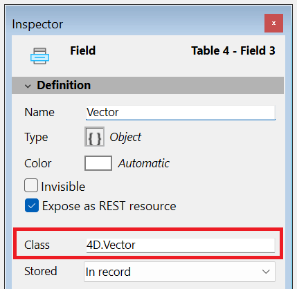

For other field properties, please refer to [doc.4d.com](https://doc.4d.com/4Dv20R10/4D/20-R10/Field-properties.300-7543749.en.html#5523008).

## Class

This property is available for fields of type **Object** (in 4D projects only). It allows you to define a **class-typed object field**, enhancing code completion, syntax checking, and runtime validation when typing code that involves object fields.

You can enter any valid class name in this property, including: 
  - User classes (e.g. `cs.MyClass`)
  - Built-in 4D classes (e.g. `4D.File`, `4D.Folder`)
  - [Exposed](../Extensions/develop-components.md#sharing-of-classes) component-defined classes (e.g. `cs.MyComponent.MyClass`)

If you enter an invalid class name, a warning is triggered and the input is rejected. 

:::note
  
**Non-streamable classes** such as [ORDA Data Model classes](../ORDA/ordaClasses.md), [file handles](../API/FileHandleClass.md), [web server](../API/WebServerClass.md)... cannot be associated to object fields.

:::

In your code, when assigning a value to a class-typed object field, 4D verifies that it belongs to the declared class. If not or if the object has no class, an error is triggered. Accessing unknown attributes will also raise syntax errors.

To retrieve the associated class name at runtime, use the [`classID`](../API/DataClassClass.md#attributename) property, for example `ds.MyTable.MyField.classID`.

### See also

- [Blog post: Stricter class-based typing for objects](https://blog.4d.com/stricter-class-based-typing-for-objects/)

