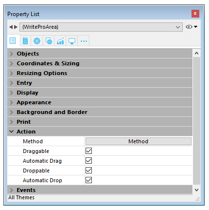

## Drag and Drop 

To configure the drag and drop features for your 4D Write Pro areas, you need to select the appropriate options in the "Action" theme of the Property List:  
  
  

4D Write Pro areas support two drag and drop modes:

* **Custom mode:** only "Draggable" and "Droppable" options checked. In this mode, you can select text and start to move it. The object method is then called with the [On Begin Drag Over](../../Events/onBeginDragOver.md) event, and you can define the drop action using custom code.
* **Automatic mode**: "Draggable", "Droppable", "Automatic Drag" and "Automatic Drop" options checked. In this mode, you can automatically move or copy the selected text by pressing the **Alt/Option** key. The [On Begin Drag Over](../../Events/onBeginDragOver.md) event is not triggered.

**Note:** Selecting only "Automatic Drag" and "Automatic Drop" options will have no effect in the 4D Write Pro area. 

## View properties 

Document view properties are directly available in the Property List for 4D Write Pro areas. They allow you to define how a 4D Write Pro document will be displayed by default in the 4D Write Pro area. These properties let you customize, for example, whether 4D Write Pro documents are displayed as they would be printed, or as they would be rendered in a browser. You can set different views of the same 4D Write Pro document in the same form.

**Note:** View settings can be managed dynamically using the [WP SET VIEW PROPERTIES](../commands/wp-set-view-properties) and [WP Get view properties](../commands/wp-get-view-properties) commands. 

Document view settings are handled through specific items in the **Appearance** theme of the Property List for 4D Write Pro form objects:  
  
  

* **Resolution**: Sets the screen resolution for the 4D Write Pro area contents. By default, it is set to **72 dpi (macOS)**, which is the standard resolution for 4D forms on all platforms. Setting this property to **Automatic** means that document rendering will differ between macOS and Windows platforms. Setting a specific dpi value will make the document rendering the same on both macOS and Windows platforms.
* **Zoom**: Sets the zoom percentage for displaying 4D Write Pro area contents.
* **View mode**: Sets the mode for displaying the 4D Write Pro document in the form area. Three values are available:  
   * **Page**: the most complete view mode, which includes page outlines, orientation, margins, page breaks, headers and footers, etc. For more information, please refer to the *Page view features* paragraph.  
   * **Draft**: draft mode with basic document properties  
   * **Embedded**: view mode suitable for embedded areas; it does not display margins, footers, headers, page frames, etc.  
   This mode can also be used to produce a web-like view output (if you also select the 96 dpi resolution and the **Show HTML WYSIWYG** option).  
   **Note:** The **View mode** property is only used for onscreen rendering. Regarding printing settings, specific rendering rules are automatically used.
* **Show page frame**: Displays/hides the page frame when Page view mode is set to "Page".
* **Show references**: Displays all 4D formulas (or expressions) inserted in the document as *references*. When this option is unchecked, 4D formulas are displayed as *values*. See [**Managing formulas**](../managing-formulas.md). 
**Note:** Formula references can be displayed as  symbols (see below).
* **Show headers/footers**: Displays/hides the headers and footers when Page view mode is set to "Page". 
* **Show background and anchored elements**: Displays/hides background images, background color, anchored images and text boxes.
* **Show hidden characters**: Displays/hides invisible characters
* **Show HTML WYSIWYG**: Enables/disables the HTML WYSIWYG view, in which any 4D Write Pro advanced attributes which are not compliant with all browsers are removed.
* **Show horizontal ruler**: Displays/hides the horizontal ruler. F
* **Show vertical ruler**: Displays/hides the vertical ruler when the document is in Page mode. 
* **Show empty or unsupported images**: Displays/hides a black rectangle for images that cannot be loaded or computed (empty images or images in an unsupported format). 
* **Display formula source as symbol**: Displays source text of formulas as  symbols when expressions are shown as references (see above). Displaying formulas as symbols makes template documents more compact and more *wysiwyg*.

## Context menu 

If the **Context menu** property is [checked for a 4D Write Pro area](./defining-a-4d-write-pro-area.md#using-the-4d-write-pro-area-object), a comprehensive context menu is available to users when the form is executed at runtime:  
  
 

This menu offers access to all the 4D Write Pro user features. 

## Selecting the view mode 

4D Write Pro documents can be displayed in one of three page view modes:

* **Draft**: draft mode with basic properties
* **Page** (default): "print view" mode
* **Embedded**: view mode suitable for embedded areas; it does not display margins, footers, headers, columns, page frames, etc. This mode can also be used to produce a Web-like view output (if you also select the 96 dpi resolution and the **HTML WYSIWYG** option).

The page view mode can be configured by means of the area pop-up menu:  
  
  

**Note:** The page view mode is not stored with the document. 

For areas embedded in 4D forms, the view mode can also be set by default using the Property List. In this case, the view mode is stored as a property of the 4D Write Pro form object (for more information, please refer to the *Configuring View properties* paragraph). 

