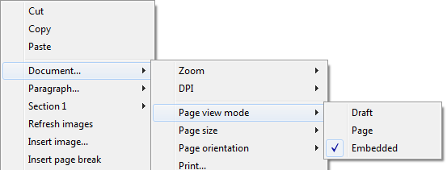

## Drag and Drop 

To configure the drag and drop features for your 4D Write Pro areas, you need to select the appropriate options in the "Action" theme of the Property List:  
  
  

4D Write Pro areas support two drag and drop modes:

* **Custom mode:** only "Draggable" and "Droppable" options checked. In this mode, you can select text and start to move it. The object method is then called with the [On Begin Drag Over](../../Events/onBeginDragOver.md) event, and you can define the drop action using custom code.
* **Automatic mode**: "Draggable", "Droppable", "Automatic Drag" and "Automatic Drop" options checked. In this mode, you can automatically move or copy the selected text by pressing the **Alt/Option** key. The [On Begin Drag Over](../../Events/onBeginDragOver.md) event is not triggered.

**Note:** Selecting only "Automatic Drag" and "Automatic Drop" options will have no effect in the 4D Write Pro area. 

## View properties 

Document view properties are directly available in the Property List for 4D Write Pro areas. They allow you to define how a 4D Write Pro document will be displayed by default in the 4D Write Pro area. These properties let you customize, for example, whether 4D Write Pro documents are displayed as they would be printed, or as they would be rendered in a browser. You can set different views of the same 4D Write Pro document in the same form.

**Note:** View settings can be managed dynamically using the [WP SET VIEW PROPERTIES](../commands/wp-set-view-properties) and [WP Get view properties](../commands/wp-get-view-properties) commands. 

Document view settings are handled through specific items in the **Appearance** theme of the Property List for 4D Write Pro form objects:  
  
  

* **Resolution**: Sets the screen resolution for the 4D Write Pro area contents. By default, it is set to **72 dpi (macOS)**, which is the standard resolution for 4D forms on all platforms. Setting this property to **Automatic** means that document rendering will differ between macOS and Windows platforms. Setting a specific dpi value will make the document rendering the same on both macOS and Windows platforms.
* **Zoom**: Sets the zoom percentage for displaying 4D Write Pro area contents.
* **View mode**: Sets the mode for displaying the 4D Write Pro document in the form area. Three values are available:  
   * **Page**: the most complete view mode, which includes page outlines, orientation, margins, page breaks, headers and footers, etc. For more information, please refer to the *Page view features* paragraph.  
   * **Draft**: draft mode with basic document properties  
   * **Embedded**: view mode suitable for embedded areas; it does not display margins, footers, headers, page frames, etc.  
   This mode can also be used to produce a web-like view output (if you also select the 96 dpi resolution and the **Show HTML WYSIWYG** option).  
   **Note:** The **View mode** property is only used for onscreen rendering. Regarding printing settings, specific rendering rules are automatically used.
* **Show page frame**: Displays/hides the page frame when Page view mode is set to "Page".
* **Show references**: Displays all 4D formulas (or expressions) inserted in the document as *references*. When this option is unchecked, 4D formulas are displayed as *values*. See [**Managing formulas**](../managing-formulas.md). 
**Note:** Formula references can be displayed as  symbols (see below).
* **Show headers/footers**: Displays/hides the headers and footers when Page view mode is set to "Page". 
* **Show background and anchored elements**: Displays/hides background images, background color, anchored images and text boxes.
* **Show hidden characters**: Displays/hides invisible characters
* **Show HTML WYSIWYG**: Enables/disables the HTML WYSIWYG view, in which any 4D Write Pro advanced attributes which are not compliant with all browsers are removed.
* **Show horizontal ruler**: Displays/hides the horizontal ruler. F
* **Show vertical ruler**: Displays/hides the vertical ruler when the document is in Page mode. 
* **Show empty or unsupported images**: Displays/hides a black rectangle for images that cannot be loaded or computed (empty images or images in an unsupported format). 
* **Display formula source as symbol**: Displays source text of formulas as  symbols when expressions are shown as references (see above). Displaying formulas as symbols makes template documents more compact and more *wysiwyg*.

## Context menu 

If the **Context menu** property is [checked for a 4D Write Pro area](./defining-a-4d-write-pro-area.md#using-the-4d-write-pro-area-object), a comprehensive context menu is available to users when the form is executed at runtime:  
  
 

This menu offers access to all the 4D Write Pro user features. 

## Selecting the view mode 

4D Write Pro documents can be displayed in one of three page view modes:

* **Draft**: draft mode with basic properties
* **Page** (default): "print view" mode
* **Embedded**: view mode suitable for embedded areas; it does not display margins, footers, headers, columns, page frames, etc. This mode can also be used to produce a Web-like view output (if you also select the 96 dpi resolution and the **HTML WYSIWYG** option).

The page view mode can be configured by means of the area pop-up menu:  
  
  

**Note:** The page view mode is not stored with the document. 

For areas embedded in 4D forms, the view mode can also be set by default using the Property List. In this case, the view mode is stored as a property of the 4D Write Pro form object (for more information, please refer to the *Configuring View properties* paragraph). 

## Standard actions

The user interface of 4D Write Pro areas can be handled through a wide set of **standard actions**. Standard actions can be assigned to:

* menu commands, available through the **menu bar** or the [Dynamic pop up menu](../../commands/dynamic-pop-up-menu) command
* list items, available through pop-up/drop-down lists or hierarchical pop-up menus,
* buttons, check boxes,
* or executed by the [INVOKE ACTION](../../commands/invoke-action) command.

When assigned to interface objects, standard actions handle the activation/disabling of the object depending on the context. For more information, please refer to the *Standard actions* section.

Two kinds of actions are available for 4D Write Pro areas:

* 4D Write Pro specific actions, that can be used only with 4D Write Pro areas,
* [Other actions](#other-actions), including fonts, expressions, spell check, and editing actions, that can be used with 4D Write Pro areas and other 4D areas (see *Standard actions*).

### 4D Write Pro actions 

The following standard actions are available with 4D Write Pro areas.

**Notes:**

* Actions that display an automatic menu/list can only be attached to menu commands, pop-up/drop-down lists or hierarchical pop-up menus objects (see *Submenu*).
* Check boxes and 3D check boxes should be associated with status actions, such as "section/differentFirstPage" or "visibleHorizontalRuler". Three-states option is supported with standard check boxes only.
* A section action status is always equal to the selected section actual status (inherited status if attribute is inherited from parent section or from default attribute) as it must reflect the selected section status (the status which is applied currently to the section). However, modifying a section attribute with a standard action will only override the selected section attribute.
* *Submenu*: When used without any parameters and associated to a menu command, a pop-up/drop-down list or a hierarchical pop-up menu object, these actions display an automatic submenu/list. For example, if you assign the "backgroundColor" action to a menu command, selecting this menu command at runtime will display the Background color submenu items. If you assign the "zoom" action to a hierarchical pop-up menu, it will automatically contain a list of predefined zoom values. Note that these actions cannot be assigned to buttons.
* *showDialog*: Adding the "/showDialog" string to the action name allows the display of the associated standard dialog box for the action. For example, you can use "paragraph/styleSheet/showDialog" to open the input dialog allowing the entry of a new stylesheet name.

| Action name | Pattern | Available with  | Description  |  
|---|---|---|---|
| anchorHorizontalAlign  | {image \| textBox}/anchorHorizontalAlign?value={left \| center \| right}  | Image, Textbox, Submenu | Defines the horizontal alignment of the element, relative to the anchorOrigin for images/text boxes in page, or to the layout box for images/text box in embedded mode. This action will reset the horizontal offset to 0. (not enabled for inline images).  | 
| anchoring | {image \| textBox}/anchoring  | Submenu | Default submenu with anchor settings actions for images or text boxes | 
| anchorLayout | image/anchorLayout?value={front \| behind \| wrapTopBottom \| wrapSquareLeft \| wrapSquareRight \| wrapSquareLargest \| wrapSquare \| inline}   textBox/anchorLayout?value={front \| behind \| wrapTopBottom \|  wrapSquareLeft \| wrapSquareRight \| wrapSquareLargest \| wrapSquare} | Image, Textbox, Submenu | Defines the anchor layout type for an image or a text box. Can be used to transform an inline image to an anchored image, or the reverse.  Note: If an image is moved from an anchored mode to inline, the image is inserted at the beginning of the current selected text.  "inline" value is not supported for text boxes | 
| anchorOrigin | {image \| textBox}/anchorOrigin?value={paper-box \| header-box \| footer-box} | Image, TextBox, Submenu | Defines the area relative to the absolute position of an anchored image or text box. If the element is relative to the header-box/footer-box which is not visible on a page, the element is not displayed. This action will reset horizontal and vertical offsets to 0.  Page mode only, not enabled for inline images. | 
| anchorPage | {image \| textBox}/anchorPage?value={all \| current \| currentSubSection} | Image, TextBox, Submenu | Defines the page(s) where the selected image or text box is displayed (not enabled for inline images).  Page mode only. | 
| anchorSection | {image \| textBox}/anchorSection?value={all \| current} | Image, TextBox, Submenu | Defines the section(s) where the selected image or text box is displayed. (not enabled for inline images).  Page mode only. | 
| anchorVerticalAlign | {image \| textBox}/anchorVerticalAlign?value={top \| center \| bottom} | Image, TextBox Submenu | Defines the vertical alignment of the image or text box, relative to the anchorOrgin for an image or text box in page, or to the layout box for an image or text box in embedded mode. This action will reset the vertical offset to 0 (not enabled for inline images). Note: See "verticalAlign" action for the vertical alignment inside the text box | 
| avoidPageBreakInside | {paragraph/}avoidPageBreakInside | Paragraph |   | 
| background |  {doc \| paragraph \| image \| textBox \| section \| header \| footer \| table \| row \| column \| cell/}background | Document, Paragraph, Image, TextBox, Section, Header, Footer, Table, Row, Column, Cell, Submenu | For menu commands only. Default submenu for all background attributes. | 
| backgroundClip | {doc \| paragraph \| image \| textBox \| section \| header \| footer \| table \| row \| column \| cell/}backgroundClip?value={paper-box \| border-box \| padding-box \| content-box} | Document, Paragraph, Image, TextBox, Section, Header, Footer, Table, Row, Column, Cell, Submenu | Changes target background clipping box (default target is paragraph). Paper-box targets document and section only. | 
| backgroundColor | {doc \| paragraph \| image \| textBox \| section \| header \| footer \| table \| row \| column \| cell/}backgroundColor?value={<Css_color> \| transparent} | Document, Paragraph, Image, TextBox, Section, Header, Footer, Table, Row, Column, Cell, Submenu, showDialog | Changes target background. | 
| backgroundDisplayMode | {doc \| paragraph \| image \| textBox \| section \| header \| footer \| table \| row \| column \| cell/}backgroundDisplayMode?value=scaledToFit \| truncated \| truncatedCentered \| proportional \| proportionalCentered \| replicated \| replicatedCentered | Document, Paragraph, Image, TextBox, Section, Header, Footer, Table, Row, Column, Cell, Submenu | Sets the display mode of images used as background. | 
| backgroundImage | {doc \| paragraph \| image \| textBox \| section \| header \| footer \| table \| row \| column \| cell/}backgroundImage?value=none | Document, Paragraph, Image, TextBox, Section, Header, Footer, Table, Row, Column, Cell, Submenu, showDialog | Clears target background image. (default target is paragraph) | 
| backgroundOrigin | {doc \| paragraph \| image \| textBox \| section \| header \| footer \| table \| row \| column \| cell/}backgroundOrigin?value={paper-box \| border-box \| padding-box \| content-box} | Document, Paragraph, Image, TextBox, Section, Header, Footer, Table, Row, Column, Cell, Submenu | Changes target background image origin box (default target is paragraph). Paper-box targets document and section only. | 
| backgroundPositionH | {doc \| paragraph \| image \| textBox \| section \| header \| footer \| table \| row \| column \| cell/}backgroundPositionH?value={left \| right \| center} | Document, Paragraph, Image, TextBox, Section, Header, Footer, Table, Row, Column, Cell, Submenu | Changes target background image horizontal alignment (default target is paragraph).  Ex: paragraph/backgroundPositionH?value=left | 
| backgroundPositionV | {doc \| paragraph \| image \| textBox \| section \| header \| footer \| table \| row \| column \| cell/}backgroundPositionV?value={top \| bottom \| center} | Document, Paragraph, Image, TextBox, Section, Header, Footer, Table, Row, Column, Cell, Submenu | Changes target background image vertical alignment (default target is paragraph).  Ex: paragraph/backgroundPositionV?value=top | 
| backgroundRepeat | {doc \| paragraph \| image \| textBox \| section \| header \| footer \| table \| row \| column \| cell/}backgroundRepeat?value={no-repeat \| repeat \| repeat-x \| repeat-y} | Document, Paragraph, Image, TextBox, Section, Header, Footer, Table, Row, Column, Cell, Submenu | Changes target background image repeat mode. (default target is paragraph) | 
| backgroundSizeH | {doc \| paragraph \| image \| textBox \| section \| header \| footer \| table \| row \| column \| cell/}backgroundSizeH?value={<Css_length> \| <Css_percentage> \| auto \| cover \| contain} | Document, Paragraph, Image, TextBox, Section, Header,  Footer, Table, Row, Column, Cell, Submenu | Changes target background image width (default target is paragraph).  Ex: paragraph/backgroundSizeH?value=100%. section/backgroundSizeH?value=cover | 
| backgroundSizeV | {doc \| paragraph \| image \| textBox \| section \| header \| footer \| table \| row \| column \| cell}/backgroundSizeV?value={<Css_length> \| <Css_percentage> \| auto} | Document, Paragraph, Image, TextBox, Section, Header,  Footer, Table, Row, Column, Cell, Submenu | Changes target background image height (default target is paragraph).  Ex: paragraph/backgroundSizeV?value=50%. Ex: section/backgroundSizeV?value=40pt | 
| bookmark | bookmark?index=<number> | Submenu | Selects the Nth bookmark.  Ex: bookmark?index=2 // selects the second bookmark | 
| borderCollapse | borderCollapse | Paragraph | Collapses selected paragraph borders and interior margins. | 
| borderColor | {doc \| paragraph \| image \| textBox \| section \| header \| footer \| table \| row \| column \| cell/}{inside \| outside/}{borderColor \| borderColorLeft \| borderColorRight \| borderColorTop \| borderColorBottom \| borderColorLeftRight \| borderColorTopBottom}?value=<Css_color> | Document, Paragraph, Image, TextBox, Section, Header,  Footer, Table, Row, Column, Cell, Submenu, showDialog | Changes target border color (default target is paragraph).  Ex: paragraph/borderColorLeft?value=green | 
| borderRadius | {doc \| paragraph \| image \| textBox \| section \| header \| footer/}borderRadius?value=<Css_length> | Document, Paragraph, Image, TextBox, Section, Header,  Footer, Submenu | Changes target border radius (default target is paragraph).  Ex: paragraph/borderRadius?value=4pt | 
| borders | {doc \| paragraph \| image \| textBox \| section \| header \| footer \| table \| row \| column \| cell/}{inside \| outside/}borders | Document, Paragraph, Image, TextBox, Section, Header,  Footer, Table, Row, Column, Cell, Submenu | Default submenu for target borders. | 
| borderStyle | {doc \| paragraph \| image \| textBox \| section \| header \| footer \| table \| row \| column \| cell/}{inside \| outside/}{borderStyle \| borderStyleLeft \| borderStyleRight \| borderStyleTop \| borderStyleBottom \| borderStyleLeftRight \| borderStyleTopBottom}?value={none \| hidden \| dotted \| dashed \| solid \| double \| groove \| ridge \| inset \| outset} | Document, Paragraph, Image, TextBox, Section, Header,  Footer, Table, Row, Column, Cell, Submenu | Changes target border style (default target is paragraph).  Ex: paragraph/borderStyleLeft?value=double. Ex: outside/borderStyle?value=solid //set selected paragraphs exterior borders to style solid. Ex: inside/borderStyle?value=none //remove selected paragraphs interior borders | 
| borderWidth | {doc \| paragraph \| image \| textBox \| section \| header \| footer \| table \| row \| column \| cell/}{inside \| outside/}{borderWidth \| borderWidthLeft \| borderWidthRight \| borderWidthTop \| borderWidthBottom \| borderWidthLeftRight \| borderWidthTopBottom}?value=<Css_length> | Document, Paragraph, Image, TextBox, Section, Header,  Footer, Table, Row, Column, Cell, Submenu | Changes target border width (default target is paragraph).  Ex: paragraph/borderWidthLeft?value=4pt | 
| columnCount | {section/}columnCount?value={1<=number<=20} | Document, Section, Submenu | Number of columns in the current document and/or section. (default target is doc)  Ex: section/columnCount?value=3 | 
| columnRuleColor | {section/}columnRuleColor?value={CSS color} | Document, Section, Submenu, showDialog | Color for the decorative line between document or section columns.  Ex: columnRuleColor?value="#FFFFFF" | 
| columnRuleStyle | {section/}columnRuleStyle?value={none \| dotted \| dashed \| solid \| double \| groove \| ridge \| inset \| outset} | Document, Section, Submenu | Style for the decorative line between document or section columns.  Ex: columnRuleStyle?value="solid" | 
| columnRuleWidth | {section/}columnRuleWidth?value={CSS length} | Document, Section, Submenu | Width of the decorative line between document or section columns.  Ex: columnRuleWidth?value="2pt" | 
| columns | {section/}columns | Document, Section, Submenu | Only for a menu item: creates automatically a complete Columns sub-menu with all column actions sub-menus (except insertColumnBreak) | 
| columnSpacing | {section/}columnSpacing?value={CSS length} | Document, Section, Submenu | Space between two columns in the current document and/or section.  Ex: columnSpacing?value="1cm" | 
| deleteColumns | deleteColumns | Table | Deletes all selected columns. | 
| deleteRows | deleteRows | Table | Deletes all selected rows. | 
| deleteStyleSheet | {paragraph \| image/}deleteStyleSheet?index={1<= number <= number of target style sheets} | Paragraph, Image, Submenu | Removes the Nth stylesheet from the stored stylesheets for the selected target (default target is paragraph). Menu item name is replaced at runtime with style sheet name. | 
| direction | direction?value={ltr \| rtl} | Paragraph, Submenu | Paragraph direction. | 
| displayFormulaAsSymbol | displayFormulaAsSymbol | Document | Displays formula references as a # symbol. Can only be used when formulas are displayed as references. | 
| doc | doc | Document, Submenu | Default submenu for document body layout (embedded mode attributes or default attributes for sections – but for margin which is reserved for embedded mode only). | 
| dpi | Modifies the dpi of the current view (independent of the document attribute wk dpi used internally for pixel conversion <-> points). | Submenu | Change view dpi.  Ex: dpi?value=72 | 
| emptyDatasource | {table}/emptyDatasource?value={showDataRow \| hideDataRow \| showPlaceholderRow \| hideTable } | Table, Submenu | Defines how the table is displayed when its datasource is empty.  | 
| fontStyleWrite | fontStyleWrite | Submenu | For menu commands only. Displays default font styles submenu for 4D Write Pro. | 
| fontSubscript | fontSubscript |   | Toggles subscript font attribute. | 
| fontSuperscript | fontSuperscript |   | Toggles superscript font attribute. | 
| footer | footer | Submenu | Displays the Footer submenu. | 
| footer/remove | footer/remove | Footer | Removes the selected footer. | 
| formulaHighlight | formulaHighlight?value={values \| references \| always \| never} | Document,  Submenu | Formula highlight mode for the document. Can be used with a dropdown menu or a button | 
| formulaHighlightColor | formulaHighlightColor?value=<Css_color> | Document,  Submenu,showDialog | Formula highlight color for the document | 
| formulaHighlightReferences | formulaHighlightReferences | Document | Toggles formula references highlighting. Can be used with a check box or a menu item | 
| formulaHighlightValues | formulaHighlightValues | Document | Toggles formula values highlighting. Can be used with a check box or a menu item | 
| header | header | Submenu | Displays the Header submenu. | 
| header/remove | header/remove | Header | Removes the selected header. | 
| height | {image \| textBox \| row}/height?value={<Css_length> \| auto} | Image, TextBox Row, Submenu | Target height.  Ex: image/height?value=50pt. For image/width, see width.  Ex: row/height?value=12pt | 
| headerRowCount | {table/}headerRowCount | Table, Submenu | Sets the number of header rows in a table. Maximum is 5. | 
| htmlWYSIWIGEnabled | htmlWYSIWIGEnabled | Document | Toggles between html wysiwyg mode. | 
| image | image | Image, Submenu | Displays image layout submenu. | 
| image/displayMode | image/displayMode?value=scaledToFit \| truncated \| truncatedCentered \| proportional \| proportionalCentered \| replicated \| replicatedCentered | Image, Submenu | Sets the display mode of anchored and inline images.  Ex: image/displayMode?value=scaledToFit | 
| image/verticalAlign | image/verticalAlign?value={top \| middle \| bottom \| baseline \| super \| sub} | Image, Submenu | Image vertical alignment.  Ex: image/verticalAlign?value=super | 
| insertColumnBreak | insertColumnBreak | Paragraph | Inserts a column break at the selection. | 
| insertColumnToTheLeft | insertColumnToTheLeft | Table | Inserts a column to the left of the first selected column(s). | 
| insertColumnToTheRight | insertColumnToTheRight | Table | Inserts a column to the right of the last selected column(s). | 
| insertContinuousSectionBreak | insertContinuousSectionBreak | Paragraph | Inserts a continuous section break at the selection. | 
| insertImage | insertImage |   | Opens a picture selection dialog box and inserts the selected picture (if any) as a character in the area. | 
| insertPageBreak | insertPageBreak | Paragraph | Inserts a page break at the selection. | 
| insertRowAbove | insertRowAbove | Table | Inserts a row above the selected row(s). | 
| insertRowBelow | insertRowBelow | Table | Inserts a row below the selected row(s). | 
| insertSectionBreak | insertSectionBreak | Paragraph | Inserts a section break at the selection. | 
| insertSoftHyphen | insertSoftHyphen |   | Inserts a soft hyphen at the cursor position. | 
| insertTextBox | insertTextBox | Document | Inserts a text box near the current selection, anchored to the first selected page (page mode).  | 
| keepWithNext | keepWithNext | Paragraph | Links a paragraph with the next so that they cannot be separated by automatic page or column breaks.   If applied to the last paragraph of the last cell in a table, the last row of the table is linked to the following paragraph.  | 
| lineHeight | lineHeight?value={<Css_length> \| <Css_percentage>} | Paragraph, Submenu | Paragraph line height.  Ex: lineHeight?value=120% | 
| layer | {image \| textBox}/layer | Submenu | Default submenu with layering actions for images or text boxes | 
| listStartNumber | listStartNumber?value={<number> (longint) \| auto} | Paragraph, Submenu | List start number. Ex: listStartNumber?value=10 | 
| listStyleImage | listStyleImage/showDialog | Paragraph, showDialog | Opens a file dialog to choose a image to display as list style bullet; it will set also list style type to disc – style to be used if image is not found. | 
| listStyleType | listStyleType?value={none \| disc \| circle \| square \| hollow-square \| diamond \| club \| decimal \| decimal-leading- zero \| lower-latin \| lower-roman \| upper-latin \| upper-roman \| lower-greek \| decimal-greek \| armenian \| georgian \| hebrew \| hiragana \| katakana \| cjk-ideographic} | Paragraph, Submenu | Paragraph list style type. | 
| margin | {doc \| paragraph \| image \| textBox \| section \| header \| footer \| table/}{inside \| outside/}{margin \| marginLeft \| marginRight \| marginTop \| marginBottom \| marginLeftRight \| marginTopBottom}?value={<Css_length> \| auto} | Document, Paragraph, Image, Textbox, Section, Header,  Footer, Table, Submenu | Changes target margin (default target is paragraph).  Ex: margin?value=4pt //sets all paragraph margins to 4pt.  Ex: outside/margin?value=4pt //set exterior paragraph margins to 4pt.  Ex: doc/marginLeft?value=1cm //sets left margin to 1cm for the document as used in embedded mode.  Ex: section/marginLeft?value=1cm //sets left margin to 1cm for the pages of the first selected section | 
| merge | {paragraph/}merge cell/merge | Paragraph,  Cell | Used with paragraphs: merges paragraphs. Used with cells: merges the selected cells. | 
| minHeight | {paragraph \| image/}minHeight?value=<Css_length> | Paragraph, Image, Submenu | Target min height (default target is paragraph).  Ex: paragraph/minHeight?value=50pt | 
| minWidth | {paragraph \| image/}minWidth?value=<Css_length> | Paragraph, Image, Submenu | Target min width (default target is paragraph).  Ex: paragraph/minWidth?value=50pt | 
| moveToBack | moveToBack | Image | Moves image to the back. (not enabled for inline images) | 
| moveToFront | moveToFront | Image | Moves image to the front. (not enabled for inline images) | 
| newLineStyleSheet | newLineStyleSheet?index={1<=number<=number of paragraph stylesheets \| newLineStyleSheet}?value=auto | Paragraph, Submenu | Selected paragraph elements will use Nth stylesheet as stylesheet to use for new paragraphs created on Return or while splitting paragraphs; If value=auto, new paragraphs will use the same stylesheet (default). (menu item name is replaced at runtime with stylesheet name) | 
| padding | {doc \| paragraph \| image \| textBox \| section \| header \| footer \| column \| row\| cell/}{inside \| outside/}{padding \| paddingLeft \| paddingRight \| paddingTop \| paddingBottom \| paddingLeftRight \| paddingTopBottom }?value=<Css_length> | Document, Paragraph, Image, TextBox, Section, Header,  Footer, Row, Column, Cell, Submenu | Changes target padding. (default target is paragraph) | 
| pageMode | pageMode?value={embedded \| page \| draft} | Submenu | Changes view mode.  Ex: pageMode?value=page | 
| pageOrientation | {section/}pageOrientation?value={landscape \| portrait} | Section, Submenu | Changes document or first selected section page orientation (if section is not specified, it will apply to all sections otherwise to the first selected section).  Ex: pageOrientation?value=portrait //change orientation to portrait for the whole document.  Ex: section/pageOrientation?value=landscape //change orientation to landscape for the first selected section | 
| pageSize | pageSize?index=<number> | Submenu | Changes document page size: number is Nth page size in the list of available pages sizes. The list contains the current printer page sizes, ISO page sizes and the custom page sizes defined by the user. | 
| paragraph | paragraph | Paragraph, Submenu | Default submenu for paragraph layout. | 
| paragraph/avoidPageBreakInside | {paragraph/}avoidPageBreakInside | Paragraph | Allows/disallows page breaks inside paragraphs. | 
| print | print | Document | Prints document as rendered in page mode with view settings of the focused 4D Write Pro area. | 
| refreshImages | refreshImages | Image | Reloads images from the network for images with URLs. | 
| removeSoftHyphens | removeSoftHyphens |   | Removes all soft hyphens in the current selection (if the selection is empty, removes soft hyphen before or after the caret if any) | 
| row/avoidPageBreakInside | row/avoidPageBreakInside | Table, Row | Allows/disallows page breaks inside table rows.  This action is disabled if:   the current selection does not contain a table the table does not allow page breaks the table is inside a header or footer Note: If several tables are selected and some of them don't allow page breaks, this option will be enabled but only applied to the tables that allow page breaks. | 
| section | section | Section, Submenu | Default submenu for page layout for the first selected section. | 
| section/differentFirstPage | section/differentFirstPage | Section | Section has different first page or not. | 
| section/differentLeftRightPages | section/differentLeftRightPages | Section | Section has different left and right pages or not. | 
| section/name/showDialog | section/name/showDialog | Section, showDialog | Displays a dialog allowing to enter the first selected section name. | 
| section/remove | section/remove | Section | Deletes the first section that intersects the user’s selection regardless if the user has selected one or multiple sections. Disabled when only one section remains in the document. | 
| section/reset | section/reset | Section | Resets all first selected section attributes to default attributes - which are inherited from doc attributes for background, border and padding (same as for embedded mode) and 2.5cm for page margins. First selected section column properties are also removed (so only default section properties will apply). | 
| split | {paragraph/}split cell/split | Paragraph, Cell | Used with paragraph: splits paragraph. Used with cells: splits the selected cells (only cells that have been already merged may be split). | 
| styleSheet | {paragraph \| image/}styleSheet?value={1<=number<=number of target style sheets} | Paragraph, Image, Submenu, showDialog | Applies Nth stylesheet to the selected target elements. With dialog, new stylesheet will use current attributes from the first selected target. (default target is paragraph)  Ex: styleSheet?value=1 //apply first paragraph style sheet to the selected paragraphs and set it as paragraph stylesheets. | 
| styleSheets | {paragraph \| image/}styleSheets | Paragraph, Image, Submenu | Default submenu for editing target stylesheets. | 
| tabDecimalSeparator | tabDecimalSeparator?value={point \| comma \| pointOrComma \| system} | Document, Submenu | Defines the character used as decimal separator by decimal tabulations.  | 
| tableAlign | tableAlign?value={left \| center \| right} or table/tableAlign?value={left \| center \| right}  | Table, Submenu | Specifies horizontal alignment for a table. | 
| table/avoidPageBreakInside | table/avoidPageBreakInside | Table | Allows/disallows page breaks inside tables.  Disabled if:  the current selection does not contain at least one table the table is in a header or a footer | 
| table/bottomCarryOverRow | table/bottomCarryOverRow | Table | Toggles between display/not display of carry-over rows (see Carry-over rows). | 
| textAlign | textAlign?value={left \| right \| center \| justify \| initial} | Paragraph | Paragraph text alignment (initial=use right for rtl or left for ltr direction). | 
| textBox | textBox | Submenu | Submenu with all actions available for the focused/selected text box | 
| textBox/remove | textBox/remove | TextBox | Removes the selected text box | 
| textIndent | textIndent?value=<Css_length> (may be negative) | Paragraph, Submenu | Paragraph text indentation (first line indentation).  Ex: textIndent?value=2cm | 
| textLinethrough | textLinethrough | Submenu | For menu commands only. Linethrough submenu (with style and color). | 
| textLinethroughColor | textLinethroughColor?value={<Css_color> \| currentColor} | Submenu, showDialog | Ex: textLinethroughColor?value=red | 
| textLinethroughStyle | textLinethroughStyle?value={none \| solid \| dotted \| dashed \| double \| semi-transparent \| word} | Submenu | Ex: textLinethroughStyle?value=dotted | 
| textShadow | textShadow | Submenu | For menu commands only. Default submenu for text shadow (with color and offset). | 
| textShadowColor | textShadowColor?value={<Css_color> \| none} | Submenu, showDialog | Changes shadow status or color for characters.  Ex: textShadowColor?value=green | 
| textShadowOffset | textShadowOffset?value=<Css_length> | Submenu | Only length in pt is supported.  Ex: textShadowOffset?value=2pt | 
| textTransform | textTransform?value={none \| capitalize \| uppercase \| lowercase \| small-uppercase} | Submenu | Formats text.  Ex: textTransform?value=capitalize | 
| textUnderline | textUnderline | Submenu | For menu commands only. Underline submenu (with style and color) | 
| textUnderlineColor | textUnderlineColor?value={<Css_color> \| currentColor} | Submenu, showDialog | Ex: textUnderlineColor?value=red | 
| textUnderlineStyle | textUnderlineStyle?value={none \| solid \| dotted \| dashed \| double \| semi-transparent \| word} | Submenu | Ex: textUnderlineStyle?value=dotted | 
| updateStyleSheet | {paragraph \| image/}updateStyleSheet | Paragraph, Image, Submenu | Updates first selected target stylesheet with first selected target current attributes (default target is paragraph) | 
| userUnit | userUnit?value={cm \| mm \| in \| pt} | Submenu | Changes document layout unit (will be reflected on rulers). | 
| verticalAlign | {paragraph \| row \| column \| cell \| textBox/}verticalAlign?value={top \| middle \| bottom} | Paragraph, Row, Column,  Cell, TextBox, Submenu | Paragraph vertical alignment.  Ex: verticalAlign?value=top. The effect depends on the minHeight value of the paragraph. | 
| view | view | Submenu | For menu commands only. Default submenu for view settings. | 
| visibleBackground | visibleBackground | Document | Shows/hides background, anchored pictures and text boxes | 
| visibleEmptyImages | visibleEmptyImages | Document | Shows/hides a default black rectangle for images that cannot be loaded or computed (empty images or images in an unsupported format). | 
| visibleFooters | visibleFooters | Document | Shows/hides footers. | 
| visibleHeaders | visibleHeaders | Document | Shows/hides headers. | 
| visibleHiddenChars | visibleHiddenChars | Document | Shows/hides hidden characters | 
| visibleHorizontalRuler | visibleHorizontalRuler | Document | Shows/hides horizontal ruler. | 
| visiblePageFrames | visiblePageFrames | Document | Shows/hides page frames. | 
| visibleVerticalRuler | visibleVerticalRuler | Document | Shows/hides vertical ruler (Page mode only). | 
| visibleTableBorders | visibleTableBorders | Document | Shows/hides internal and external table borders as dashed lines where no borders are defined. | 
| widowAndOrphanControlEnabled | widowAndOrphanControlEnabled | Paragraph | Toggles between widow and orphan control mode. | 
| width | {paragraph \| image \| textBox \| column/}width?value=<Css_length> \| auto | Paragraph, Image, TextBox, Column, Submenu | Target width (default target is paragraph). Auto value not available for text boxes (converted to 8 cm) and columns.   Ex: image/width?value=50pt | 
| zoom | zoom?value={25% <= percentage in Css <= 400%} | Document, Submenu | Changes document view zoom.  Ex: zoom?value=120% | 

  
### Other actions 

Several other standard actions are available in 4D forms and can be used in 4D Write Pro areas:

* *Edit actions*, such as copy/paste actions.
* *Font* actions, such as fontBold or fontSize.
* *Dynamic expressions* actions, allowing to handle inserted expressions..
* *Spellchecking* actions.