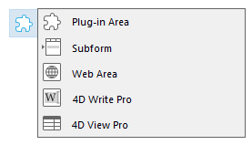
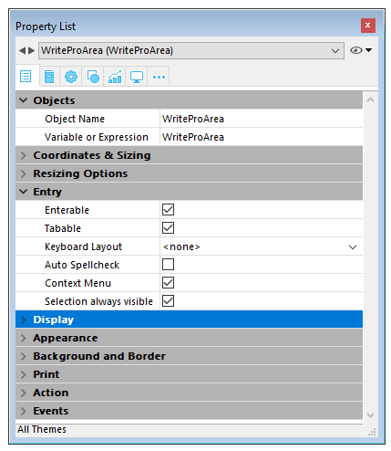
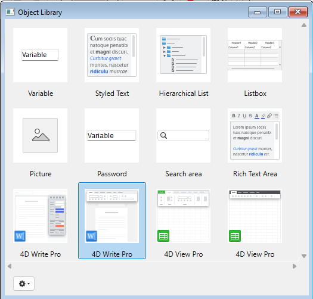

4D Write Pro offers 4D users an advanced word-processing tool, fully integrated with your 4D database. Using 4D Write Pro, you can write pre-formatted emails and/or letters or any documents containing images, tables, bookmarks, a scanned signature, formatted text and placeholders for dynamic variables. You can also create invoices or reports dynamically, including formatted text and images.

The key features of the product are:

* Word processing: a 4D Write Pro object embedded in a form provides standard word-processing features, including text and style manipulation, image insertion, import and export, and much more.
* Datastore integration:  
   * A 4D Write Pro object can display variable parts which will be filled with data from the datastore, or any data computed by 4D.  
   * 4D Write Pro documents can be stored within database fields or on disk.

4D Write Pro comes with:

- a **form object** that you can install in your forms. You can load, handle, and save **4D Write Pro documents** in this area. This object is configurable through the Property list and includes a comprehensive developer pop up menu at runtime.
- **language commands**, added to the 4D Language and allowing you to deeply customize the area.
- **standard actions**, to help building a fully customized interface. 
- **4D Write Pro Interface**, an extension that offers a set of predefined palettes for end users.

## Installation and activation 

4D Write Pro is fully integrated into 4D itself, making it easier to deploy and manage. No additional installation is required; you can add 4D Write Pro areas to your forms and handle 4D Write Pro variables directly in your 4D applications.

However, you need to have a 4D Write Pro license installed in your application in order to enable the feature. 

## Creating a 4D Write Pro area

### Using the 4D Write Pro area object 

4D Write Pro documents can be displayed and edited manually in a 4D form object: **4D Write Pro**. This object is available as part of the last tool (Plug-in Area, Web Area, etc.) found in the [object bar](../../FormEditor/formEditor.md#object-bar):  
  
  

A 4D Write Pro form area is configured by means of standard properties found in the Property List, such as **Object Name** and **Variable or Expression**, **Coordinates**, **Entry**, **Display**, **Appearance**, and/or **Events**.  
  
  

The **Variable or Expression** property can be used in the language as a reference to the 4D Write Pro area. Note that the variable must be of the [Object](../../Concepts/dt_object.md) type.

"Entry" properties manage basic features for text entry:

* **Enterable**: enables you to lock/unlock the area in order to allow or prevent editing
* **Auto Spellcheck**: available for 4D Write Pro areas
* **Context Menu**: allows you to enable/disable the context menu when the form is executed at runtime (see the [Using a 4D Write Pro area](./using-a-4d-write-pro-area.md))
* **Selection always visible**: handles text selection as in standard text areas.

### Using 4D Write Pro Interface 

You can create preconfigured 4D Write Pro areas using the **4D Write Pro** objects found in the [Object library](../../FormEditor/objectLibrary.md) of the 4D Form editor ("Entry areas" theme):  
  
  

These areas come with either a control panel or a toolbar for managing all the attributes of the area (font, color, style, etc.):  
  
  

For more information, refer to the [4D Write Pro Interface](../writeprointerface.md) section.